# AGC-002 — Lookalike-Domain Phishing (Homoglyph Attack)

<p align="center">
  
  
  
  
  
</p>

---

## 1. Overview & Case Metadata

| Case Attribute | Value / Specification |
|:---|:---|
| **Incident ID** | `AGC-002` (`T100-002`) |
| **Tactic & Technique** | **Initial Access (TA0001)** — `T1566.002` (Spearphishing Link) |
| **Secondary Techniques** | `T1583.001` (Domains), `T1071.001` (Web Protocols), `T1056.003` (Credential Harvesting) |
| **Investigating Analyst** | **Ali (TOOSHY2)** |
| **Execution Date & Time** | 2026-09-25 — 12:09 to 15:49 UTC |
| **Target Host** | `COMPROMISED-HOST-01` (`10.10.10.103` — `michael.chen`) |
| **Adversary Infrastructure** | `EXT-ATTACKER-SIM` (`10.10.40.10:80` — `ashfordgr0ve.local`) |
| **Detection Status** | **True Positive (Confirmed Malicious)** |
| **Triage Confidence** | **High** (Correlated across Email Headers, DNS NXDOMAIN, Sysmon EID 22/1, Zeek, and OPNsense) |
| **Kill-Chain Stage** | Initial Access & Credential Harvesting (Campaign Evolution: Scenario 2 of 100) |

### Incident Summary
Following the initial campaign attempt in AGC-001, the external adversary refined their attack vector by employing a **lookalike domain (Homoglyph / Typosquatting)** attack. Instead of merely spoofing the display name, the threat actor registered the deceptive domain `ashfordgr0ve.local`—substituting the letter `'o'` with the digit `'0'` at the 10th character position. 

The lure impersonated the **"HR Department"** regarding mandatory employee benefits enrollment closing on Friday. Because the lookalike domain lacked a registered record in the corporate DNS resolver, system queries triggered `NXDOMAIN` (Win32 Error `9003`). The email body directed victim `michael.chen` to the external harvesting infrastructure at `http://10.10.40.10/portal-login`, leading to corporate credential entry. Detection engineering was executed live in Wazuh by drafting and deploying custom rule `100022` to monitor Sysmon DNS query telemetry.

---

## 2. Adversary Tradecraft & Technical Analysis

```
       [Attacker: EXT-ATTACKER-SIM] (10.10.40.10)
                    |
                    | 1. Homoglyph Lure: "hr@ashfordgr0ve.local" (0 for 'o')
                    v
       [Victim: COMPROMISED-HOST-01] (10.10.10.103)
                    |
                    | 2. DNS Query: ashfordgr0ve.local -> NXDOMAIN (9003)
                    |    (Logged locally via Sysmon Event ID 22)
                    |
                    | 3. Browser navigation to http://10.10.40.10/portal-login
                    +------------------------+
                    |                        |
                    v                        v
           [OPNsense Firewall]      [Security Onion / Zeek]
           (LAN In -> Pass)         (zeek.http -> 200 OK)
                    |                        |
                    +-----------+------------+
                                |
                                v
                   [Wazuh SIEM / Detection]
                 (Rule 100022 Custom DNS Alert)
```

1. **Homoglyph Domain Deception:** Standard user security awareness advises employees to "inspect the sender's email address." By swapping `o` with `0`, the address `hr@ashfordgr0ve.local` visually mimics `hr@ashfordgrove.local` in common email client fonts, defeating visual scrutiny.
2. **DNS NXDOMAIN as a Behavioral Signal:** Because the attacker directed credential submission directly to `10.10.40.10/portal-login` while keeping the sender domain unregistered on the internal DNS server, queries for `ashfordgr0ve.local` resulted in `NXDOMAIN`. In an enterprise environment, a DNS query for an unregistered domain that is a near-miss (Levenshtein distance of 1) of the organization's root domain is a critical detection indicator.
3. **Cross-Campaign Infrastructure Reuse:** The landing page and credential-harvesting backend remained identical to AGC-001 (`10.10.40.10`), proving adversary infrastructure reuse across multiple phishing lures.

---

## 3. Hands-On Execution & Simulation

### Step 1: Pre-Flight Baseline & Agent Verification
Before triggering the scenario, agent health and monitoring telemetry were verified via the Wazuh Dashboard (`10.10.30.10`). Both the Domain Controller (`AD-DC-01`, Agent `001`) and victim endpoint (`COMPROMISED-01`, Agent `004`) were validated in an active reporting state.

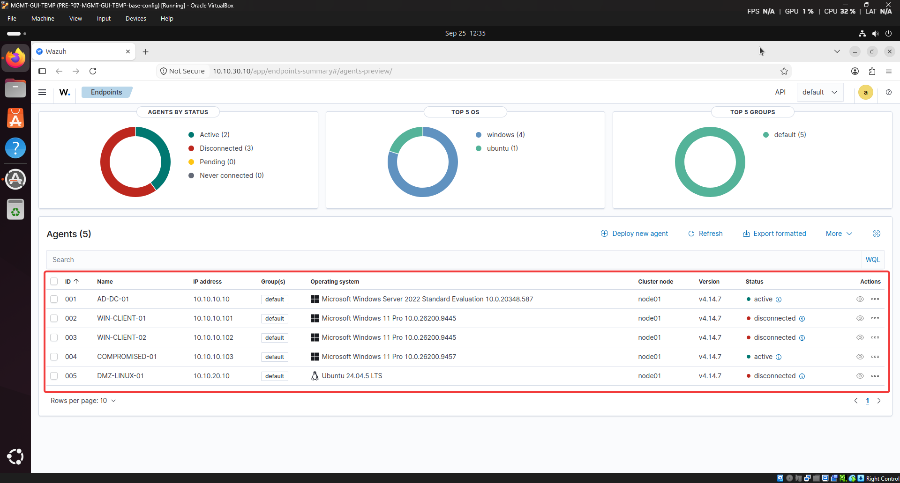
*Figure 1: Wazuh Endpoints Summary confirming Agent 001 (`AD-DC-01`) and Agent 004 (`COMPROMISED-01`) are active.*

### Step 2: Adversary Infrastructure Staging
On `EXT-ATTACKER-SIM` (Kali Linux), the HTTP credential-harvesting sink service was verified listening on TCP port 80.

```bash
sudo systemctl status attacker-http.service
```

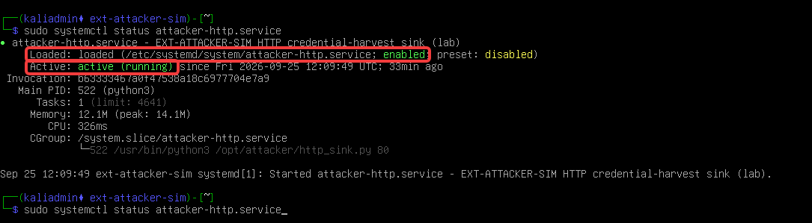
*Figure 2: `attacker-http.service` active and running on Kali Linux (`EXT-ATTACKER-SIM`).*

### Step 3: Homoglyph Phishing Lure Delivery & Header Analysis
The phishing lure was staged at `C:\PhishingDelivery\AGC-002-lookalike-domain.eml.txt` on the victim workstation. Header inspection revealed the homoglyph substitution:

```text
From: "HR Department" <hr@ashfordgr0ve.local>
To: michael.chen@ashfordgrove.local
Subject: Updated Employee Benefits Portal - Action Required
Date: Tue, 22 Sep 2026 09:00:00 +0000
MIME-Version: 1.0
Content-Type: text/plain; charset="utf-8"

Dear Michael,

Your benefits enrollment window closes this Friday.
Please review and confirm your selections at the link below:
http://10.10.40.10/portal-login

If you have questions, contact HR at hr@ashfordgr0ve.local.

Best regards,
Ashford Grove HR Team
```

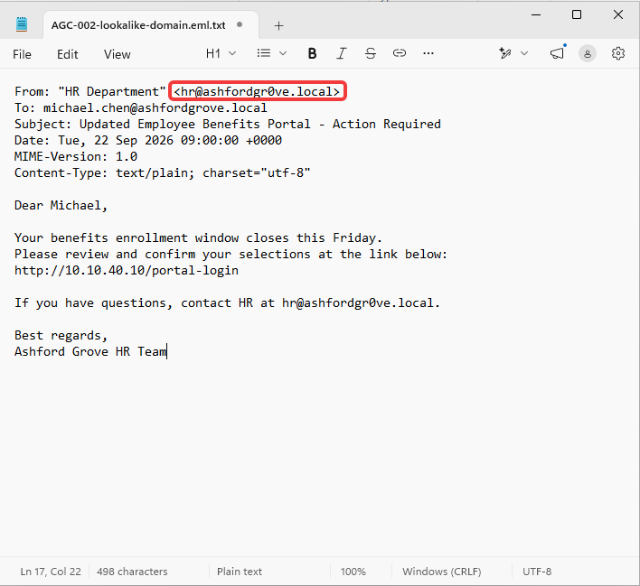
*Figure 3: Inspection of email headers highlighting the sender address `hr@ashfordgr0ve.local` with digit '0'.*

### Step 4: Endpoint DNS Query Simulation & Resolution Failure
To emulate operating system domain resolution when interacting with the sender address, a DNS resolution query was executed in PowerShell on `COMPROMISED-HOST-01`:

```powershell
Resolve-DnsName ashfordgr0ve.local
```

The internal DNS resolver correctly rejected the non-existent lookalike domain, returning `DNS name does not exist` (`DNS_ERROR_RCODE_NAME_ERROR` / Win32 `9003`).

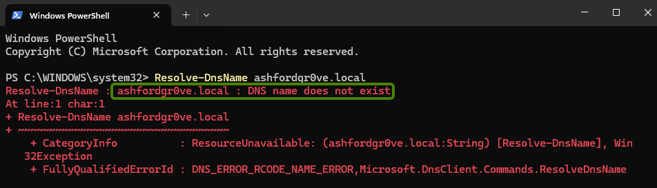
*Figure 4: PowerShell output demonstrating `NXDOMAIN` failure for `ashfordgr0ve.local`.*

### Step 5: Victim Interaction & Credential Submission
The victim opened Microsoft Edge and browsed to the benefits link `http://10.10.40.10/portal-login`. The deceptive Single Sign-On portal rendered, requesting corporate credentials.

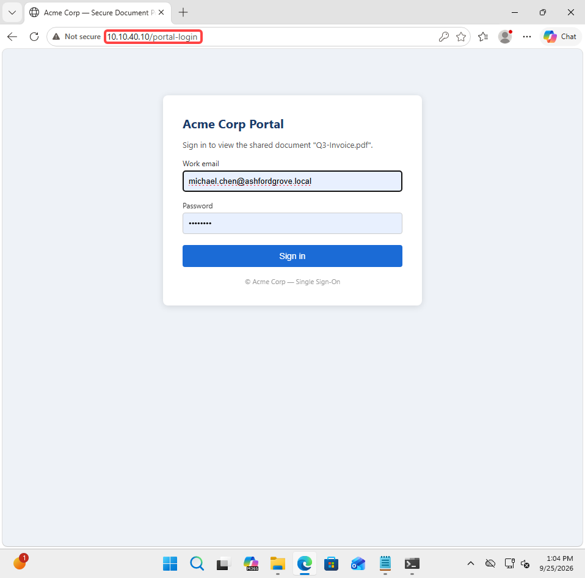
*Figure 5: Victim navigating to `http://10.10.40.10/portal-login` and entering domain credentials.*

Upon submission, the form transmitted a POST request to `10.10.40.10/login`, and the attacker sink confirmed harvest completion with *"Sign-in received. Redirecting..."*.

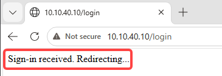
*Figure 6: Credential submission acknowledged by the attacker sink.*

---

## 4. SOC Investigation & Multi-Source Telemetry

### A. Endpoint Telemetry & Local Sysmon Audit
Auditing the local Sysmon operational event log on `COMPROMISED-HOST-01` via elevated PowerShell confirmed that the operating system captured the DNS lookup under **Event ID 22**:

```powershell
Get-WinEvent -LogName "Microsoft-Windows-Sysmon/Operational" -MaxEvents 50 | Where-Object { $_.Id -eq 22 }
```

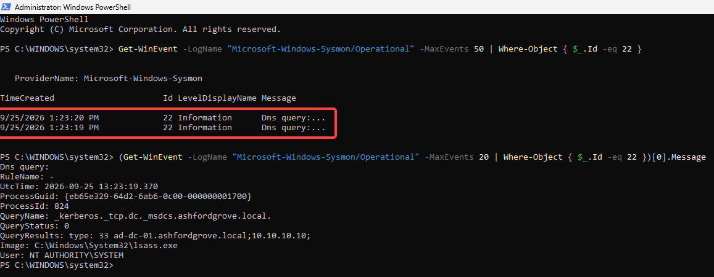
*Figure 7: Elevated PowerShell audit confirming local Sysmon Event ID 22 (DNS query) generation.*

---

### B. Detection Engineering: Wazuh Custom Rule Implementation
Default SIEM rulesets classify standard DNS queries at `Level 0` to prevent alert fatigue. To bridge this detection gap and alert on DNS queries originating from endpoints, custom rule `100022` was authored in `local_rules.xml` on `WAZUH-SIEM-01` via the web console:

```xml
<!-- AGC-002: Detect Sysmon Event ID 22 (DNS Query) -->
<rule id="100022" level="7">
  <if_sid>60000</if_sid>
  <field name="win.system.eventID">^22$</field>
  <description>Sysmon - Event 22: DNS query [$(win.eventdata.queryName)] Status: $(win.eventdata.queryStatus)</description>
  <mitre>
    <id>T1566.002</id>
  </mitre>
</rule>
```

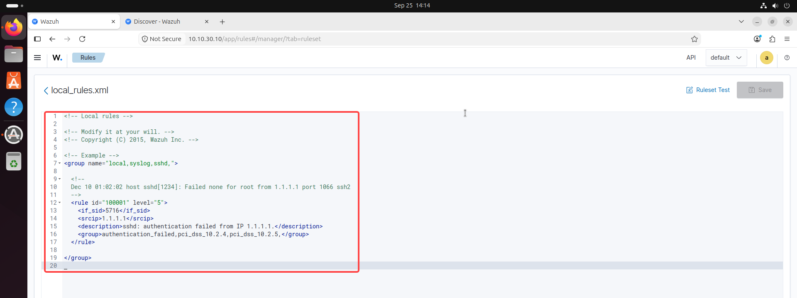
*Figure 8: Baseline inspection of `local_rules.xml` prior to detection engineering.*

The rule was saved and hot-reloaded across the manager cluster without service interruption.

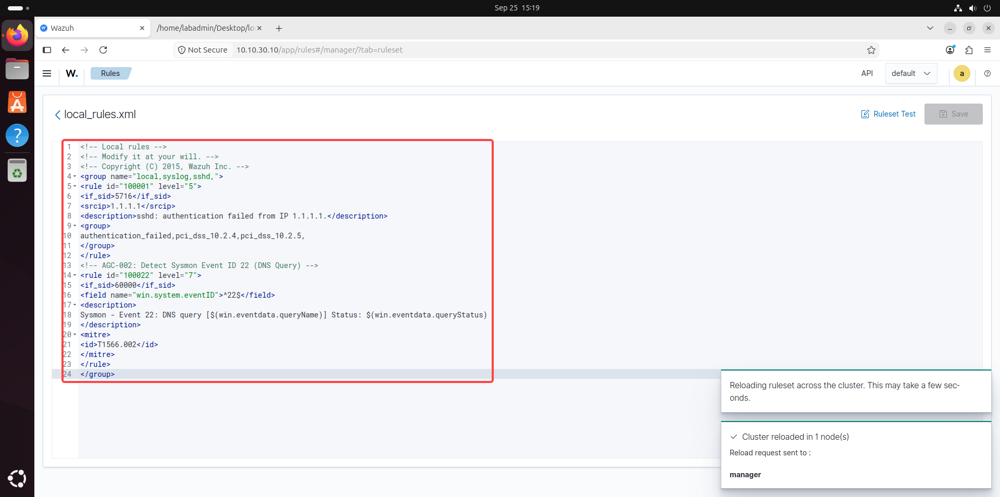
*Figure 9: Custom rule `100022` saved and cluster reloaded successfully.*

---

### C. Wazuh Endpoint Ingestion Analysis
In Wazuh Discover, auditing telemetry from Agent `004` (`COMPROMISED-01` — `10.10.10.103`) verified endpoint activity and browser telemetry.

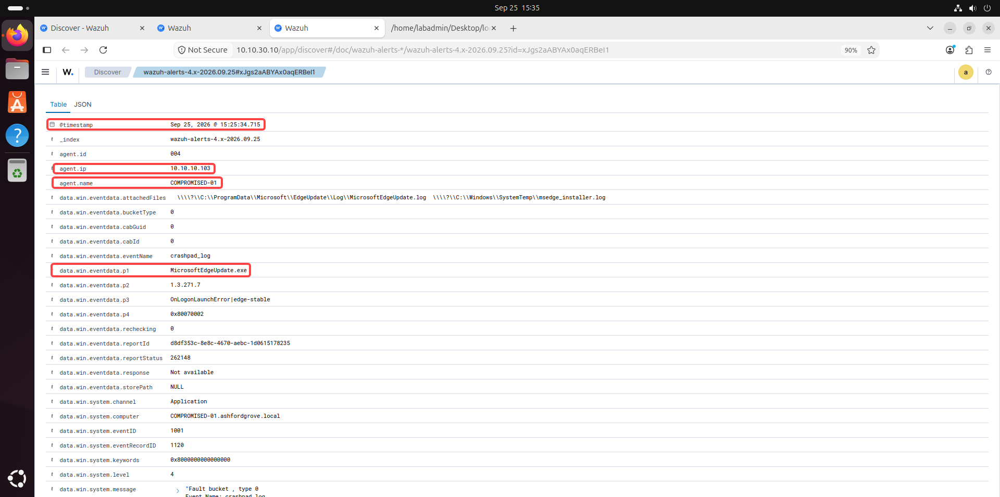
*Figure 10: Wazuh Discover showing endpoint activity and process execution on `COMPROMISED-01`.*

---

### D. Network Traffic Telemetry (Security Onion / Zeek HTTP)
In Security Onion Hunt (`10.10.30.20`), querying `source.ip: 10.10.10.103 and destination.ip: 10.10.40.10` isolated the full web transaction recorded by Zeek (`http.log`):

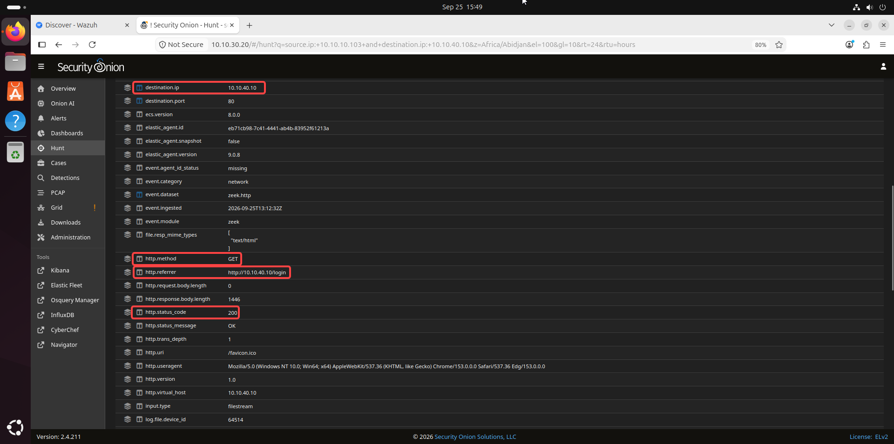
*Figure 11: Zeek HTTP log confirming `GET` request, referrer `http://10.10.40.10/login`, and status `200 OK`.*

* **Source Host:** `10.10.10.103`
* **Destination Host:** `10.10.40.10:80`
* **HTTP Method / Referrer:** `GET` | Referrer: `http://10.10.40.10/login`
* **HTTP Status Code:** `200 OK`

---

### E. Perimeter Firewall Analysis (OPNsense)
Inspection of `Firewall → Log Files` on `10.10.10.1` isolated the outbound entry flow on the `LAN (In)` interface.

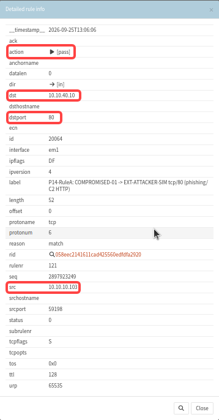
*Figure 12: OPNsense detailed rule info modal confirming permitted outbound traffic from `10.10.10.103` to `10.10.40.10:80`.*

* **Action:** `[pass]`
* **Interface / Direction:** `em1` (`LAN`) / `[in]`
* **Source Address:** `10.10.10.103`
* **Destination Address / Port:** `10.10.40.10:80`
* **Rule Label:** `P14-RuleA: COMPROMISED-01 -> EXT-ATTACKER-SIM tcp/80 (phishing/C2 HTTP)`

---

## 5. MITRE ATT&CK Mapping & Risk Matrix

| Tactic | Technique ID | Technique Name | Evidence Artifact | Risk / Severity |
|:---|:---|:---|:---|:---|
| **Resource Development (TA0042)** | `T1583.001` | Domains: Lookalike Domain | Email From header `hr@ashfordgr0ve.local` (homoglyph substitution) | **HIGH** |
| **Initial Access (TA0001)** | `T1566.002` | Spearphishing Link | Lure directing to `http://10.10.40.10/portal-login` | **HIGH** |
| **Command & Control (TA0011)** | `T1071.001` | Web Protocols (HTTP) | Zeek `http.log` GET / 200 OK & OPNsense LAN pass rule | **MEDIUM** |
| **Credential Access (TA0006)** | `T1056.003` | Web Portal Harvesting | Fake benefits portal submission (`10.10.40.10/login`) | **HIGH** |

---

## 6. Incident Response & Containment Plan (IR Playbook)

### Immediate Containment (SOP)
1. **DNS Sinkhole:** Create an authoritative Host Override in Unbound DNS redirecting `ashfordgr0ve.local` to loopback `0.0.0.0` to prevent any enterprise host from resolving this domain.
2. **Perimeter Firewall Block:** Enforce an egress drop rule on OPNsense targeting `10.10.40.10:ANY`.
3. **Identity Remediation:**
   * Force reset domain password for `michael.chen` on `AD-DC-01`.
   * Invalidate all active Kerberos TGTs and active VPN/cloud sessions.
   * Require immediate MFA re-authentication.
4. **Mail Gateway Sweep:** Query mail gateway logs for all emails originating from `*@ashfordgr0ve.local` or containing the string `ashfordgr0ve` to purge active lures from other user inboxes.

---

## 7. SOC L1 ➔ L2 Escalation Note

```ini
[TICKET HANDOVER: TIER 1 -> TIER 2]
Ticket ID       : INC-AGC-002
Severity / Pri  : HIGH (P2)
Triage Verdict  : True Positive (Homoglyph Phishing & Cred Harvest)
Assigned Analyst: Ali (TOOSHY2) | Shift UTC: 2026-09-25 15:49
Target Scope    : COMPROMISED-HOST-01 (10.10.10.103) \ michael.chen
Adversary IoC   : 10.10.40.10:80 | ashfordgr0ve.local

[INCIDENT SUMMARY]
Adversary executed homoglyph phishing ("HR Department" via
hr@ashfordgr0ve.local, swapping 'o' for '0'). Target user
queried lookalike domain (NXDOMAIN) and submitted corporate
credentials to harvesting portal at 10.10.40.10/portal-login.

[TRIAGE EVIDENCE]
• Email Artifact   : Raw .eml confirms homoglyph ashfordgr0ve.local.
• DNS Telemetry    : Sysmon EID 22 captured NXDOMAIN (status 9003).
• SIEM Detection   : Custom Wazuh rule 100022 authored for DNS monitoring.
• Perimeter Log    : OPNsense LAN pass confirms outbound TCP/80 flow.
• Network Telemetry: Zeek http.log confirms HTTP 200 GET & login POST.

[ACTION ITEMS FOR TIER 2]
[ ] Force AD password reset & revoke Kerberos TGT for michael.chen.
[ ] Instate DNS sinkhole (0.0.0.0) for ashfordgr0ve.local on Unbound.
[ ] Deploy perimeter drop rule for 10.10.40.10 on OPNsense.
[ ] Sweep mail server for additional recipients of ashfordgr0ve lures.
```
