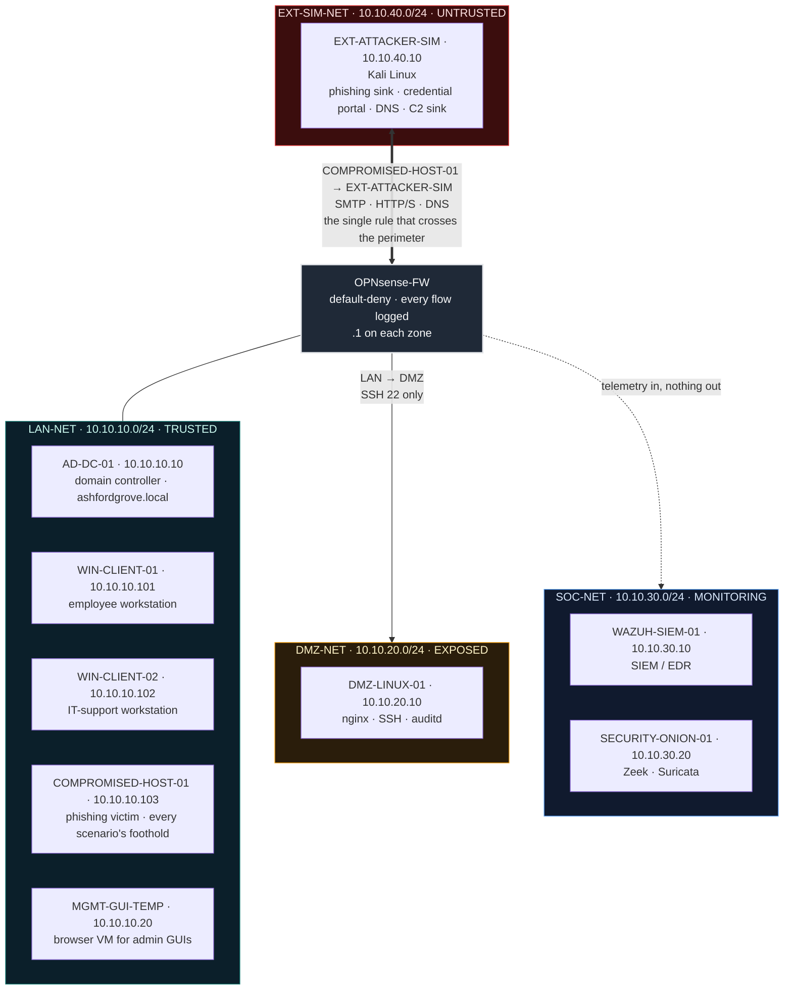

<h1 align="center">Ashford Grove Capital</h1>

<p align="center">
  <b>SOC L1 Detection &amp; Investigation Portfolio</b><br>
  <sub>One breach · one hundred cases · every verdict evidenced</sub>
</p>

<p align="center">
  
  
  
  
  
</p>

<p align="center">
  <a href="#the-premise">Premise</a> ·
  <a href="#what-sets-this-apart">What sets this apart</a> ·
  <a href="#how-to-read-this-repository">How to read this</a> ·
  <a href="#the-environment">Environment</a> ·
  <a href="#anatomy-of-a-scenario">Scenario anatomy</a> ·
  <a href="#scenario-catalog">Catalog</a> ·
  <a href="#results--coverage">Results</a> ·
  <a href="#analysis-principles">Principles</a> ·
  <a href="#methodology--disclosure">Methodology</a> ·
  <a href="#how-to-reproduce-this-lab">Reproduce</a> ·
  <a href="#repository-structure">Structure</a>
</p>

---

> **One hundred detection and investigation scenarios, worked end-to-end against a live open-source SOC lab, from a single phishing-led breach of a fictional financial firm. Each one is evidenced with raw telemetry, mapped to MITRE ATT&CK, and reasoned through the way an L1 analyst works a real case — including twenty where the work is judgment: clearing an alert as benign with evidence, hunting with no alert to start from, and recognising an insider who is technically authorised.**

<p align="center">
  <sub><b>TOOSHY2</b> · SOC Analysis · Detection &amp; Investigation</sub>
</p>

---

## The premise

**Ashford Grove Capital** is a fictional mid-size financial-services firm. It runs what most firms its size run: a Windows Active Directory domain, a handful of employee workstations, a public-facing web server in a DMZ, and a small security team watching it all from a monitoring segment.

On an ordinary Tuesday, an external attacker emails one of its employees. The employee clicks.

Everything after that click — the foothold, the persistence, the escalation, the credential harvest, the network mapping, the lateral movement, the call home, the staging, the exfiltration, and the final attempt to cover tracks and cause damage — is simulated inside an isolated lab, detected with production-grade open-source tooling, and then **investigated and written up as a hundred individual cases**.

This repository is those hundred cases. It is not a build guide and not a tool tutorial. **It is the analyst's side of a breach.**

---

## What sets this apart

Most public SOC labs demonstrate that a SIEM was installed and an alert fired. Three deliberate choices separate this one.

<table>
<tr>
<td width="33%" valign="top">

### The attacker starts outside

Most lab projects start with an attacker box already sitting inside the LAN. Here the attacker occupies its own isolated segment, reachable only through a single narrow, logged firewall rule — so *"how did they get in"* has a real answer, and every scenario inherits it.

</td>
<td width="33%" valign="top">

### Twenty scenarios test judgment

Eighty scenarios follow the attacker's lifecycle. The other twenty test what separates an analyst from an alert-reader: **ruling an alert a false positive** with evidence, **hunting with no alert to start from**, and recognising that the threat is sometimes a **legitimate, authenticated employee**. These demand the opposite posture — baseline deviation, not indicators of compromise.

</td>
<td width="33%" valign="top">

### Every verdict carries confidence

True Positive / False Positive / Benign / Escalated is only half a call. Every triage verdict is rated **Critical**, **High**, or **Medium** (hunts report a hypothesis outcome instead), because evidence that is conclusive and evidence that is merely a lead are different things — and a SOC that treats them the same drowns.

</td>
</tr>
</table>

---

## How to read this repository

Three readers want three different things from a portfolio. Pick the path that matches yours.

| If you want to… | Read it as | Start here |
|---|---|---|
| **Understand one incident deeply** | A narrative — one continuous breach across sequential scenarios, each linked to the step before and after | [`docs/02-attack-narrative.md`](docs/02-attack-narrative.md), then [AGC-001](scenarios/01-phishing/AGC-001-spoofed-display-name/README.md) and follow the `Chain` row |
| **Assess analytical skill quickly** | A skills sample — an end-to-end incident plus the judgment calls where the answer isn't obvious | [AGC-077](scenarios/13-full-attack-chain/AGC-077-full-chain-credential-to-ransomware/README.md) (full chain) · [AGC-085](scenarios/14-false-positive/AGC-085-offhours-service-account/README.md) (false positive) · [AGC-090](scenarios/15-threat-hunting/AGC-090-hunt-lolbin-parent-child/README.md) (hunt) |
| **Find a specific technique** | A reference — indexed by ID, category, verdict, and confidence | [`scenarios/00-index.md`](scenarios/00-index.md) |
| **See coverage at a glance** | A heatmap — every technique across the full ATT&CK matrix | [`attack-navigator-layer.json`](attack-navigator-layer.json) → import into [ATT&CK Navigator](https://mitre-attack.github.io/attack-navigator/) |

---

## The environment

Ten virtual machines across four network zones, each zone on its own dedicated firewall interface. The attacker is architecturally outside; the only way in is one logged rule.



| Zone | Contents | Trust posture |
|---|---|---|
| **LAN-NET** | Domain controller (`ashfordgrove.local`), two employee workstations, the phishing victim, a management browser VM | **Trusted** — the crown jewels |
| **DMZ-NET** | nginx web server with SSH and auditd | **Exposed** — reachable inward on SSH only, logged |
| **SOC-NET** | Wazuh (SIEM/EDR), Security Onion (Zeek + Suricata) | **Monitoring** — receives telemetry, initiates nothing outbound |
| **EXT-SIM-NET** | Kali attacker: phishing sink, credential-harvest portal, DNS responder, C2 sink | **Untrusted** — architecturally outside |

> Each zone sits behind its own dedicated firewall interface rather than a shared VLAN trunk. Shared trunks are common in real enterprises for cost reasons, but they open VLAN-hopping as an attack class; dedicated interfaces close it. Realism here means making the call a security-conscious firm would make, not copying every real-world shortcut.

<details>
<summary><b>Host inventory and firewall policy</b> — all ten VMs and the four rules that exist</summary>

<br>

| System | Zone | IP | Role |
|---|---|---|---|
| OPNsense-FW | perimeter | `.1` on each zone | Firewall/router — default-deny, every flow logged |
| AD-DC-01 | LAN-NET | 10.10.10.10 | Domain controller, `ashfordgrove.local` |
| WIN-CLIENT-01 | LAN-NET | 10.10.10.101 | Employee workstation |
| WIN-CLIENT-02 | LAN-NET | 10.10.10.102 | IT-support workstation |
| COMPROMISED-HOST-01 | LAN-NET | 10.10.10.103 | Phishing victim — every scenario's foothold |
| MGMT-GUI-TEMP | LAN-NET | 10.10.10.20 | Browser VM for admin GUIs |
| DMZ-LINUX-01 | DMZ-NET | 10.10.20.10 | nginx web server, SSH, auditd |
| WAZUH-SIEM-01 | SOC-NET | 10.10.30.10 | SIEM / EDR |
| SECURITY-ONION-01 | SOC-NET | 10.10.30.20 | Network security monitoring — Zeek + Suricata |
| EXT-ATTACKER-SIM | EXT-SIM-NET | 10.10.40.10 | Kali — phishing sink, credential portal, C2 sink |

| Firewall rule | Ports | Purpose |
|---|---|---|
| COMPROMISED-HOST-01 → EXT-ATTACKER-SIM | SMTP / HTTP / HTTPS / DNS | Phishing delivery, C2, exfiltration — the one path across the perimeter |
| LAN-NET → DMZ-LINUX-01 | SSH (22) | Lateral-movement pivot into the DMZ |
| LAN / DMZ → Internet (NAT) | HTTP / HTTPS / DNS | Package updates only |
| Any → SOC-NET | Agent and NSM ports only | Telemetry in, nothing out |

Everything else is denied and logged.

</details>

Full specification, including the box-drawing topology diagram: [`docs/01-architecture.md`](docs/01-architecture.md)

---

## Anatomy of a scenario

Every scenario is a single `README.md` with the same shape, so the hundredth reads like the first.

```
Disclosure                         who executed, documented, and reviewed this scenario (stated on every report)

Card                               ID · category · ATT&CK technique · verdict · confidence
                                   affected systems · time to detect · time to triage
                                   ◀ previous scenario  ·  next scenario ▶

Attacker Perspective
  ├── Tradecraft                   why this technique, at this point in the chain, and exactly
  │                                where it surfaces in this lab's telemetry
  │                                (Sysmon Event ID / Wazuh rule / Zeek–Suricata signature)
  └── Simulation                   the precise steps taken — reproducible from this alone

SOC Perspective
  ├── Detection                    what fired: alert ID, rule, raw log excerpt, timestamp
  │                                (threat hunts state the Hypothesis BEFORE the query)
  ├── Investigation                the reasoning trail — each check motivated by the last,
  │                                dead ends included, not just the path that worked
  ├── Report                       verdict + confidence + the evidence it rests on +
  │                                the response a real SOC would take
  └── MITRE Mapping                each technique tied to the specific field that evidences it

Evidence                           screenshot status for this scenario
```

The four full-chain incidents add an **attacker-vs-analyst timeline** (both sides against the same clock) and a **mock escalation** — the message an analyst would actually send a manager. Threat hunts have no attacker side and open with a hypothesis; false-positive cases replace tradecraft with a **discriminating-evidence** table against their malicious twin. Each variant is defined in the field guide.

Field-by-field guide: [`docs/03-scenario-template.md`](docs/03-scenario-template.md)

---

## Scenario catalog

| # | Category | Track | Scenarios |
|:--|---|---|--:|
| 01 | [Phishing & Initial Access](scenarios/01-phishing/) | Lifecycle | 10 |
| 02 | [Execution](scenarios/02-execution/) | Lifecycle | 8 |
| 03 | [Persistence](scenarios/03-persistence/) | Lifecycle | 6 |
| 04 | [Privilege Escalation](scenarios/04-privilege-escalation/) | Lifecycle | 6 |
| 05 | [Credential Access](scenarios/05-credential-access/) | Lifecycle | 6 |
| 06 | [Discovery](scenarios/06-discovery/) | Lifecycle | 6 |
| 07 | [Lateral Movement](scenarios/07-lateral-movement/) | Lifecycle | 8 |
| 08 | [Command & Control](scenarios/08-command-control/) | Lifecycle | 6 |
| 09 | [Collection](scenarios/09-collection/) | Lifecycle | 5 |
| 10 | [Exfiltration](scenarios/10-exfiltration/) | Lifecycle | 5 |
| 11 | [Defense Evasion](scenarios/11-defense-evasion/) | Lifecycle | 5 |
| 12 | [Impact & Recovery](scenarios/12-impact-recovery/) | Lifecycle | 5 |
| 13 | [Full Attack Chain](scenarios/13-full-attack-chain/) | **Capstone** | 4 |
| 14 | [False Positive Triage](scenarios/14-false-positive/) | **Judgment** | 8 |
| 15 | [Proactive Threat Hunting](scenarios/15-threat-hunting/) | **Judgment** | 6 |
| 16 | [Insider Threat](scenarios/16-insider-threat/) | **Judgment** | 6 |
| | **Total** | | **100** |

<details>
<summary><b>Full catalog</b> — all 100 scenarios with verdict and confidence, grouped by category</summary>

<!-- CATALOG:BEGIN -->

**01 · Phishing & Initial Access** — 10 scenarios

| ID | Scenario | Verdict | Confidence |
|---|---|---|:--:|
| `AGC-001` | [Spoofed Display-Name Phishing](scenarios/01-phishing/AGC-001-spoofed-display-name/README.md) | True Positive | High |
| `AGC-002` | [Lookalike-Domain Phishing](scenarios/01-phishing/AGC-002-lookalike-domain/README.md) | True Positive | High |
| `AGC-003` | [Credential-Harvesting Link Click](scenarios/01-phishing/AGC-003-credential-harvest-link/README.md) | True Positive | Critical |
| `AGC-004` | [QR-Code Phishing Indicator](scenarios/01-phishing/AGC-004-qr-code-phish/README.md) | True Positive | Medium |
| `AGC-005` | [URL-Shortener Redirect Chain](scenarios/01-phishing/AGC-005-url-shortener-redirect/README.md) | True Positive | High |
| `AGC-006` | [HTML Attachment Redirect Indicator](scenarios/01-phishing/AGC-006-html-attachment-redirect/README.md) | True Positive | High |
| `AGC-007` | [Macro Lure Document](scenarios/01-phishing/AGC-007-macro-lure-document/README.md) | True Positive | High |
| `AGC-008` | [Password-Reset Phishing Lure](scenarios/01-phishing/AGC-008-password-reset-lure/README.md) | True Positive | Critical |
| `AGC-009` | [OAuth-Consent Phishing Review](scenarios/01-phishing/AGC-009-oauth-consent-phish/README.md) | True Positive (conceptual) | Medium |
| `AGC-010` | [User-Reported Phishing Triage & Containment](scenarios/01-phishing/AGC-010-user-reported-triage/README.md) | Triage Complete | High |

**02 · Execution** — 8 scenarios

| ID | Scenario | Verdict | Confidence |
|---|---|---|:--:|
| `AGC-011` | [Browser Spawns a Script Interpreter](scenarios/02-execution/AGC-011-browser-spawns-script/README.md) | True Positive | High |
| `AGC-012` | [Office Application Spawns PowerShell](scenarios/02-execution/AGC-012-office-spawns-powershell/README.md) | True Positive | Critical |
| `AGC-013` | [Encoded PowerShell Command](scenarios/02-execution/AGC-013-encoded-powershell/README.md) | True Positive | High |
| `AGC-014` | [Executable Launched From a Temp Directory](scenarios/02-execution/AGC-014-executable-from-temp/README.md) | True Positive | Medium |
| `AGC-015` | [Signed Binary Proxy Execution (rundll32)](scenarios/02-execution/AGC-015-signed-binary-proxy/README.md) | True Positive | High |
| `AGC-016` | [WMI-Based Local Process Creation](scenarios/02-execution/AGC-016-wmi-process-creation/README.md) | True Positive | High |
| `AGC-017` | [Task-Triggered Suspicious Execution](scenarios/02-execution/AGC-017-task-triggered-execution/README.md) | True Positive | High |
| `AGC-018` | [EICAR Safe Detection Test](scenarios/02-execution/AGC-018-eicar-detection-test/README.md) | Pipeline Pass | High |

**03 · Persistence** — 6 scenarios

| ID | Scenario | Verdict | Confidence |
|---|---|---|:--:|
| `AGC-019` | [Registry Run-Key Persistence](scenarios/03-persistence/AGC-019-registry-run-key/README.md) | True Positive | High |
| `AGC-020` | [Scheduled-Task Persistence](scenarios/03-persistence/AGC-020-scheduled-task/README.md) | True Positive | High |
| `AGC-021` | [New Auto-Start Service Persistence](scenarios/03-persistence/AGC-021-new-autostart-service/README.md) | True Positive | Critical |
| `AGC-022` | [WMI Event-Subscription Persistence](scenarios/03-persistence/AGC-022-wmi-event-subscription/README.md) | True Positive | High |
| `AGC-023` | [New Local Administrator Account](scenarios/03-persistence/AGC-023-new-local-admin/README.md) | True Positive | High |
| `AGC-024` | [Malicious Browser-Extension Persistence](scenarios/03-persistence/AGC-024-browser-extension/README.md) | True Positive | Medium |

**04 · Privilege Escalation** — 6 scenarios

| ID | Scenario | Verdict | Confidence |
|---|---|---|:--:|
| `AGC-025` | [Existing Account Added to Privileged Group](scenarios/04-privilege-escalation/AGC-025-privileged-group-add/README.md) | True Positive | High |
| `AGC-026` | [UAC-Bypass Behavior (fodhelper)](scenarios/04-privilege-escalation/AGC-026-uac-bypass-behavior/README.md) | True Positive | Critical |
| `AGC-027` | [Service Misconfiguration (Unquoted Service Path)](scenarios/04-privilege-escalation/AGC-027-service-misconfig/README.md) | True Positive | High |
| `AGC-028` | [DLL Search-Order Hijacking](scenarios/04-privilege-escalation/AGC-028-dll-search-order-hijack/README.md) | True Positive | High |
| `AGC-029` | [Suspicious sudo Usage (GTFOBins Escape)](scenarios/04-privilege-escalation/AGC-029-suspicious-sudo-linux/README.md) | True Positive | High |
| `AGC-030` | [Domain Admin Logon on a Workstation](scenarios/04-privilege-escalation/AGC-030-domain-admin-logon-workstation/README.md) | True Positive | Critical |

**05 · Credential Access** — 6 scenarios

| ID | Scenario | Verdict | Confidence |
|---|---|---|:--:|
| `AGC-031` | [LSASS Memory Access](scenarios/05-credential-access/AGC-031-lsass-access/README.md) | True Positive | High |
| `AGC-032` | [SAM / SECURITY Hive Extraction](scenarios/05-credential-access/AGC-032-sam-security-hive/README.md) | True Positive | Critical |
| `AGC-033` | [Browser Credential-Store Access](scenarios/05-credential-access/AGC-033-browser-credential-store/README.md) | True Positive | High |
| `AGC-034` | [Kerberos Ticket Enumeration / Export](scenarios/05-credential-access/AGC-034-kerberos-ticket-export/README.md) | True Positive (Probable) | Medium |
| `AGC-035` | [Password Spray](scenarios/05-credential-access/AGC-035-password-spray/README.md) | True Positive | High |
| `AGC-036` | [NTLM Authentication Anomaly](scenarios/05-credential-access/AGC-036-ntlm-auth-anomaly/README.md) | True Positive (Probable) | Medium |

**06 · Discovery** — 6 scenarios

| ID | Scenario | Verdict | Confidence |
|---|---|---|:--:|
| `AGC-037` | [System and User Discovery Burst](scenarios/06-discovery/AGC-037-system-user-discovery/README.md) | True Positive | Medium |
| `AGC-038` | [Domain Trust Discovery](scenarios/06-discovery/AGC-038-domain-trust-discovery/README.md) | True Positive | High |
| `AGC-039` | [Privileged Group Enumeration](scenarios/06-discovery/AGC-039-group-enumeration/README.md) | True Positive | High |
| `AGC-040` | [Service and Process Discovery](scenarios/06-discovery/AGC-040-service-process-discovery/README.md) | True Positive | Medium |
| `AGC-041` | [Network Share Enumeration Sweep](scenarios/06-discovery/AGC-041-network-share-enum/README.md) | True Positive | Medium |
| `AGC-042` | [AD Object Query Burst](scenarios/06-discovery/AGC-042-ad-object-query-burst/README.md) | True Positive | High |

**07 · Lateral Movement** — 8 scenarios

| ID | Scenario | Verdict | Confidence |
|---|---|---|:--:|
| `AGC-043` | [Unusual RDP Logon (Workstation-to-Workstation)](scenarios/07-lateral-movement/AGC-043-unusual-rdp-logon/README.md) | True Positive | High |
| `AGC-044` | [SMB Admin-Share Access (C$)](scenarios/07-lateral-movement/AGC-044-smb-admin-share/README.md) | True Positive | High |
| `AGC-045` | [WinRM Lateral Movement](scenarios/07-lateral-movement/AGC-045-winrm-movement/README.md) | True Positive | High |
| `AGC-046` | [Remote WMI Execution](scenarios/07-lateral-movement/AGC-046-remote-wmi-execution/README.md) | True Positive | High |
| `AGC-047` | [Pass-the-Hash](scenarios/07-lateral-movement/AGC-047-pass-the-hash/README.md) | True Positive | High |
| `AGC-048` | [SSH Pivot LAN to DMZ](scenarios/07-lateral-movement/AGC-048-ssh-pivot-to-dmz/README.md) | True Positive | High |
| `AGC-049` | [One Account Authenticating to Many Hosts](scenarios/07-lateral-movement/AGC-049-account-multi-host-auth/README.md) | True Positive | Critical |
| `AGC-050` | [East-West Internal Port Scan](scenarios/07-lateral-movement/AGC-050-east-west-port-scan/README.md) | True Positive | High |

**08 · Command & Control** — 6 scenarios

| ID | Scenario | Verdict | Confidence |
|---|---|---|:--:|
| `AGC-051` | [HTTPS Beacon (Periodic C2)](scenarios/08-command-control/AGC-051-https-beacon/README.md) | True Positive | High |
| `AGC-052` | [DNS Beacon (High-Entropy Subdomains)](scenarios/08-command-control/AGC-052-dns-beacon/README.md) | True Positive | High |
| `AGC-053` | [Uncommon-Port C2](scenarios/08-command-control/AGC-053-uncommon-port-c2/README.md) | True Positive | High |
| `AGC-054` | [Rare / First-Seen Destination Domain](scenarios/08-command-control/AGC-054-rare-destination-domain/README.md) | True Positive (conditional) | Medium |
| `AGC-055` | [PowerShell Outbound Connection](scenarios/08-command-control/AGC-055-powershell-outbound/README.md) | True Positive | High |
| `AGC-056` | [Full C2 Process Tree (mshta -> PowerShell -> beacon)](scenarios/08-command-control/AGC-056-c2-process-tree/README.md) | True Positive | Critical |

**09 · Collection** — 5 scenarios

| ID | Scenario | Verdict | Confidence |
|---|---|---|:--:|
| `AGC-057` | [Bulk Archive Creation (Staging for Exfiltration)](scenarios/09-collection/AGC-057-bulk-archive-creation/README.md) | True Positive | High |
| `AGC-058` | [Screenshot Collection (Regular Interval)](scenarios/09-collection/AGC-058-screenshot-collection/README.md) | True Positive | High |
| `AGC-059` | [Browser Data Staging (Cookies / History / Web Data)](scenarios/09-collection/AGC-059-browser-data-staging/README.md) | True Positive | Critical |
| `AGC-060` | [Sensitive-Share Access Burst](scenarios/09-collection/AGC-060-sensitive-share-burst/README.md) | True Positive | Medium |
| `AGC-061` | [AD Export Collection (Query + Staged CSV)](scenarios/09-collection/AGC-061-ad-export-collection/README.md) | True Positive | High |

**10 · Exfiltration** — 5 scenarios

| ID | Scenario | Verdict | Confidence |
|---|---|---|:--:|
| `AGC-062` | [Large HTTPS Upload (Data Theft)](scenarios/10-exfiltration/AGC-062-large-https-upload/README.md) | True Positive | Critical |
| `AGC-063` | [DNS Tunneling Exfiltration](scenarios/10-exfiltration/AGC-063-dns-tunneling/README.md) | True Positive | Critical |
| `AGC-064` | [Removable-Media Exfiltration (USB)](scenarios/10-exfiltration/AGC-064-removable-media-exfil/README.md) | True Positive | High |
| `AGC-065` | [Unusual Internal SMB Transfer](scenarios/10-exfiltration/AGC-065-unusual-smb-transfer/README.md) | True Positive | High |
| `AGC-066` | [Compressed Archive + Web Upload](scenarios/10-exfiltration/AGC-066-compressed-archive-web/README.md) | True Positive | Critical |

**11 · Defense Evasion** — 5 scenarios

| ID | Scenario | Verdict | Confidence |
|---|---|---|:--:|
| `AGC-067` | [Security Event-Log Clearing](scenarios/11-defense-evasion/AGC-067-event-log-clearing/README.md) | True Positive | Critical |
| `AGC-068` | [Windows Defender Real-Time Protection Disabled](scenarios/11-defense-evasion/AGC-068-defender-disabled/README.md) | True Positive | Critical |
| `AGC-069` | [Wazuh Agent Tampering (Silenced Telemetry)](scenarios/11-defense-evasion/AGC-069-wazuh-agent-tamper/README.md) | True Positive | Critical |
| `AGC-070` | [Staged-Artifact Deletion (Cleanup)](scenarios/11-defense-evasion/AGC-070-staged-artifact-deletion/README.md) | True Positive | High |
| `AGC-071` | [Obfuscated Command Line (Non-Encoded)](scenarios/11-defense-evasion/AGC-071-obfuscated-command-line/README.md) | True Positive | Medium |

**12 · Impact & Recovery** — 5 scenarios

| ID | Scenario | Verdict | Confidence |
|---|---|---|:--:|
| `AGC-072` | [Ransomware Simulation (Safe XOR + Rename)](scenarios/12-impact-recovery/AGC-072-ransomware-simulation/README.md) | True Positive | Critical |
| `AGC-073` | [Critical Service Disruption](scenarios/12-impact-recovery/AGC-073-critical-service-disruption/README.md) | True Positive | High |
| `AGC-074` | [Controlled DMZ Website Defacement](scenarios/12-impact-recovery/AGC-074-dmz-website-defacement/README.md) | True Positive | Critical |
| `AGC-075` | [High-Impact Group Policy Change](scenarios/12-impact-recovery/AGC-075-high-impact-gpo-change/README.md) | True Positive | Critical |
| `AGC-076` | [Containment, Snapshot Recovery & Validation](scenarios/12-impact-recovery/AGC-076-containment-recovery/README.md) | Recovery Complete | High |

**13 · Full Attack Chain** — 4 scenarios

| ID | Scenario | Verdict | Confidence |
|---|---|---|:--:|
| `AGC-077` | [Full Attack Chain: Credential Harvest to Ransomware](scenarios/13-full-attack-chain/AGC-077-full-chain-credential-to-ransomware/README.md) | True Positive | Critical |
| `AGC-078` | [Full Attack Chain: Trusted Access to GPO Impact](scenarios/13-full-attack-chain/AGC-078-full-chain-trusted-access-to-gpo-impact/README.md) | True Positive | Critical |
| `AGC-079` | [Full Attack Chain: DMZ Pivot to External Defacement](scenarios/13-full-attack-chain/AGC-079-full-chain-dmz-pivot-to-defacement/README.md) | True Positive | High |
| `AGC-080` | [Full Attack Chain: Discovery to Service Disruption](scenarios/13-full-attack-chain/AGC-080-full-chain-discovery-to-service-disruption/README.md) | True Positive | High |

**14 · False Positive Triage** — 8 scenarios

| ID | Scenario | Verdict | Confidence |
|---|---|---|:--:|
| `AGC-081` | [Encoded PowerShell: Legitimate Scheduled Backup (False Positive)](scenarios/14-false-positive/AGC-081-encoded-ps-backup/README.md) | False Positive / Benign | High |
| `AGC-082` | [New Local Admin Account: Matches IT Onboarding Ticket (False Positive)](scenarios/14-false-positive/AGC-082-new-admin-change-ticket/README.md) | False Positive / Benign | High |
| `AGC-083` | [LSASS Access: Caused by AV/EDR Self-Scan (False Positive)](scenarios/14-false-positive/AGC-083-lsass-av-selfscan/README.md) | False Positive / Benign | High |
| `AGC-084` | [DNS Beacon Pattern: Legitimate SaaS Update Checker (False Positive)](scenarios/14-false-positive/AGC-084-dns-beacon-saas/README.md) | False Positive / Benign | High |
| `AGC-085` | [Off-Hours Logon: Scheduled Task Under Service Account (False Positive)](scenarios/14-false-positive/AGC-085-offhours-service-account/README.md) | False Positive / Benign | High |
| `AGC-086` | [Large HTTPS Upload: Legitimate Regulatory Data Submission (False Positive)](scenarios/14-false-positive/AGC-086-regulatory-submission/README.md) | False Positive / Benign | High |
| `AGC-087` | [Internal Port Scan: Scheduled Vulnerability Scanner (False Positive)](scenarios/14-false-positive/AGC-087-portscan-vuln-scanner/README.md) | False Positive / Benign | High |
| `AGC-088` | [Security Log Clearing: Legitimate Retention Policy (False Positive)](scenarios/14-false-positive/AGC-088-log-clearing-retention/README.md) | False Positive / Benign | High |

**15 · Proactive Threat Hunting** — 6 scenarios

| ID | Scenario | Verdict | Confidence |
|---|---|---|:--:|
| `AGC-089` | [Proactive Hunt: WMI Event-Subscription Persistence](scenarios/15-threat-hunting/AGC-089-hunt-wmi-persistence/README.md) | Hypothesis Confirmed (Benign) | — |
| `AGC-090` | [Proactive Hunt: Rare Parent-Child Process Relationships (LOLBins)](scenarios/15-threat-hunting/AGC-090-hunt-lolbin-parent-child/README.md) | Hypothesis Confirmed (Residual Scenario Artifacts) | — |
| `AGC-091` | [Proactive Hunt: Beaconing Pattern via Connection Statistics](scenarios/15-threat-hunting/AGC-091-hunt-beacon-statistics/README.md) | Hypothesis Refuted (No Active Beaconing Detected) | — |
| `AGC-092` | [Proactive Hunt: Abnormal Domain-Wide Logon-Time Patterns](scenarios/15-threat-hunting/AGC-092-hunt-logon-time-patterns/README.md) | Hypothesis Refuted (Insufficient Baseline Data) | — |
| `AGC-093` | [Proactive Hunt: DNS Query Volume and Subdomain Entropy](scenarios/15-threat-hunting/AGC-093-hunt-dns-entropy/README.md) | Hypothesis Refuted (Insufficient DNS Log Access) | — |
| `AGC-094` | [Proactive Hunt: Scheduled Tasks Created Outside Change Windows](scenarios/15-threat-hunting/AGC-094-hunt-offhours-scheduled-tasks/README.md) | Hypothesis Confirmed (Residual Scenario Artifacts) | — |

**16 · Insider Threat** — 6 scenarios

| ID | Scenario | Verdict | Confidence |
|---|---|---|:--:|
| `AGC-095` | [Employee Accesses HR/Finance Share Outside Their Role](scenarios/16-insider-threat/AGC-095-unusual-file-access/README.md) | Confirmed Policy Violation — Escalate to Manager/HR | High |
| `AGC-096` | [Bulk Document Download Before Resignation](scenarios/16-insider-threat/AGC-096-bulk-download-resignation/README.md) | Confirmed Anomaly — Coordinate Security/HR/Legal | High |
| `AGC-097` | [Personal Cloud Upload: Policy Violation](scenarios/16-insider-threat/AGC-097-personal-cloud-upload/README.md) | Confirmed Policy Violation | High |
| `AGC-098` | [Service Account Used for Interactive Logon](scenarios/16-insider-threat/AGC-098-service-account-interactive/README.md) | Confirmed Policy Violation — Identify Human Operator | High |
| `AGC-099` | [After-Hours Access With No Ticket or Approval](scenarios/16-insider-threat/AGC-099-afterhours-no-ticket/README.md) | Confirmed Anomaly — Contact Employee/Manager | Medium |
| `AGC-100` | [Access Attempt to Resource After Permission Revocation](scenarios/16-insider-threat/AGC-100-revoked-resource-access/README.md) | Access Control Working — Single Explainable Attempt | High |
<!-- CATALOG:END -->

</details>

Same data as a single flat table: [`scenarios/00-index.md`](scenarios/00-index.md)

---

## Results & coverage

<table>
<tr>
<td align="center" width="25%"><h3>100</h3><sub>scenarios executed<br>and documented</sub></td>
<td align="center" width="25%"><h3>85</h3><sub>ATT&amp;CK technique–tactic pairs<br>(78 distinct techniques)</sub></td>
<td align="center" width="25%"><h3>12 / 12</h3><sub>ATT&amp;CK tactics<br>evidenced</sub></td>
<td align="center" width="25%"><h3>20</h3><sub>judgment-track cases<br>(FP · hunt · insider)</sub></td>
</tr>
</table>

Every scenario was run against live VirtualBox lab infrastructure — Wazuh SIEM/EDR, Security Onion NSM, Sysmon endpoint telemetry — with the detection evidence captured from the actual event logs and quoted in the report.

| Track | Categories | Scenarios | Outcomes |
|---|---|--:|---|
| **Lifecycle** | 12 (Phishing → Impact & Recovery) | 76 | 69 True Positive · 4 True Positive, qualified (probable / conceptual / conditional) · 1 Pipeline Pass · 1 Triage Complete · 1 Recovery Complete |
| **Capstone** | 1 (Full Attack Chain) | 4 | 4 True Positive, multi-phase |
| **Judgment** | 3 (FP · Hunting · Insider) | 20 | 8 False Positive / Benign · 3 hunts confirmed, 3 refuted for lack of data · 5 confirmed insider violations · 1 access control working |
| **Confidence** | | 100 | **21 Critical · 60 High · 13 Medium** · 6 hunts report a hypothesis outcome rather than a confidence level |

**Master heatmap:** [`attack-navigator-layer.json`](attack-navigator-layer.json) (identical copy at [`MITRE-Mapping/layers/master-coverage.json`](MITRE-Mapping/layers/master-coverage.json)) — import into [ATT&CK Navigator](https://mitre-attack.github.io/attack-navigator/).
**Per-scenario layers:** [`MITRE-Mapping/layers/`](MITRE-Mapping/layers/) — 99 layers, one per scenario except AGC-076 (recovery closure, no technique); six of them carry no technique because the scenario is a pipeline test or a policy-based insider case.

<details>
<summary><b>Progress</b> — both phases, real counts</summary>

<br>

| Phase | What it is | Progress |
|---|---|:--|
| **Phase one — directed reference pass** | All 100 scenarios executed and documented by Claude Code under Hasan's direction, each report reviewed before publication and carrying its disclosure line | `██████████` 100 / 100 |
| **Phase two — hand-executed track** | Each scenario re-run by hand, independently, with its own data, methods, and screenshot evidence; the disclosure line is updated when that lands | `░░░░░░░░░░` 0 / 100 |

Phase-two progress is counted from scenario reports whose disclosure line records a hand-executed run — never from intent. See [Methodology & disclosure](#methodology--disclosure).

</details>

<details>
<summary><b>Techniques by category</b> — all 16 categories</summary>

<br>

| # | Category | Count | Key techniques |
|:--|---|--:|---|
| 01 | Phishing & Initial Access | 10 | T1566.001, T1566.002 |
| 02 | Execution | 8 | T1059.001, T1059.003, T1047, T1204.002, T1218.005 |
| 03 | Persistence | 6 | T1547.001, T1053.005, T1543.003, T1546.003, T1136.001 |
| 04 | Privilege Escalation | 6 | T1548.002, T1548.003, T1078.002, T1098, T1574.001 |
| 05 | Credential Access | 6 | T1003.001, T1003.002, T1555.003, T1110.003, T1557.001 |
| 06 | Discovery | 6 | T1082, T1033, T1016, T1069, T1135, T1482 |
| 07 | Lateral Movement | 8 | T1021.001 / .002 / .004 / .006, T1550.002, T1046 |
| 08 | Command & Control | 6 | T1071.001, T1071.004, T1571, T1573 |
| 09 | Collection | 5 | T1560.001, T1113, T1074.001, T1039 |
| 10 | Exfiltration | 5 | T1041, T1048.003, T1052.001, T1567.002 |
| 11 | Defense Evasion | 5 | T1070.001, T1562.001, T1070.004, T1027.010 |
| 12 | Impact & Recovery | 5 | T1486, T1489, T1491.002, T1484.001 |
| 13 | Full Attack Chain | 4 | Multi-technique chains, 8–14 techniques each |
| 14 | False Positive Triage | 8 | Same techniques as their malicious twins, benign context |
| 15 | Proactive Threat Hunting | 6 | T1546.003, T1218, T1071, T1078, T1053.005 |
| 16 | Insider Threat | 6 | T1567.002 (one scenario); five are baseline-deviation only |

</details>

<details>
<summary><b>Detection stack performance</b> — what each source actually contributed</summary>

<br>

| Source | Events captured | Role |
|---|---|---|
| Sysmon (SwiftOnSecurity config) | EID 1, 11, 13, 19–22 | Primary host telemetry |
| Windows Security Log | EID 4624, 4625, 4698, 4732, 1102 | Authentication and audit |
| Windows Defender | Real-time detection, Tamper Protection | Endpoint protection |
| journalctl / auditd (Linux) | sudo, SSH, service events | Linux host telemetry |

</details>

<details>
<summary><b>Lab constraints encountered</b> — documented, not hidden</summary>

<br>

- Security Onion network telemetry inaccessible (no Guest Additions)
- Wazuh indexer API offline (port 9200 refused)
- Domain trust broken on COMPROMISED-HOST-01 (NTLM-only authentication)
- Sysmon EID 7 (Image Loaded) and EID 10 (ProcessAccess) disabled in config
- Admin shares (`C$`) blocked between lab endpoints
- DMZ-LINUX-01 Guest Additions at RunLevel 0

Each constraint is recorded in the affected scenario's Investigation section, with the workaround used and its effect on detection fidelity. Three threat hunts (AGC-091 – AGC-093) end with the hypothesis refuted for lack of data rather than a manufactured finding.

</details>

---

## Analysis principles

Five rules govern every scenario here.

**1 · Evidence, or it didn't happen.**
No scenario is marked complete on a description of a finding. Every claim rests on an artefact — a raw log excerpt, an event ID with its field values, an alert ID. Phase one produced text evidence only; when phase two adds screenshots, each one carries a caption saying what to look at, because an uncaptioned image asks the reader to do the analyst's job.

**2 · The reasoning is the deliverable.**
Anyone can paste a query result. The Investigation section records what was checked, in what order, and *why* — each step motivated by the ambiguity in the previous one. Dead ends stay in: a check that came back clean and ruled something out is part of the reasoning, not a failure to hide.

**3 · Confidence is part of the verdict.**
*Critical* means near-zero false-positive rate on definitive evidence. *High* means strong evidence with a small chance of an alternate explanation. *Medium* means a hunting lead — correlated, not conclusive alone.

**4 · Correlation over single events.**
The strongest calls chain evidence across sources — a host event that only becomes meaningful next to a network observation. Where one source alone was insufficient to reach the verdict, the scenario says so.

**5 · A false positive is a finding, not a failure.**
When triage proves an alert benign, the discriminating evidence is stated plainly — the specific fact that separates this from the real attack it resembles — and any resulting rule change goes in the [detection tuning log](docs/04-detection-tuning-log.md). Correctly clearing an alert and improving the rule behind it is analyst work, not wasted work.

---

## Methodology & disclosure

This lab's architecture, the 100-scenario curriculum, and every investigative judgment call in it were designed and directed by Hasan. Claude Code (Anthropic's agentic coding tool) was used as the execution and documentation engine — running the simulations, capturing the evidence, and drafting each report under that direction, with every report reviewed and audited before publication. A fully hand-executed version of each scenario, built independently, is in progress as a parallel skill-building track.

**What that means in practice.**

- Every scenario report opens with the same one-line disclosure — *Executed & documented by Claude Code under direction and review by Hasan.* — and each scenario's ATT&CK Navigator layer carries the same line in its description.
- Execution ran through VirtualBox Guest Control against the live lab, which is why the reference-pass evidence is text (command output, event fields, alert records) rather than screenshots.
- The hand-executed track re-runs each scenario independently — its own data and methods, screenshot evidence, and an updated disclosure line — at 1–2 scenarios per weekday. The [Progress](#results--coverage) table counts only scenarios where that has landed.

**Why say all this.**
A portfolio that is transparent about its process reads as more serious, not less. The direction, the curriculum, the review, and the judgment calls are the analyst's work; the tooling that ran the commands is disclosed rather than hidden, and the git history shows both layers against the same scenario IDs.

<!-- Update note for when the hand-executed track completes: change "is in
progress" to "is complete", set the Progress table to 100 / 100, and consider
adding the completion date. -->

---

## How to reproduce this lab

[`docs/01-architecture.md`](docs/01-architecture.md) is the specification — zones, addresses, hosts, and the complete firewall policy. This is the build order that follows from it.

1. **Networks.** In VirtualBox, create four internal networks — `LAN-NET`, `DMZ-NET`, `SOC-NET`, `EXT-SIM-NET` — each on its own subnet as listed in the architecture doc. No shared trunk.
2. **Firewall.** Build OPNsense-FW with one interface per zone (`.1` on each), plus a NAT uplink. Set the default policy to deny and enable logging on every rule. Add only the four rules in the [host inventory](#the-environment) above; the rule from COMPROMISED-HOST-01 to EXT-ATTACKER-SIM on SMTP / HTTP / HTTPS / DNS is the sole path across the perimeter.
3. **LAN.** Windows Server 2022 as AD-DC-01, promoted to the `ashfordgrove.local` forest. Windows 11 Pro for WIN-CLIENT-01, WIN-CLIENT-02, COMPROMISED-HOST-01, and MGMT-GUI-TEMP, all domain-joined. Install Sysmon with the SwiftOnSecurity configuration on every Windows host.
4. **DMZ.** Ubuntu 24.04 LTS as DMZ-LINUX-01 running nginx, OpenSSH, and auditd.
5. **SOC.** Wazuh manager on WAZUH-SIEM-01 with agents on every Windows and Linux host; Security Onion on SECURITY-ONION-01 with a monitoring interface mirrored from the zones you want Zeek and Suricata to see. Confirm agents report as active before running anything.
6. **Attacker.** Kali Linux as EXT-ATTACKER-SIM hosting the phishing sink, credential-harvest portal, DNS responder, and C2 sink the scenarios point at (`10.10.40.10`).
7. **Snapshot everything.** Take a clean baseline snapshot of every VM before the first scenario. Each scenario's Simulation section names its pre-conditions and cleanup so the environment can be restored between runs.
8. **Run a scenario.** Copy the matching skeleton from [`docs/templates/`](docs/templates/), follow the target scenario's Simulation section step by step, and write up each section in the order an incident unfolds — tradecraft, simulation, detection, investigation, report, MITRE mapping.

The scenarios reference specific versions only where they affect the evidence (Windows 11 removed `wmic.exe`; Kali uses journald rather than `auth.log`). Everything else is whatever the current stable release is when you build.

---

## Toolchain

Entirely free and open-source — no commercial licences, no trial keys, nothing that expires.

| Tool | Role |
|---|---|
| [OPNsense](https://opnsense.org/) | Firewall, routing, zone segmentation, flow logging |
| [Wazuh](https://wazuh.com/) | SIEM and EDR — host telemetry, detection rules, alerting |
| [Security Onion](https://securityonionsolutions.com/) | Network security monitoring — Zeek and Suricata |
| [Sysmon](https://learn.microsoft.com/en-us/sysinternals/downloads/sysmon) | Windows process, network, and file telemetry |
| Windows Server 2022 · Windows 11 Pro | Active Directory domain and endpoints |
| Ubuntu 24.04 LTS · Kali Linux | DMZ services, SOC hosts, attacker infrastructure |

---

## Scope and safety

This lab is an on-premises enterprise simulation. Cloud identity, SaaS telemetry, and mobile endpoints are deliberately **out of scope** — the environment contains no systems that would produce authentic evidence for them, and a scenario without real evidence behind it would undercut the standard every other scenario is held to.

All simulation is confined to lab-owned systems. **No live malware, no real phishing to real people, no external targets.** Safe test artefacts (EICAR and synthetic equivalents) stand in wherever a real payload would otherwise be required. Lab credentials are redacted from every report. The attacker segment is isolated and reachable only through one logged firewall rule.

---

## Repository structure

```
.
├── README.md                          ← you are here
├── LICENSE                            MIT
├── attack-navigator-layer.json        Master ATT&CK Navigator layer — all 100 scenarios merged
├── docs/
│   ├── 01-architecture.md             Zones, hosts, addressing, firewall policy, topology diagram
│   ├── 02-attack-narrative.md         The breach story end-to-end, and why scenarios are numbered as they are
│   ├── 03-scenario-template.md        Field-by-field guide to the scenario format and its variants
│   ├── 04-detection-tuning-log.md     Rule changes made in response to false positives
│   └── templates/                     Copy-paste scenario skeletons (standard and full-chain)
├── MITRE-Mapping/
│   └── layers/                        99 per-scenario Navigator layers + master-coverage.json
└── scenarios/
    ├── 00-index.md                    All 100 scenarios: ID, category, verdict, confidence
    └── 01-phishing/ … 16-insider-threat/
        └── AGC-XXX-<name>/
            ├── README.md              The complete scenario
            └── screenshots/           Created when phase-two evidence images land (none yet)
```

---

## Documentation

| Doc | What's in it |
|---|---|
| [`docs/01-architecture.md`](docs/01-architecture.md) | Zones, IPs, hosts, firewall rules, box-drawing topology |
| [`docs/02-attack-narrative.md`](docs/02-attack-narrative.md) | The breach story and the reasoning behind scenario numbering and execution order |
| [`docs/03-scenario-template.md`](docs/03-scenario-template.md) | Field-by-field guide to the scenario format, chain notation, structural variants |
| [`docs/04-detection-tuning-log.md`](docs/04-detection-tuning-log.md) | Detection rules tuned after false positives (empty until a false positive produces a real rule change) |
| [`scenarios/00-index.md`](scenarios/00-index.md) | Flat 100-scenario index with verdict and confidence distributions |
| [`attack-navigator-layer.json`](attack-navigator-layer.json) | Merged ATT&CK coverage heatmap (85 technique–tactic pairs, 12 tactics) |

---

## License

MIT — see [`LICENSE`](LICENSE). Use it, adapt it, build on it.

<p align="center">
  <sub>Built as an ongoing exercise in SOC analysis, detection engineering, and incident documentation. Feedback welcome.</sub>
</p>
