# AGC-001 — Spoofed Display-Name Phishing

<p align="center">
  
  
  
  
  
</p>

---

## 1. Overview & Case Metadata

| Case Attribute | Value / Specification |
|:---|:---|
| **Incident ID** | `AGC-001` |
| **Tactic & Technique** | **Initial Access (TA0001)** — `T1566.002` (Spearphishing Link) |
| **Secondary Technique** | `T1071.001` (Application Layer Protocol: Web Protocols) |
| **Investigating Analyst** | **Ali (TOOSHY2)** |
| **Execution Date & Time** | 2026-09-21 — 20:37 to 22:15 UTC |
| **Target Host** | `COMPROMISED-HOST-01` (`10.10.10.103` — `michael.chen`) |
| **Adversary Infrastructure** | `EXT-ATTACKER-SIM` (`10.10.40.10:80`) |
| **Detection Status** | **True Positive (Confirmed Malicious)** |
| **Triage Confidence** | **High** (Correlated across Email Headers, Zeek, OPNsense, and Sysmon) |
| **Kill-Chain Stage** | Foothold / Initial Breach Vector (Scenario 1 of 100) |

### Incident Summary
An external adversary targeted employee `michael.chen` using a spearphishing email with a **spoofed display name** (`IT Support`). The sender address originated from the attacker-controlled domain `ashford-grove-support.local` rather than the legitimate enterprise domain `ashfordgrove.local`. 

The email delivered a credential-harvesting link (`http://10.10.40.10/portal-login`). The victim opened the link and submitted credentials. During triage, a critical endpoint telemetry gap was discovered (Wazuh Agent was not ingesting Sysmon logs), diagnosed, and engineered live into a working detection pipeline.

---

## 2. Adversary Tradecraft & Technical Analysis

```
       [Attacker: EXT-ATTACKER-SIM] (10.10.40.10)
                    |
                    | 1. Spoofed .eml (Display Name: "IT Support")
                    v
       [Victim: COMPROMISED-HOST-01] (10.10.10.103)
                    |
                    | 2. Outbound HTTP GET /portal-login
                    +------------------------+
                    |                        |
                    v                        v
           [OPNsense Firewall]      [Security Onion / Zeek]
           (10.10.10.1 - Pass)      (10.10.30.20 - Event 200 OK)
                    |
                    v
         [Wazuh SIEM / Sysmon EID 1]
         (Detection Gap Diagnosed & Fixed)
```

1. **Display-Name Impersonation:** Most modern email clients prominently display the friendly name ("IT Support") while concealing the actual sender address. Attackers exploit this cognitive bias to bypass visual scrutiny.
2. **Domain Lookalike (Typosquatting):** The domain `ashford-grove-support.local` mimics the organization’s naming convention while remaining entirely under external control.
3. **Low Telemetry Footprint:** By directing the target to an external web landing page instead of executing a macro or binary attachment, the adversary avoids signature-based AV/EDR detections at the initial delivery stage.

---

## 3. Hands-On Execution & Simulation

### Step 1: Pre-Flight Baseline & Agent Verification
Before triggering the attack, agent connectivity and monitoring health were validated via the Wazuh Dashboard (`10.10.30.10`). Both the Domain Controller (`AD-DC-01`, Agent `001`) and the victim workstation (`COMPROMISED-01`, Agent `004`) were confirmed active and reporting.

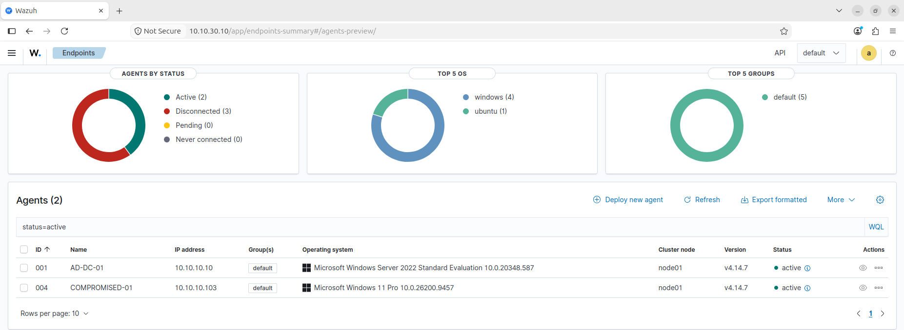
*Figure 1: Baseline verification on Wazuh Dashboard confirming Agent 004 (`COMPROMISED-01`) is active.*

### Step 2: Adversary Infrastructure Staging
On `EXT-ATTACKER-SIM` (Kali Linux), the attacker HTTP credential-harvesting sink service was started on TCP port 80. The service serves a tailored fake authentication portal.

```bash
sudo systemctl status attacker-http.service
```

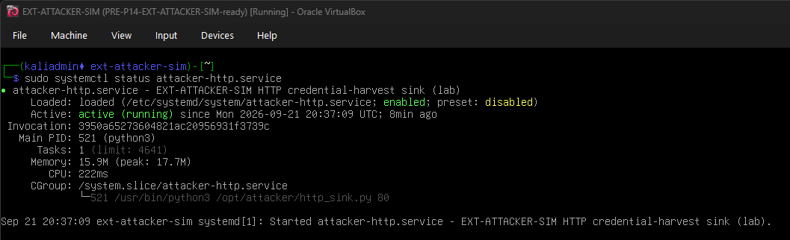
*Figure 2: `attacker-http.service` active and listening on port 80 on Kali Linux (`EXT-ATTACKER-SIM`).*

### Step 3: Phishing Lure Delivery & Header Analysis
The phishing email was staged at `C:\PhishingDelivery\AGC-001-spoofed-display-name.eml`. The raw RFC 822 headers were inspected on the victim workstation:

```text
From: "IT Support" <it-support@ashford-grove-support.local>
To: michael.chen@ashfordgrove.local
Subject: Mailbox Storage Almost Full
Date: Mon, 21 Sep 2026 20:45:00 +0000
MIME-Version: 1.0
Content-Type: text/plain; charset="utf-8"

Your mailbox is almost full. Click here to request more space:
http://10.10.40.10/portal-login
```

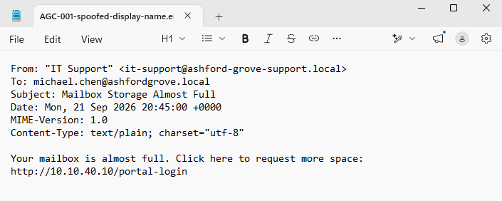
*Figure 3: Inspection of raw email headers displaying the disparity between display name and sending domain.*

### Step 4: Victim Interaction & Credential Submission
The victim opened Microsoft Edge and navigated to `http://10.10.40.10/portal-login`. The browser loaded the fake portal titled *"Acme Corp Portal - Sign in to view shared document Q3-Invoice.pdf"*.

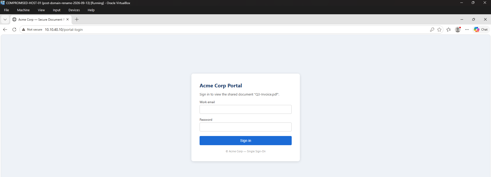
*Figure 4: The fake portal loaded on `COMPROMISED-HOST-01` over `10.10.40.10/portal-login`.*

The victim entered corporate credentials and submitted the form, resulting in a POST request to `10.10.40.10/login`.

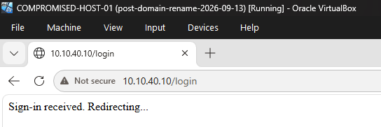
*Figure 5: Credential submission acknowledged by the attacker sink ("Sign-in received. Redirecting...").*

---

## 4. SOC Investigation & Multi-Source Telemetry

### A. Perimeter Firewall Analysis (OPNsense)
Inspection of `Firewall → Log Files → Live View` on `10.10.10.1` confirmed that the perimeter firewall allowed outbound traffic from `10.10.10.103` to `10.10.40.10:80`.

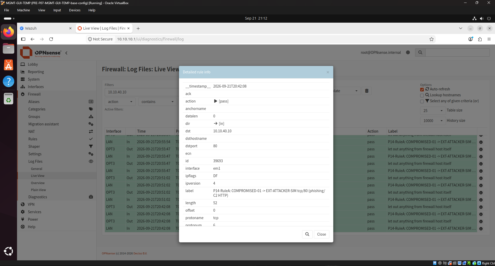
*Figure 6: OPNsense firewall rule pass log for outbound TCP/80 traffic to external IP `10.10.40.10`.*

* **Source IP / Port:** `10.10.10.103` (LAN)
* **Destination IP / Port:** `10.10.40.10:80` (EXT-SIM-NET)
* **Rule Label:** `P14-RuleA: COMPROMISED-01 -> EXT-ATTACKER-SIM tcp/80 (phishing/C2 HTTP)`
* **Action:** `Pass`

---

### B. Network Traffic Telemetry (Security Onion / Zeek)
In Security Onion Hunt (`10.10.30.20`), querying `destination.ip: 10.10.40.10` identified the full HTTP transaction logged by Zeek (`http.log`):

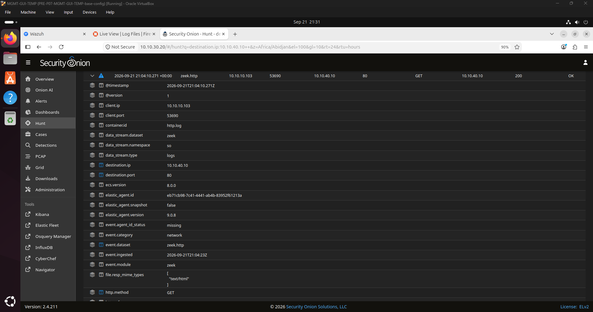
*Figure 7: Zeek HTTP log showing `GET /portal-login` with HTTP `200 OK` from `10.10.10.103` to `10.10.40.10`.*

* **Timestamp:** `2026-09-21 21:04:10 UTC`
* **Source Host:** `10.10.10.103:53690`
* **Destination Host:** `10.10.40.10:80`
* **HTTP Method / URI:** `GET /portal-login`
* **HTTP Response Code:** `200 OK` (MIME: `text/html`)

---

### C. Endpoint Telemetry & Detection Engineering (Wazuh & Sysmon)

#### The Telemetry Gap:
During initial triage in Wazuh Discover, events for Agent `004` showed standard Windows System events (Event ID `7040`), but **zero Sysmon process creation alerts (Event ID 1)** were present.

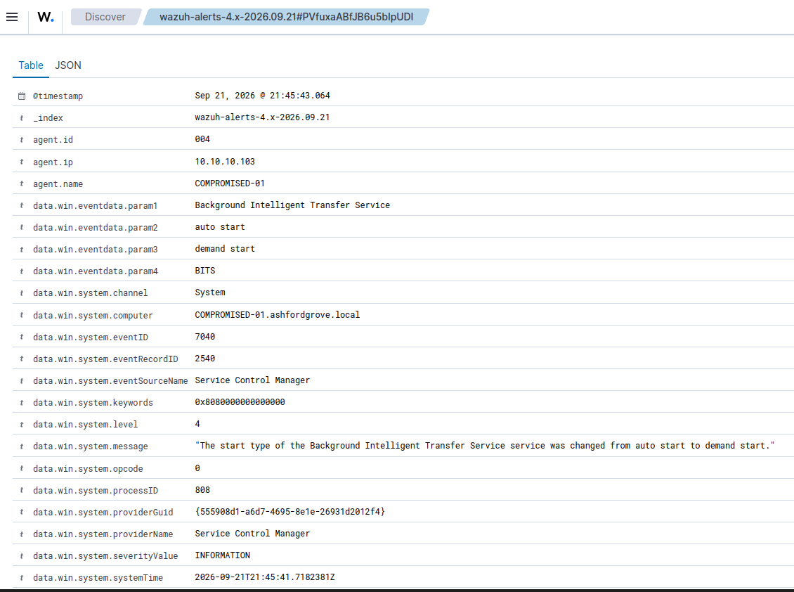
*Figure 8: Initial Wazuh alerts showing generic system events with no Sysmon telemetry.*

#### Root Cause Analysis (RCA):
1. Verified on `COMPROMISED-HOST-01` that `Sysmon64` service was running and generating local Event IDs `1`, `8`, and `11` in `Microsoft-Windows-Sysmon/Operational`.
   
   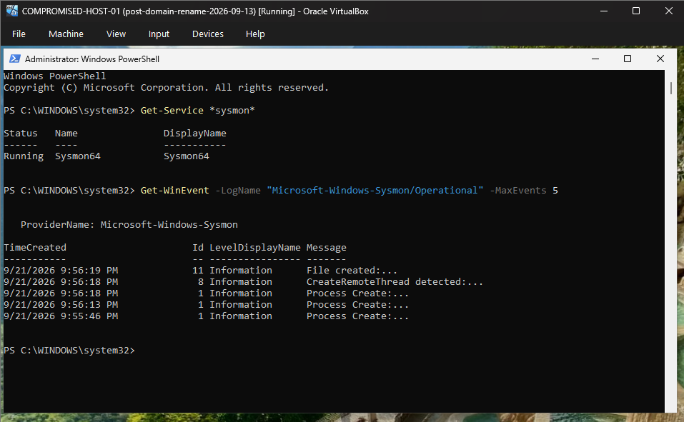
   *Figure 9: Verifying Sysmon64 is active and logging locally via PowerShell.*

2. Audited `C:\Program Files (x86)\ossec-agent\ossec.conf`. Found that the Wazuh Agent was configured to monitor `Application`, `Security`, and `System`, but **lacked a `<localfile>` block for the Sysmon channel**.
   
   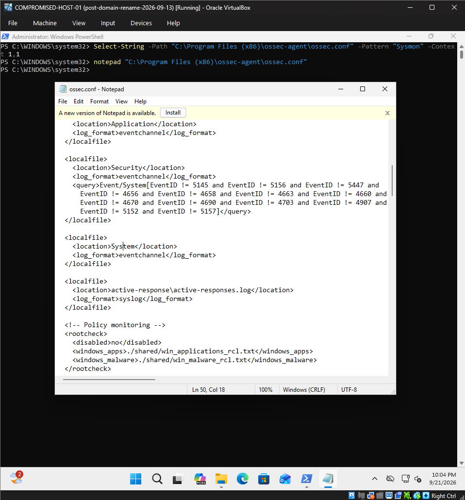
   *Figure 10: Inspecting `ossec.conf` revealing the missing Sysmon channel entry.*

#### Engineering the Solution:
Added the missing configuration block directly under the `<location>System</location>` entry:

```xml
<localfile>
  <location>Microsoft-Windows-Sysmon/Operational</location>
  <log_format>eventchannel</log_format>
</localfile>
```

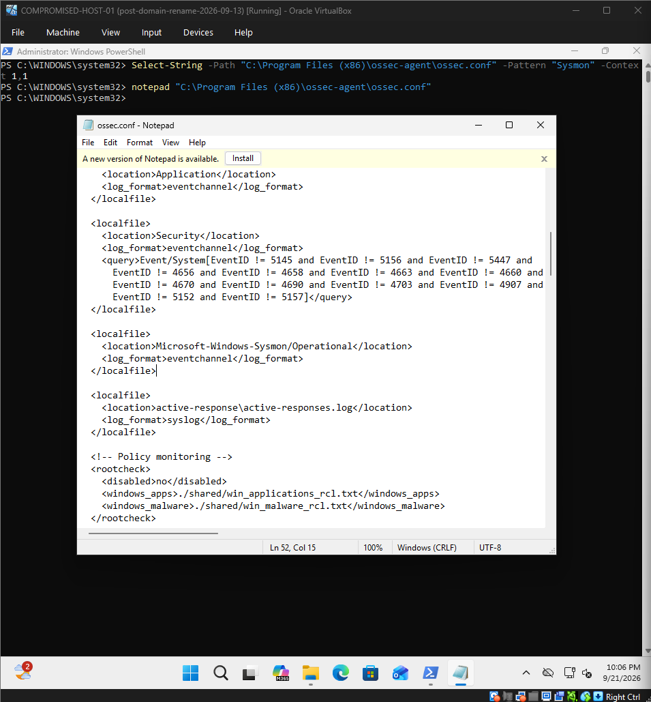
*Figure 11: Updating `ossec.conf` with the `Microsoft-Windows-Sysmon/Operational` eventchannel.*

Restarted the agent (`Restart-Service Wazuh`). Re-queried Wazuh Discover with:
```text
agent.name: "COMPROMISED-01" and data.win.system.eventID: "1"
```
**Result:** 22 hits populated immediately, streaming live process telemetry (`net.exe`, `net1.exe`, and browser activity) to the SIEM.

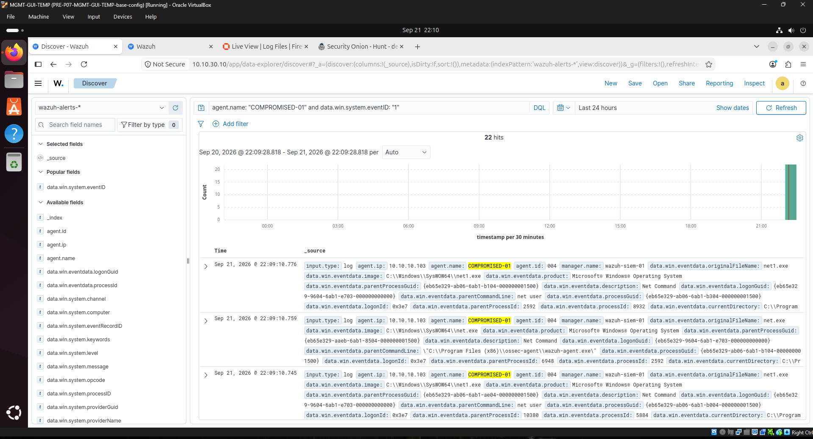
*Figure 12: Live Sysmon Event ID 1 process creation logs appearing in Wazuh Discover.*

---

## 5. MITRE ATT&CK Mapping & Risk Matrix

| Tactic | Technique ID | Technique Name | Evidence Artifact | Risk / Severity |
|:---|:---|:---|:---|:---|
| **Initial Access (TA0001)** | `T1566.002` | Spearphishing Link | `.eml` file with spoofed "IT Support" header & external harvesting URL | **HIGH** |
| **Command & Control (TA0011)** | `T1071.001` | Web Protocols (HTTP) | Zeek `http.log` GET /portal-login & OPNsense rule pass to `10.10.40.10:80` | **MEDIUM** |
| **Credential Access (TA0006)** | `T1056.003` | Web Portal Harvesting | Fake credential form submission (`10.10.40.10/login`) | **HIGH** |

---

## 6. Incident Response & Containment Plan (IR Handover)

### Immediate Containment (Playbook Actions)
1. **Perimeter Block:** Submit urgent firewall change ticket to block outbound traffic to `10.10.40.10` on OPNsense:
   * Rule: `LAN -> Drop -> Destination: 10.10.40.10:ANY`
2. **DNS Sinkhole:** Create Host Override in Unbound DNS redirecting `ashford-grove-support.local` to loopback `0.0.0.0` to neutralize lookalike resolution enterprise-wide.
3. **Identity Invalidation:**
   * Force reset password for `michael.chen` in Active Directory (`AD-DC-01`).
   * Enable *"User must change password at next logon"*.
   * Revoke active Kerberos TGT and active cloud/VPN sessions.
4. **Host Isolation:** Place `COMPROMISED-HOST-01` into logical quarantine via Wazuh active response pending full forensic verification.

---

## 7. Incident Escalation Report (SOC L1 ➔ Incident Response / L2)

```text
================================================================================
                    SOC INCIDENT ESCALATION REPORT (L1 -> IR)
================================================================================
CASE ID:        AGC-001-IR-ESC
SEVERITY:       HIGH
ANALYST:        Ali (TOOSHY2)
TIMESTAMP:      2026-09-21 22:15 UTC

1. INCIDENT SUMMARY:
   A confirmed credential-harvesting spearphishing incident targeted employee
   michael.chen (10.10.10.103). The email utilized display-name spoofing
   ("IT Support" <it-support@ashford-grove-support.local>) delivering a link
   to adversary infrastructure at 10.10.40.10/portal-login.

2. IMPACT & TRIAGE FINDINGS:
   - Target Host: COMPROMISED-HOST-01 (10.10.10.103)
   - Adversary IP: 10.10.40.10 (External Sim Zone)
   - User Activity: Edge browser opened link, and credentials were submitted
     to the external login form at 21:04 UTC.
   - Network Evidence: Zeek captured complete HTTP 200 GET & POST transactions.
   - Detection Engineering: Resolved local Sysmon forwarding gap on endpoint;
     EDR process logging is now fully restored.

3. ACTIONS TAKEN BY L1:
   - Preserved raw .eml artifact and browser cache.
   - Verified firewall and Zeek network flow.
   - Documented full kill-chain evidence and screenshots.

4. HANDOVER RECOMMENDATIONS FOR IR:
   - Invalidate michael.chen active domain & SSO sessions immediately.
   - Execute domain-wide perimeter block on 10.10.40.10.
   - Monitor Active Directory authentication logs for anomalous sign-ins from
     external or untrusted IP addresses using michael.chen credentials.
================================================================================
```
