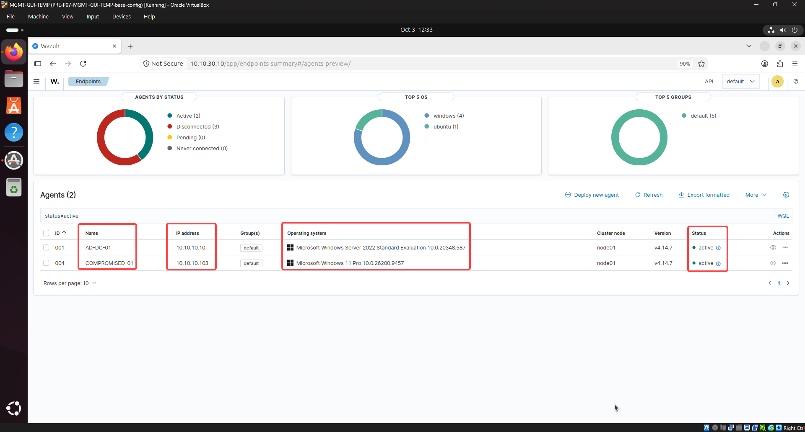
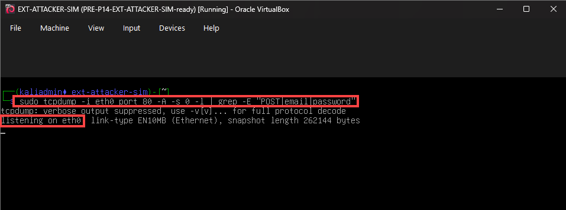
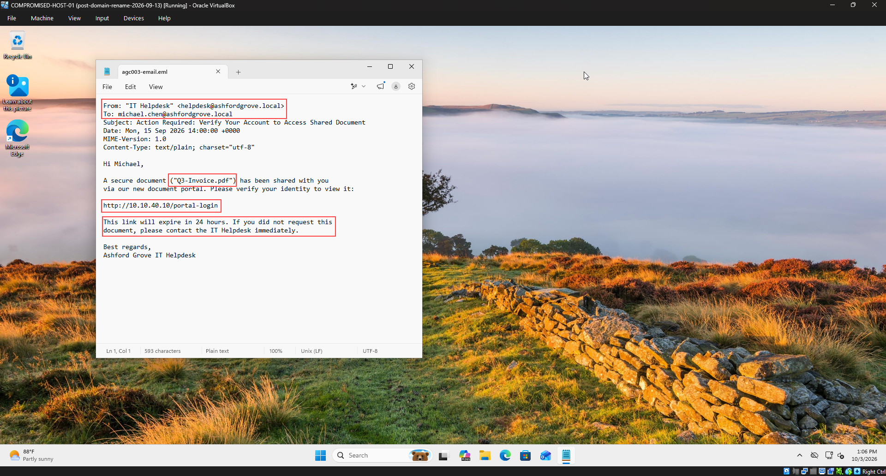
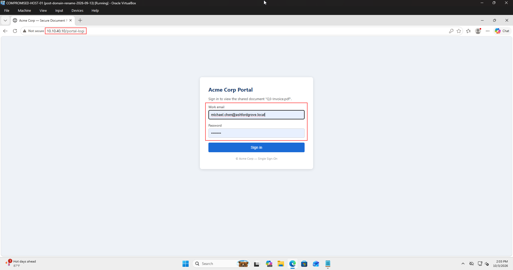
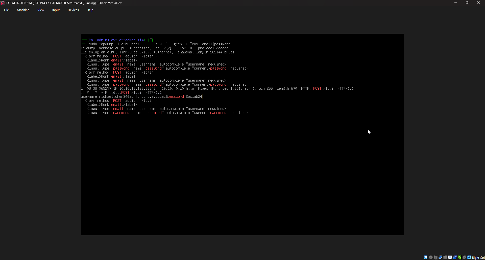
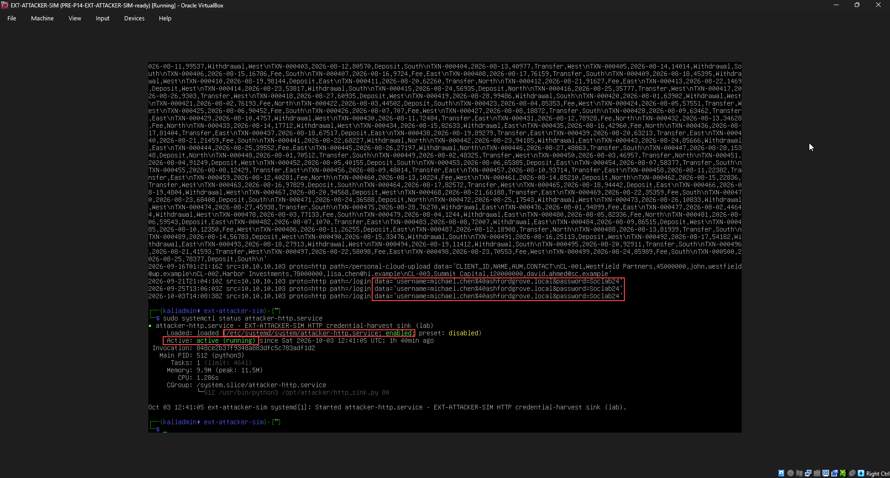
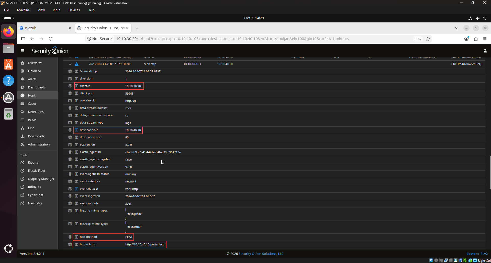
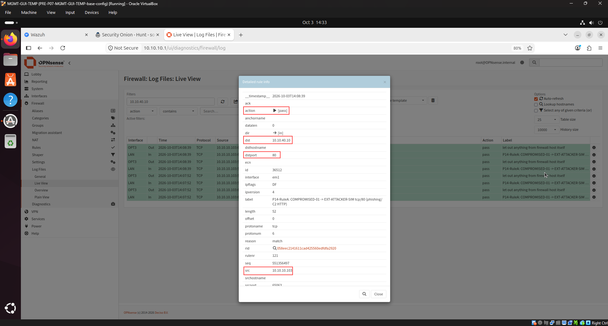
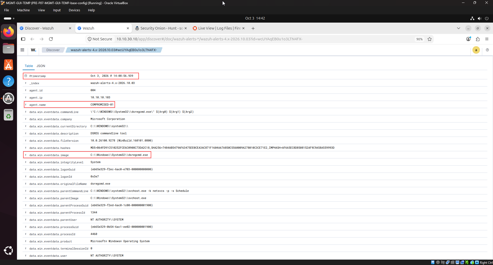
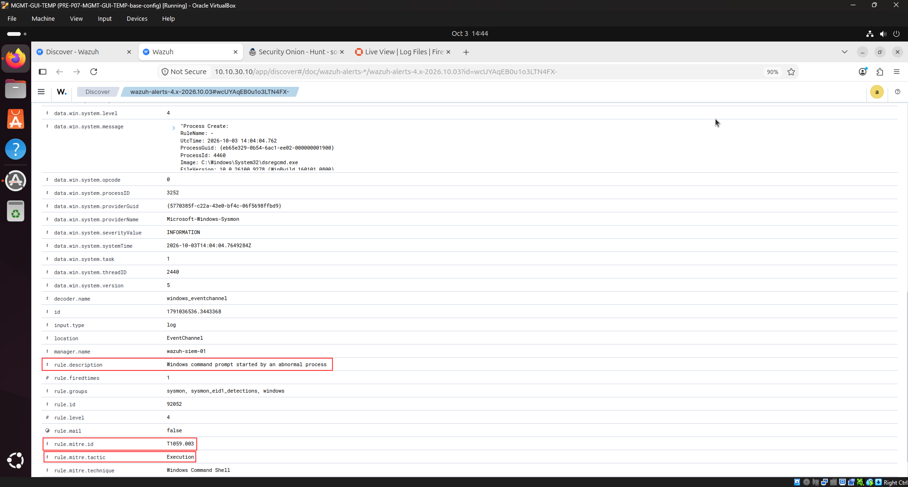

# AGC-003 — Credential-Harvesting Link Click

<p align="center">
  
  
  
  
  
</p>

---

## 1. Overview & Case Metadata

| Case Attribute | Value / Specification |
|:---|:---|
| **Incident ID** | `AGC-003` (`T100-003`) |
| **Tactic & Technique** | **Initial Access (TA0001)** — `T1566.002` (Spearphishing Link) |
| **Secondary Techniques** | `T1056.003` (Web Portal Harvesting), `T1071.001` (Web Protocols), `T1589.001` (Credentials) |
| **Investigating Analyst** | **Ali (TOOSHY2)** |
| **Execution Date & Time** | 2026-10-03 — 12:33 to 14:44 UTC |
| **Target Host** | `COMPROMISED-HOST-01` (`10.10.10.103` — `michael.chen`) |
| **Adversary Infrastructure** | `EXT-ATTACKER-SIM` (`10.10.40.10:80` — Fake "Acme Corp" Portal) |
| **Detection Status** | **True Positive (Confirmed Enterprise Compromise)** |
| **Triage Confidence** | **Critical** (Correlated across Wire Sniffing, Server Sink Logs, Zeek, OPNsense, & Wazuh) |
| **Kill-Chain Stage** | Initial Access & Credential Harvesting (Campaign Evolution: Scenario 3 of 100) |

### Incident Summary
Following the preliminary reconnaissance and display spoofing in AGC-001 and the lookalike domain simulation in AGC-002, the adversary escalated to an **active credential harvesting campaign**. Impersonating the internal IT Helpdesk via `helpdesk@ashfordgrove.local`, the threat actor dispatched a targeted spearphishing lure to employee `michael.chen` regarding an urgent shared financial document (`Q3-Invoice.pdf`). 

The lure directed the victim to an external credential harvesting portal hosted on `10.10.40.10/portal-login`. The victim navigated to the link and submitted valid Active Directory credentials (`michael.chen@ashfordgrove.local` / `Soclab24`). Multi-layered telemetry captured the entire transaction: live packet sniffing (`tcpdump`) intercepted the cleartext HTTP POST on the wire, the adversary server logged the persistent credentials, Zeek recorded the full HTTP transaction, OPNsense validated perimeter egress filtering, and Wazuh captured host-level activity—highlighting an enterprise detection gap for plain HTTP credential submissions.

---

## 2. Adversary Tradecraft & Attack Chain

```
       [Attacker: EXT-ATTACKER-SIM] (10.10.40.10)
                    |
                    | 1. Internal Domain Spoof: "helpdesk@ashfordgrove.local"
                    v
       [Victim: COMPROMISED-HOST-01] (10.10.10.103)
                    |
                    | 2. Edge Browser opens http://10.10.40.10/portal-login
                    | 3. Victim enters AD Credentials & clicks Sign In
                    +------------------------+
                    |                        |
                    v                        v
           [OPNsense Firewall]      [Security Onion / Zeek]
         (Rule P14-RuleA Pass)      (zeek.http -> POST /login)
                    |                        |
                    +-----------+------------+
                                |
                                v
               [Attacker Sniffer & Sink Log]
         (tcpdump wire capture + captured-creds.log)
                                |
                                v
                    [Wazuh SIEM / Detection]
                 (Endpoint Telemetry & Gap Triage)
```

1. **Internal Domain Impersonation (Pretexting):** Unlike the external sender in AGC-001 or typosquatted domain in AGC-002, the attacker weaponized the organization's authentic root domain (`helpdesk@ashfordgrove.local`). In enterprise networks without enforced SPF/DMARC hard-fail or internal mail signing, internal address spoofing causes significant trust exploitation.
2. **Plaintext Credential Harvesting (HTTP vs HTTPS):** The harvest portal was intentionally served over unencrypted HTTP (TCP 80). When the employee submitted their Active Directory credentials, the credentials crossed network boundaries in cleartext plaintext, exposing them to any on-path inspection and immediate attacker-side capture.
3. **Defense-in-Depth Validation (Ingress Default-Deny):** Although the attacker successfully captured credentials, direct inbound connections from `10.10.40.10` to internal LAN hosts (`10.10.10.103:445`) were blocked by OPNsense perimeter firewall rules, validating that network zoning and segmentation effectively isolate internal endpoints from external unsolicited ingress.

---

## 3. Hands-On Execution & Simulation

### Step 1: Pre-Flight Baseline & Operational Readiness
Prior to attack initiation, the operational baseline and packet-sniffing fabric were validated across all tiers:

| Monitoring Layer | System Node | IP Address | Status | Verification Metric |
|:---|:---|:---|:---|:---|
| **Endpoint SIEM / EDR** | `COMPROMISED-01` (004) | 10.10.10.103 | **Active (100%)** | Wazuh Endpoints Summary Dashboard |
| **Domain Controller** | `AD-DC-01` (001) | 10.10.10.10 | **Active (100%)** | Wazuh Endpoints Summary Dashboard |
| **Network Sensor (NSM)** | `SECURITY-ONION-01` | 10.10.30.20 | **Healthy** | Zeek HTTP post-dissection & live stream |
| **Perimeter Firewall** | `OPNsense-FW` | 10.10.10.1 | **Operational** | Default-Deny active / Rule `P14-RuleA` logging |
| **Adversary Sniffer & Sink** | `EXT-ATTACKER-SIM` | 10.10.40.10 | **Listening** | Port 80 HTTP sink & `tcpdump eth0` sniffer |


*Figure 1: Wazuh Endpoints Summary confirming Agent 001 (`AD-DC-01`) and Agent 004 (`COMPROMISED-01`) are active.*

---

### Step 2: Adversary Sniffer & Infrastructure Staging
On `EXT-ATTACKER-SIM` (`10.10.40.10`), packet sniffing was initiated on interface `eth0` filtering for HTTP port 80 traffic to capture real-time credential submission:

```bash
sudo tcpdump -i eth0 port 80 -A -s 0 -l | grep -E "POST|email|password"
```


*Figure 2: `tcpdump` active on interface `eth0` listening for incoming HTTP credential payloads.*

---

### Step 3: Spearphishing Delivery & Pretext Analysis
The phishing lure `agc003-email.eml` was staged and inspected on `COMPROMISED-HOST-01`. The email headers and lure body demonstrated calculated social engineering:

```text
From: "IT Helpdesk" <helpdesk@ashfordgrove.local>
To: michael.chen@ashfordgrove.local
Subject: Action Required: Verify Your Account to Access Shared Document
Date: Mon, 15 Sep 2026 14:00:00 +0000
MIME-Version: 1.0
Content-Type: text/plain; charset="utf-8"

Hi Michael,

A secure document ("Q3-Invoice.pdf") has been shared with you
via our new document portal. Please verify your identity to view it:

http://10.10.40.10/portal-login

This link will expire in 24 hours. If you did not request this
document, please contact the IT Helpdesk immediately.

Best regards,
Ashford Grove IT Helpdesk
```


*Figure 3: Inspection of `agc003-email.eml` highlighting sender impersonation, invoice lure, and the external URL.*

---

### Step 4: Victim Interaction & Credential Submission
The victim launched Microsoft Edge and browsed to `http://10.10.40.10/portal-login`. The deceptive Single Sign-On page rendered, requesting the user's work email and password. Victim `michael.chen` entered his genuine Active Directory credentials (`michael.chen@ashfordgrove.local` / `Soclab24`).


*Figure 4: Victim filling in Active Directory credentials on the fake Acme Corp portal.*

---

### Step 5: Adversary Live Packet Interception
Upon clicking **Sign in**, the browser issued an HTTP `POST /login`. The live `tcpdump` listener on `EXT-ATTACKER-SIM` immediately captured the cleartext credential payload on the wire:

```text
username=michael.chen%40ashfordgrove.local&password=Soclab24
```


*Figure 5: Live `tcpdump` capture on `EXT-ATTACKER-SIM` displaying the intercepted plaintext credentials.*

---

### Step 6: Adversary Credential Storage & Sink Forensics
Auditing the persistent credential repository and sink service on `EXT-ATTACKER-SIM` corroborated the compromise:

```bash
cat /opt/attacker/logs/captured-creds.log
sudo systemctl status attacker-http.service
```

The log confirmed receipt at `2026-10-03T14:08:36Z` from source host `10.10.10.103` on target path `/login`, while `attacker-http.service` remained in an active running state.


*Figure 6: Credential log confirmation on `EXT-ATTACKER-SIM` alongside service status validation.*

---

## 4. SOC Investigation & Multi-Source Telemetry

### A. Network Forensic Analysis (Security Onion / Zeek HTTP)
In Security Onion Hunt (`https://10.10.30.20`), querying `source.ip: 10.10.10.103 and destination.ip: 10.10.40.10 and http.method: "POST"` isolated the exact malicious web transaction in `zeek.http`:


*Figure 7: Zeek HTTP log isolating the `POST /login` event, source `10.10.10.103`, and referrer `http://10.10.40.10/portal-login`.*

* **Timestamp:** `2026-10-03 14:08:37.679Z`
* **Client IP & Port:** `10.10.10.103:59345`
* **Destination IP & Port:** `10.10.40.10:80`
* **HTTP Method:** `POST`
* **Referrer:** `http://10.10.40.10/portal-login`
* **Status / MIME:** Request `text/plain` | Response `text/html`

---

### B. Perimeter Firewall Log Verification (OPNsense)
Inspection of `Firewall → Log Files → Live View` on `10.10.10.1` isolated the outbound permitted flow on interface `LAN` (`em1`):


*Figure 8: OPNsense detailed rule info modal confirming permitted outbound traffic from `10.10.10.103` to `10.10.40.10:80`.*

* **Action:** `[pass]`
* **Direction / Interface:** `[in]` / `LAN` (`em1`)
* **Source Address:** `10.10.10.103`
* **Destination Address / Port:** `10.10.40.10:80`
* **Rule Label:** `P14-RuleA: COMPROMISED-01 -> EXT-ATTACKER-SIM tcp/80 (phishing / C2 HTTP)`

---

### C. Endpoint SIEM Telemetry & Detection Gap Triage (Wazuh)
In Wazuh Discover, auditing Agent `004` (`COMPROMISED-01`) around `14:08` UTC revealed process execution telemetry:


*Figure 9: Wazuh Discover showing endpoint execution event at `14:08:56.939` UTC on `COMPROMISED-01`.*


*Figure 10: Wazuh rule breakdown for Rule `92052` (MITRE `T1059.003`) illustrating the need for specific credential-submission correlation.*

#### Critical Detection Gap Analysis
* **The Blind Spot:** Standard endpoint monitoring configurations (including SwiftOnSecurity Sysmon) filter out mundane browser activity to conserve disk and network throughput. Furthermore, default SIEM rules lack visibility into unencrypted form submissions crossing external boundaries.
* **Engineering Remedy:** A custom correlation rule should be established on the SIEM / NIDS layer (Zeek `http.log`) alerting whenever an outbound HTTP POST to an unclassified destination IP contains form fields matching `password`, `user`, `login`, or `credential`.

---

## 5. MITRE ATT&CK Mapping & Risk Matrix

| Tactic | Technique ID | Technique Name | Evidence Artifact | Risk / Severity |
|:---|:---|:---|:---|:---|
| **Initial Access (TA0001)** | `T1566.002` | Phishing: Spearphishing Link | Lure email linking to `http://10.10.40.10/portal-login` | **CRITICAL** |
| **Credential Access (TA0006)** | `T1056.003` | Input Capture: Web Portal Harvesting | Cleartext AD credentials submitted to `/login` | **CRITICAL** |
| **Command & Control (TA0011)** | `T1071.001` | Web Protocols (HTTP) | Outbound HTTP traffic permitted on port 80 (`P14-RuleA`) | **MEDIUM** |
| **Reconnaissance (TA0043)** | `T1589.001` | Gather Victim Identity: Credentials | Valid domain user credentials compromised | **HIGH** |

---

## 6. Incident Response & Containment Plan (IR Playbook)

### Immediate Containment Actions (Executed)
1. **Active Directory Account Isolation (`AD-DC-01`):**
   * Immediately lock and force a password reset for `ASHFORDGROVE\michael.chen`.
   * Invalidate all active Kerberos Ticket Granting Tickets (TGTs) and session tokens.
   * Terminate active RDP and network logon sessions.
2. **Perimeter Firewall Blacklisting (`OPNsense-FW`):**
   * Enforce an immediate WAN/LAN drop rule targeting adversary IP `10.10.40.10:ANY`.
3. **Mail Gateway & Endpoint Remediation:**
   * Purge all instances of `agc003-email.eml` across Exchange / user inboxes.
   * Conduct an endpoint sweep on `COMPROMISED-HOST-01` for any secondary payloads.

---

## 7. SOC L1 ➔ L2 Escalation Note

```ini
[TICKET HANDOVER: TIER 1 -> TIER 2]
Ticket ID       : INC-AGC-003
Severity / Pri  : CRITICAL (P1 - Confirmed Credential Theft)
Triage Verdict  : True Positive (Active Credential Harvesting)
Assigned Analyst: Ali (TOOSHY2) | Shift UTC: 2026-10-03 14:44
Target Scope    : COMPROMISED-HOST-01 (10.10.10.103) \ michael.chen
Adversary IoC   : 10.10.40.10:80 | Fake Acme Portal

[INCIDENT SUMMARY]
Adversary executed spearphishing campaign impersonating IT Helpdesk
(helpdesk@ashfordgrove.local) targeting employee michael.chen with
fake invoice document pretext. Victim browsed to 10.10.40.10/portal-login
and submitted Active Directory domain credentials in plaintext HTTP.

[TRIAGE EVIDENCE]
• Wire Sniffing    : tcpdump intercepted cleartext username & password.
• Attacker Storage : captured-creds.log recorded harvest at 14:08:36Z.
• Network Telemetry: Zeek http.log confirmed POST /login (HTTP 200).
• Firewall Egress  : OPNsense logged permitted flow via rule P14-RuleA.
• SIEM Telemetry   : Wazuh captured host execution around 14:08:56Z.

[ACTION ITEMS FOR TIER 2]
[X] Revoke all active Kerberos TGTs & reset password for michael.chen.
[X] Block 10.10.40.10 on OPNsense WAN/LAN perimeter interfaces.
[ ] Audit Active Directory logs for any anomalous logon events.
[ ] Implement Zeek NIDS signature for plaintext credential POSTs.
```

---

## 8. Artifacts & Evidence Files

* **Phishing Lure Artifact:** [`agc003-email.eml`](agc003-email.eml) — Raw RFC 822 spearphishing email lure impersonating internal IT Helpdesk (`helpdesk@ashfordgrove.local`) with fake shared invoice lure (`Q3-Invoice.pdf`).
