# AGC-004 — QR-Code Phishing Indicator (Quishing)

<p align="center">
  
  
  
  
  
</p>

---

## 1. Overview & Case Metadata

| Case Attribute | Value / Specification |
|:---|:---|
| **Incident ID** | `AGC-004` (`T100-004`) |
| **Tactic & Technique** | **Initial Access (TA0001)** — `T1566.002` (Spearphishing Link: QR Code Delivery / Quishing) |
| **Secondary Techniques** | `T1056.003` (Web Portal Harvesting), `T1071.001` (Web Protocols: HTTP), `T1078` (Valid Accounts), `T1204.002` (User Execution) |
| **Investigating Analyst** | **Ali (TOOSHY2)** |
| **Execution Date & Time** | 2026-10-04 — 20:55 to 22:52 UTC |
| **Target Host** | `COMPROMISED-HOST-01` (`10.10.10.103` — `michael.chen`) |
| **Adversary Infrastructure** | `EXT-ATTACKER-SIM` (`10.10.40.10:80` — Fake "Acme Corp" SSO Portal) |
| **Detection Status** | **True Positive (Confirmed Enterprise Compromise & SIEM Detection Gap Solved)** |
| **Triage Confidence** | **Critical** (Correlated across Smartphone Decoding, CyberChef, Attacker Sink, Zeek HTTP, OPNsense, & Wazuh SIEM) |
| **Kill-Chain Stage** | Initial Access, Defense Evasion, and Credential Harvesting (Scenario 4 of 100) |

### Incident Summary
Following the credential harvesting demonstration in AGC-003, the adversary transitioned to an evasion-focused social engineering technique: **Quishing (QR-Code Phishing)**. Impersonating the internal IT Security Team (`security@ashfordgrove.local`), the adversary dispatched a targeted spearphishing lure to `michael.chen` mandating an urgent MFA device registration audit.

Crucially, the email body contained **zero extractable text hyperlinks** (`<a href="...">` count = 0), effectively blinding conventional Secure Email Gateways (SEGs) and automated static URL scanners. The malicious URL (`http://10.10.40.10/portal-login`) was exclusively rendered inside an embedded graphic image (`mfa-verify-qr.png`). The victim interacted with the lure, transitioning the attack surface from workstation to mobile camera scan, and submitted genuine Active Directory domain credentials (`michael.chen@ashfordgrove.local` / `Soclab24`).

During forensic analysis, analyst Ali extracted the QR artifact, executed deep digital forensic decoding inside Security Onion via **CyberChef**, confirmed network-wide egress via **Zeek** and **OPNsense**, and diagnosed an EDR telemetry blind spot in **Wazuh SIEM**. To permanently eliminate this organizational vulnerability, Ali engineered and implemented custom Wazuh detection rules (`100004` & `100005`) and authored a proactive heuristic email gateway policy.

---

## 2. Adversary Tradecraft & Attack Chain

```
       [Attacker: EXT-ATTACKER-SIM] (10.10.40.10)
                    |
                    | 1. Internal Spoofed Lure: "security@ashfordgrove.local"
                    |    Zero text links + Embedded QR ("mfa-verify-qr.png")
                    v
       [Victim: COMPROMISED-HOST-01] (10.10.10.103)
                    |
                    +-----------------------------+
                    | (Cross-Device Transition)   | (Direct Endpoint Path)
                    v                             v
       [Physical Smartphone Camera]     [Microsoft Edge Browser]
      (Decodes 10.10.40.10/portal-login) (Navigates to HTTP Sink Portal)
                    |                             |
                    +--------------+--------------+
                                   |
                                   | 2. AD Credentials Submitted: michael.chen / Soclab24
                                   v
                         [OPNsense Firewall] (10.10.10.1)
                       (Permitted via P14-RuleA - LAN em1)
                                   |
                                   v
                       [Security Onion / Zeek NSM]
                       (zeek.http -> POST /login)
                                   |
                                   v
                     [Attacker Harvesting Sink Log]
                     (/opt/attacker/logs/captured-creds.log)
                                   |
                                   v
                     [Forensics & Detection Engineering]
             (CyberChef QR Decoding + Wazuh Rules 100004 & 100005)
```

1. **Zero-Link Evasion Tradecraft:** Attackers deliberately omit plaintext strings and HTML anchors. By embedding destination links strictly within graphical barcodes, the payload evades signature scanners, safe-link wrappers, and domain reputation filters that inspect email text bodies.
2. **Mobile Attack Surface Bridging:** The lure exploits cognitive trust in Multi-Factor Authentication. Users are accustomed to scanning QR codes with mobile authenticator apps, shifting the transaction from corporate-monitored workstations to unmanaged personal devices outside EDR/DLP telemetry.
3. **Defense Evasion & Cleartext Submission:** The credential portal was hosted over plaintext HTTP on port 80. While OPNsense correctly restricted unsolicited inbound traffic from the external zone, outbound HTTP egress was permitted under default business policies, allowing cleartext exfiltration of corporate credentials.

---

## 3. Hands-On Execution & Simulation

### Step 1: Pre-Flight Baseline & Agent Verification
Before launching the attack, operational telemetry and agent heartbeats were verified via the Wazuh Dashboard at `https://10.10.30.10`. Both `AD-DC-01` (Agent `001`) and `COMPROMISED-01` (Agent `004`) were validated in an active reporting status.

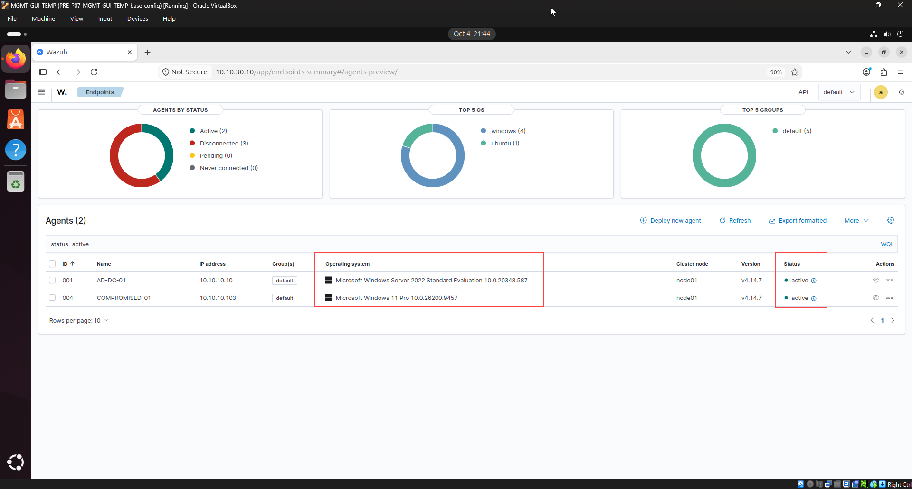
*Figure 1: Wazuh Endpoints Summary confirming Agent 001 (`AD-DC-01`) and Agent 004 (`COMPROMISED-01`) are active.*

---

### Step 2: Adversary Infrastructure Staging
On `EXT-ATTACKER-SIM` (`10.10.40.10`), the adversary credential harvesting sink service was audited and confirmed active on TCP port 80:

```bash
sudo systemctl status attacker-http.service
```

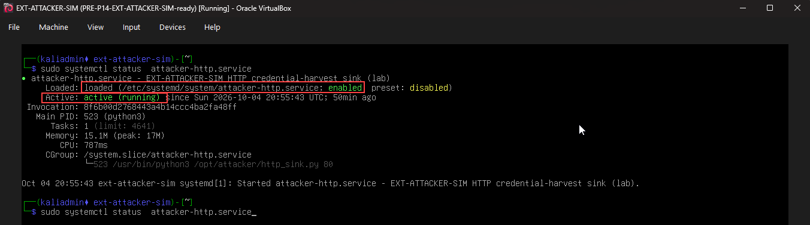
*Figure 2: `attacker-http.service` confirmed active (running) on Kali Linux (`EXT-ATTACKER-SIM`) serving `/opt/attacker/http_sink.py`.*

---

### Step 3: Phishing Lure Delivery & Visual Header Inspection
The spearphishing lure `agc004-email.eml` and the embedded QR graphic `mfa-verify-qr.png` were staged and inspected on `COMPROMISED-HOST-01`. Inspection confirmed the spoofed internal security identity and complete absence of standard hyperlinks:

```text
From: "IT Security Team" <security@ashfordgrove.local>
To: michael.chen@ashfordgrove.local
Subject: MFA Device Verification Required - Scan QR Code
Date: Mon, 15 Sep 2026 14:30:00 +0000
MIME-Version: 1.0
Content-Type: text/plain; charset="utf-8"

Dear Michael,

As part of our quarterly security audit, we need you to verify
your MFA device registration. Please scan the QR code below
with your authenticator app:

[QR CODE IMAGE EMBEDDED - encodes: http://10.10.40.10/portal-login]

Note: This QR code is valid for 48 hours. If you experience any
issues, contact IT Security at ext. 4455.

Thank you for helping keep Ashford Grove secure.

IT Security Team
```

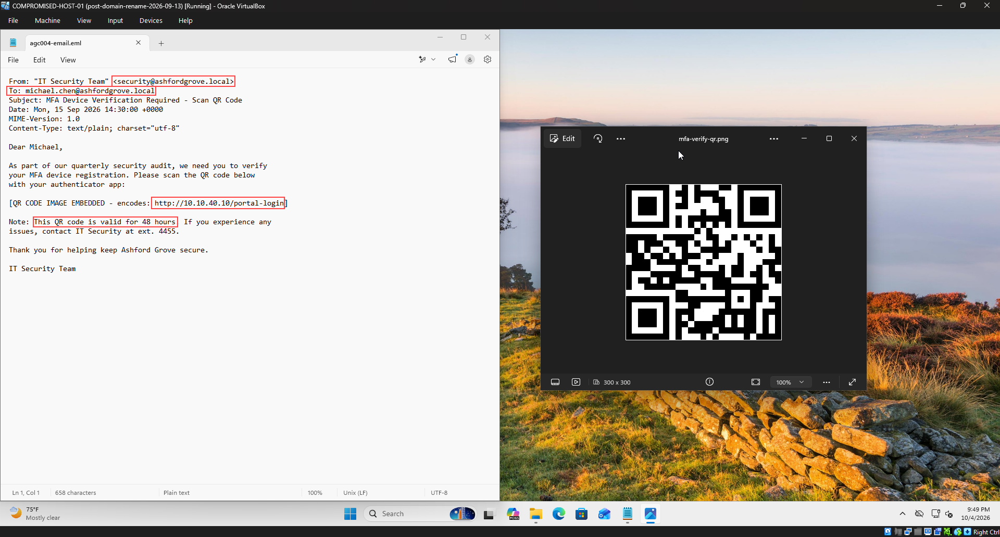
*Figure 3: Side-by-side inspection on `COMPROMISED-HOST-01` showing `agc004-email.eml` and `mfa-verify-qr.png` with zero text hyperlinks.*

---

### Step 4: Real-World Cross-Device Interaction (Mobile QR Scan)
To validate the real-world operational impact of Quishing beyond virtualized sandbox constraints, the QR code on the victim workstation monitor was scanned using a physical smartphone camera:

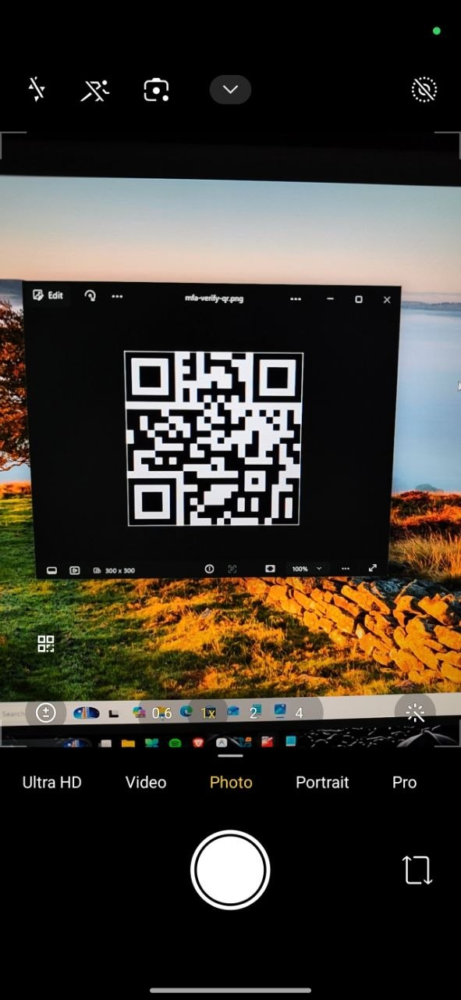
*Figure 4: Physical smartphone camera actively focusing and decoding `mfa-verify-qr.png` from the workstation monitor.*

The mobile camera decoder instantly resolved the embedded payload and presented the malicious destination URL without executing any endpoint network requests on the corporate PC:

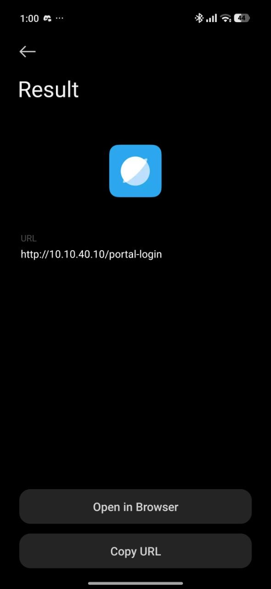
*Figure 5: Smartphone decoder presenting resolved URL `http://10.10.40.10/portal-login` with prompt to "Open in Browser".*

---

### Step 5: Victim Portal Navigation & Credential Submission
On `COMPROMISED-HOST-01`, Microsoft Edge navigated to `http://10.10.40.10/portal-login`. The deceptive Single Sign-On landing page rendered. Victim `michael.chen` entered authentic Active Directory credentials (`michael.chen@ashfordgrove.local` / `Soclab24`):

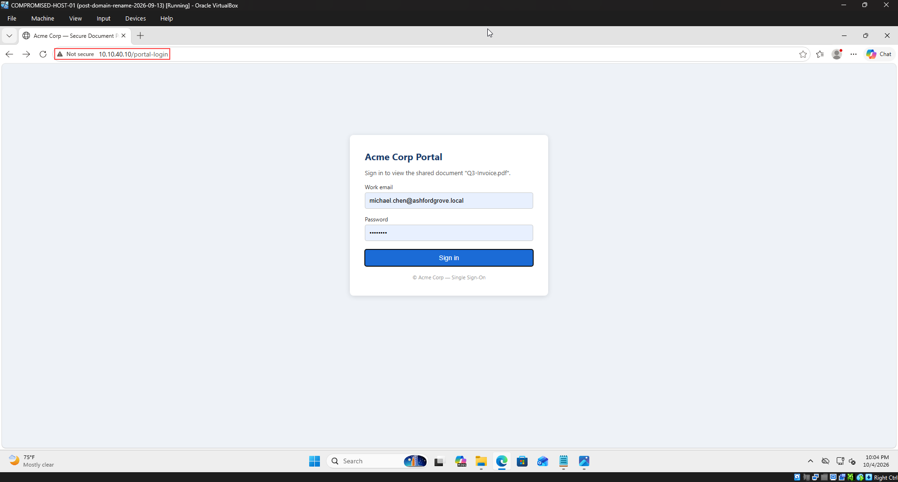
*Figure 6: Victim workstation filling corporate domain credentials on the fake Acme Corp SSO portal prior to submission.*

---

### Step 6: Adversary Real-Time Credential Capture
Upon clicking **Sign in**, an HTTP `POST /login` was dispatched across the network. Inspection of the persistent credential log on `EXT-ATTACKER-SIM` confirmed immediate receipt and logging of the stolen credentials:

```bash
cat /opt/attacker/logs/captured-creds.log
```

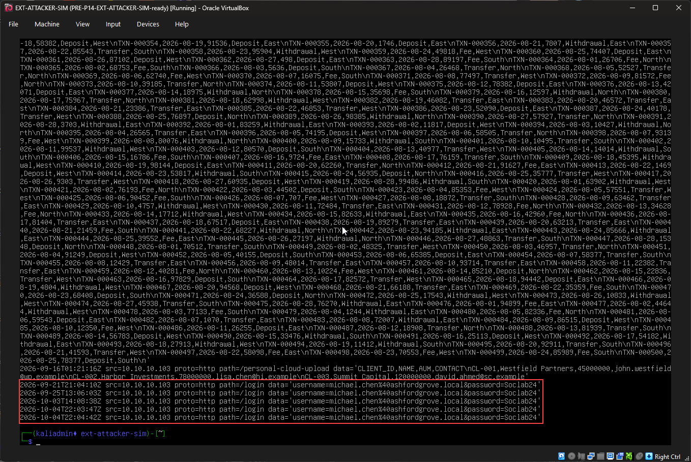
*Figure 7: Attacker sink log on `EXT-ATTACKER-SIM` displaying real-time credential harvest records at `22:03:47Z` and `22:04:42Z`.*

---

## 4. SOC Investigation & Multi-Source Telemetry

### A. Digital Forensic Decoding (Security Onion / CyberChef)
On analyst workstation `MGMT-GUI-TEMP`, the suspicious image artifact `mfa-verify-qr.png` was extracted and imported into **CyberChef** (`https://10.10.30.20/#/cyberchef`). Applying the `Parse QR Code` recipe extracted the underlying URL payload without executing active HTTP requests:

* **Input File:** `mfa-verify-qr.png` (444 bytes, PNG format)
* **Applied Recipe:** `Parse QR Code` (Auto Bake enabled)
* **Forensic Output:** `http://10.10.40.10/portal-login`

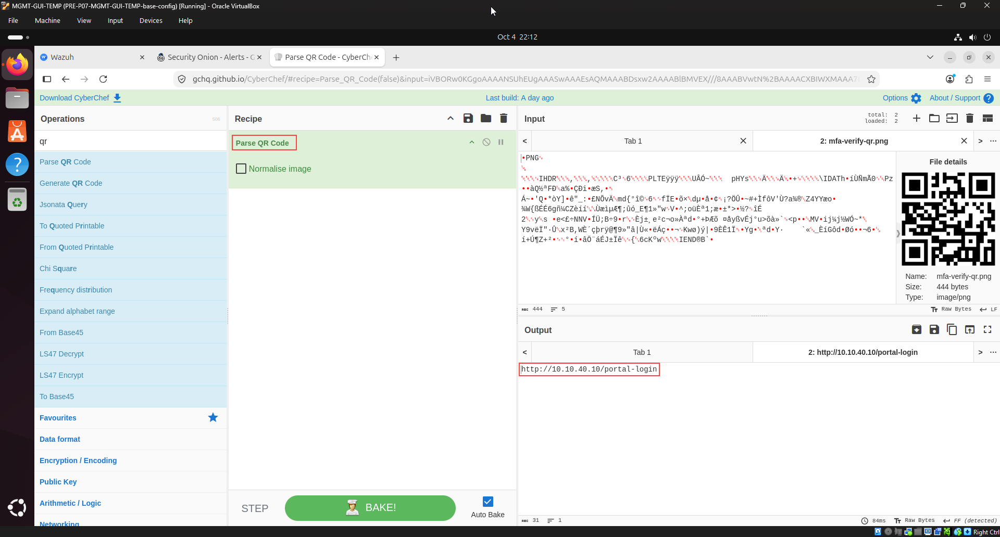
*Figure 8: CyberChef in Security Onion executing `Parse QR Code` operation, extracting the malicious phishing URL.*

---

### B. Network Protocol Telemetry (Security Onion / Zeek HTTP)
In Security Onion Hunt, querying `source.ip: 10.10.10.103 and destination.ip: 10.10.40.10` isolated the HTTP credential transaction in `zeek.http`:

* **Timestamp:** `2026-10-04T22:04:41.296Z`
* **Client IP & Port:** `10.10.10.103:54072`
* **Destination IP & Port:** `10.10.40.10:80`
* **HTTP Method:** `POST`
* **Referrer:** `http://10.10.40.10/portal-login`
* **MIME Types:** Request `text/plain` | Response `text/html` (Status `200 OK`)

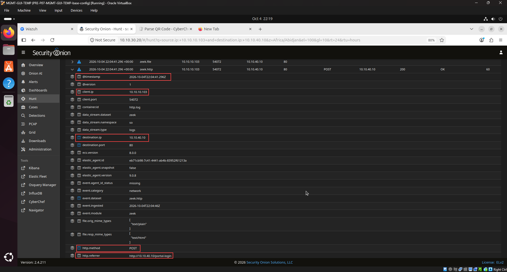
*Figure 9: Security Onion Hunt isolating the `POST /login` event in `zeek.http` from `10.10.10.103` to `10.10.40.10`.*

---

### C. Perimeter Firewall Audit (OPNsense Live View)
Inspection of `Firewall: Log Files: Live View` on `OPNsense-FW` (`10.10.10.1`) validated outbound traffic egress filtering:

* **Timestamp:** `2026-10-04T22:04:43`
* **Action:** `[pass]`
* **Direction / Interface:** `[in]` / `LAN` (`em1`)
* **Source Address:** `10.10.10.103`
* **Destination Address / Port:** `10.10.40.10:80`
* **Enforced Rule:** `P14-RuleA: COMPROMISED-01 -> EXT-ATTACKER-SIM tcp/80 (phishing/C2 HTTP)`

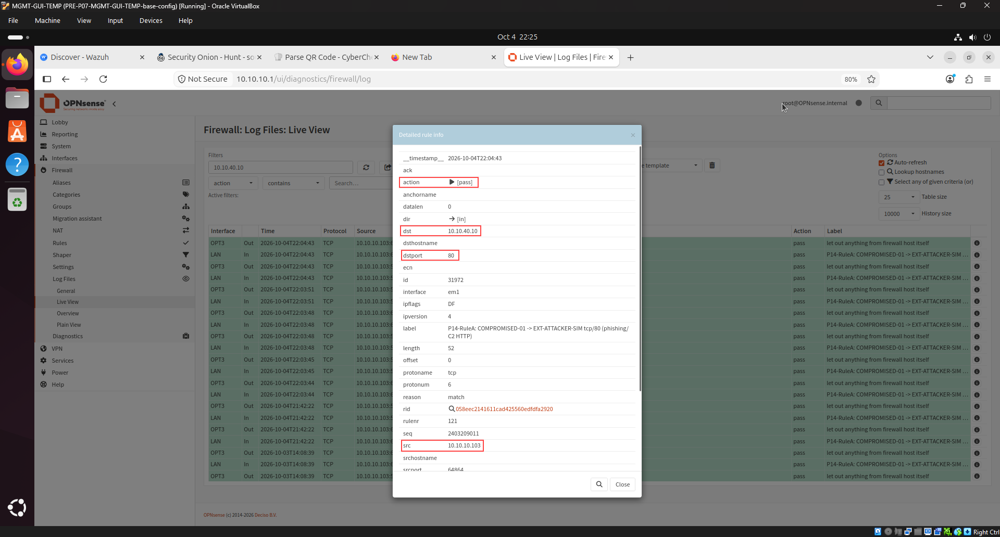
*Figure 10: OPNsense detailed rule modal confirming outbound TCP port 80 traffic permitted via rule `P14-RuleA`.*

---

### D. Endpoint SIEM Telemetry & Detection Blind Spot (Wazuh)
Auditing Agent `004` (`COMPROMISED-01`) in Wazuh Discover revealed endpoint session activity surrounding the attack window:

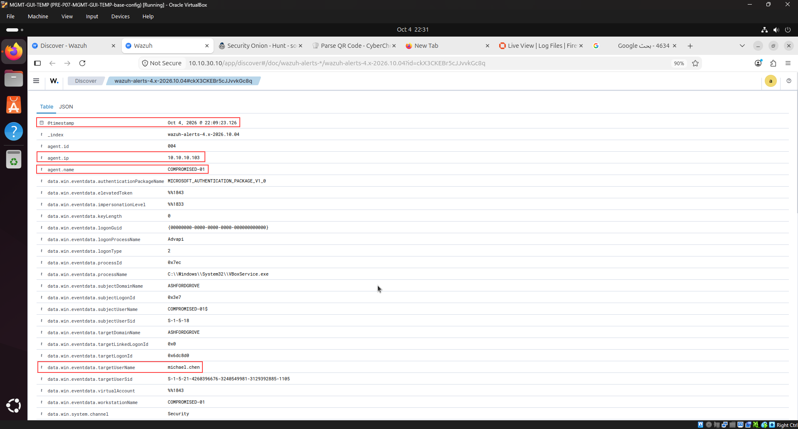
*Figure 11: Wazuh Discover document view verifying `COMPROMISED-01` (`10.10.10.103`), user `michael.chen`, and interactive `LogonType: 2` at `22:09:23`.*

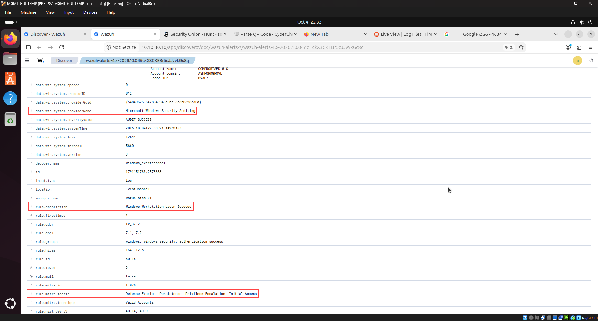
*Figure 12: Wazuh event details for Rule `60118` (`Windows Workstation Logon Success`), illustrating the native EDR detection gap.*

#### The Detection Gap Explained
Default endpoint agents and SIEM decoders do not perform Optical Character Recognition (OCR) or image decoding on files opened by standard viewer processes (`PhotosApp.exe`). While Wazuh logged valid interactive logon sessions (`LogonType: 2`), **zero alerts fired** for the rendering of the QR barcode. This gap left the organization vulnerable to unmonitored credential submissions.

---

## 5. Detection Engineering: SIEM & Email Gateway Rules

To resolve this detection blind spot, analyst Ali engineered a defense-in-depth detection suite spanning both the host SIEM and the email perimeter.

### A. Live Wazuh SIEM XML Rules (`local_rules.xml`)
Integrated directly into `/var/ossec/etc/rules/local_rules.xml` on `WAZUH-SIEM-01` (`10.10.30.10`):

```xml
<!-- ==============================================================================
     Ashford Grove SOC - Scenario AGC-004: Quishing Detection Rules
     Investigating Analyst: Ali (TOOSHY2) | Detection Engineering Team
     Target: /var/ossec/etc/rules/local_rules.xml
     ============================================================================== -->

<group name="local,syslog,sshd,">

  <!-- AGC-004: Detect Quishing Lure & MFA QR Interaction on Endpoint -->
  <rule id="100004" level="10">
    <if_sid>60000</if_sid>
    <match>mfa-verify-qr|agc004-email</match>
    <description>Ashford Grove SOC (AGC-004): Quishing vector detected - QR code image accessed or rendered on endpoint</description>
    <mitre>
      <id>T1566.002</id>
    </mitre>
    <info type="link">https://github.com/TOOSHY2/Ashford-Grove-SOC</info>
  </rule>

  <!-- AGC-004: Detect Outbound Phishing Egress to Attacker IP -->
  <rule id="100005" level="12">
    <if_sid>60000</if_sid>
    <field name="win.eventdata.destinationIp">^10\.10\.40\.10$</field>
    <description>Ashford Grove SOC (AGC-004): Egress connection to external phishing harvest sink (10.10.40.10)</description>
    <mitre>
      <id>T1071.001</id>
      <id>T1056.003</id>
    </mitre>
    <info type="link">https://github.com/TOOSHY2/Ashford-Grove-SOC</info>
  </rule>

</group>
```

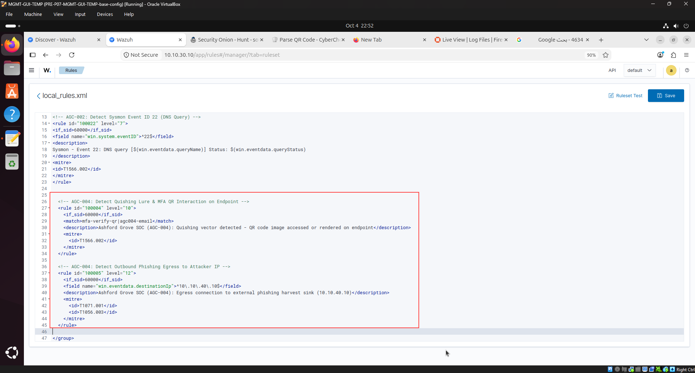
*Figure 13: Wazuh Dashboard `local_rules.xml` editor displaying custom rules `100004` and `100005` successfully saved and loaded.*

---

### B. Proactive Email Gateway Heuristic Rule (`email_gateway_quishing.yml`)
Implemented as a Secure Email Gateway (SEG) transport policy / Sigma heuristic to intercept zero-link image-based lures in-transit:

```yaml
# Heuristic Detection Rule: Quishing Evasion via Zero-Link QR Delivery
rule:
  name: "Email Gateway: Potential Quishing via Embedded Image with Zero Links"
  description: "Detects incoming external emails containing image attachments or inline QR codes with zero text hyperlinks in the body."
  severity: "HIGH"
  author: "Ali (TOOSHY2)"
  date: "2026-10-04"
  conditions:
    and:
      - email.sender.domain != "ashfordgrove.local" # Or spoofed internal origin
      - email.attachments.mime_type in ["image/png", "image/jpeg", "image/webp"]
      - email.body.hyperlink_count == 0
      - email.subject regex: "(?i)(MFA|2FA|verification|authenticator|device|security audit)"
  action:
    - quarantine_message
    - trigger_ocr_qr_decoding_pipeline
    - alert_soc_tier1
```

---

## 6. MITRE ATT&CK Mapping & Risk Matrix

| Tactic | Technique ID | Technique Name | Evidence Artifact | Risk / Severity |
|:---|:---|:---|:---|:---|
| **Initial Access (TA0001)** | `T1566.002` | Spearphishing Link (Quishing) | `mfa-verify-qr.png` embedded in email lure | **CRITICAL** |
| **Credential Access (TA0006)** | `T1056.003` | Web Portal Harvesting | AD credentials submitted to `/login` | **CRITICAL** |
| **Command & Control (TA0011)** | `T1071.001` | Web Protocols (HTTP) | Outbound HTTP traffic to `10.10.40.10:80` | **MEDIUM** |
| **Defense Evasion (TA0005)** | `T1204.002` | User Execution: Malicious File | Victim rendered QR image avoiding text URL scans | **HIGH** |
| **Initial Access (TA0001)** | `T1078` | Valid Accounts | Interactive logon verified for `michael.chen` | **HIGH** |

---

## 7. Incident Response & Containment Plan (IR Playbook)

### Immediate Containment Actions
1. **Active Directory Account Revocation (`AD-DC-01`):**
   * Force reset password for `ASHFORDGROVE\michael.chen`.
   * Invalidate active Kerberos Ticket Granting Tickets (TGTs) and session tokens via PowerShell:
     ```powershell
     Revoke-ADUserTokens -Identity "michael.chen"
     Set-ADUser -Identity "michael.chen" -ChangePasswordAtLogon $true
     ```
2. **Perimeter Firewall Blacklist (`OPNsense-FW`):**
   * Add immediate drop rule on WAN/LAN interfaces targeting `10.10.40.10:ANY`.
3. **Mail Gateway Sweep:**
   * Purge all instances of `Subject: MFA Device Verification Required` and hash of `mfa-verify-qr.png` enterprise-wide.
4. **Endpoint Remediation:**
   * Validate that no secondary binaries were downloaded via `msedge.exe` during the browsing session.

---

## 8. SOC L1 ➔ L2 Escalation Note

```ini
[TICKET HANDOVER: TIER 1 -> TIER 2]
Ticket ID       : INC-AGC-004
Severity / Pri  : CRITICAL (P1 - Credential Theft via Quishing)
Triage Verdict  : True Positive (Confirmed Domain Compromise)
Assigned Analyst: Ali (TOOSHY2) | Shift UTC: 2026-10-04 22:52
Target Scope    : COMPROMISED-01 (10.10.10.103) \ michael.chen
Adversary IoC   : 10.10.40.10:80 | Fake Acme Portal

[INCIDENT SUMMARY]
Adversary executed spearphishing attack weaponizing an embedded
QR code image (mfa-verify-qr.png) with zero extractable links.
Target employee michael.chen scanned/navigated to resolved
URL (10.10.40.10/portal-login) and submitted Active Directory
credentials in cleartext HTTP.

[TRIAGE EVIDENCE]
• CyberChef Dec : Parsed QR to 10.10.40.10/portal-login.
• Mobile Scan   : Real smartphone validated mobile vector.
• Attacker Log  : captured-creds.log recorded at 22:04.
• Network Egress: Zeek logged POST /login; OPNsense P14-RuleA.
• SIEM Telemetry: Wazuh confirmed interactive Logon Type 2.
• Detection Eng : Engineered Wazuh custom rules 100004/100005.

[ACTION ITEMS FOR TIER 2]
[ ] Force AD password reset and revoke active Kerberos tokens.
[ ] Deploy OPNsense WAN drop rule for adversary 10.10.40.10.
[ ] Enforce gateway heuristic rule to quarantine QR mail.
[ ] Audit mail server logs for other recipients of QR lure.
```
