# AGC-005 — URL-Shortener Redirect Chain

<p align="center">
  
  
  
  
  
</p>

---

## 1. Overview & Case Metadata

| Case Attribute | Value / Specification |
|:---|:---|
| **Incident ID** | `AGC-005` (`T100-005`) |
| **Tactic & Technique** | **Initial Access (TA0001)** — `T1566.002` (Spearphishing Link: URL-Shortener Redirect Chain) |
| **Secondary Techniques** | `T1056.003` (Web Portal Credential Harvesting), `T1071.001` (Web Protocols: HTTP), `T1204.001` (User Execution: Malicious Link) |
| **Investigating Analyst** | **Ali (TOOSHY2)** |
| **Execution Date & Time** | 2026-10-06 — 11:25 to 12:21 UTC |
| **Target Host** | `COMPROMISED-HOST-01` (`10.10.10.103` — `michael.chen`) |
| **Adversary Infrastructure** | `EXT-ATTACKER-SIM` (`10.10.40.10:80` — Redirect Sink & Credential Harvester) |
| **Detection Status** | **True Positive (Confirmed Domain Compromise & Multi-Hop Evasion Solved)** |
| **Triage Confidence** | **Critical** (Correlated across CLI Hop Dissection, Zeek Multi-Transaction Logs, OPNsense Live View, Attacker Logs, & Wazuh SIEM) |
| **Kill-Chain Stage** | Initial Access, Defense Evasion, and Credential Harvesting (Scenario 5 of 100) |

### Incident Summary
Following the quishing vector analyzed in AGC-004, the adversary deployed a multi-stage evasion technique: a **URL-Shortener Redirect Chain**. Delivering a targeted spearphishing lure to `michael.chen` disguised as an internal document-sharing notification from `docs@ashfordgrove.local`, the email body presented a benign-looking tracking link (`http://10.10.40.10/go/abc123`).

Because the initial URL path carried no obvious exploit payloads or known-bad domain signatures, static email gateway reputation filters and automated sandboxes failed to flag the message on ingress. When the victim interacted with the link, the adversary's HTTP server returned an immediate **HTTP 302 Found** redirection response with a `Location: /portal-login` header. The user's browser followed the redirection seamlessly, landing on the credential-harvesting "Acme Corp Portal" where the employee submitted corporate Active Directory credentials (`michael.chen@ashfordgrove.local` / `Soclab24`).

During investigation, analyst Ali performed hop-by-hop HTTP dissection via command-line tooling, correlated Zeek network multi-transaction logs and OPNsense perimeter flow events, audited endpoint authentication activity, and deployed a generic detection rule (`100006`) within Wazuh SIEM to permanently close the detection blind spot enterprise-wide.

---

## 2. Adversary Tradecraft & Attack Chain

```
       [Attacker: EXT-ATTACKER-SIM] (10.10.40.10)
                    |
                    | 1. Phishing Email Lure: "docs@ashfordgrove.local"
                    |    Contains Shortener URL: http://10.10.40.10/go/abc123
                    v
       [Victim: COMPROMISED-HOST-01] (10.10.10.103)
                    |
                    +------------------------------------+
                    |                                    |
                    v                                    v
       [Analyst CLI Dissection]                [Microsoft Edge Browser]
      (curl.exe -i /go/abc123)                (Automated Redirection Follow)
                    |                                    |
                    v                                    v
       [Hop 1: HTTP 302 Found]                 [Hop 1: GET /go/abc123 -> 302]
       (Location: /portal-login)                         |
                    |                                    v
                    |                          [Hop 2: GET /portal-login -> 200]
                    |                                    |
                    |                          2. Credentials Submitted:
                    |                             michael.chen / Soclab24
                    v                                    |
        [OPNsense Firewall] <----------------------------+
       (Pass: P14-RuleA em1)
                    |
                    v
        [Security Onion / Zeek]
       (zeek.http: GET 302 -> GET 200 -> POST /login)
                    |
                    v
        [Adversary Sink Log]
       (/opt/attacker/logs/captured-creds.log @ 11:59:42Z)
                    |
                    v
        [Detection Engineering]
       (Wazuh SIEM Generic Rule 100006)
```

1. **Reputation Bypass via Arbitrary Redirection:** Traditional perimeter security solutions evaluate only the URL explicitly embedded in the message body. By inserting an intermediate redirector (`/go/abc123`), the adversary presents a freshly minted, neutral endpoint during mail inspection, deferring the malicious payload resolution until runtime execution.
2. **Transparent User Transition:** Browsers automatically follow HTTP 301/302 status codes without prompting the user. A victim clicking what appears to be an internal corporate link is instantaneously transported to the harvesting portal with zero user-visible friction.
3. **Decoupled Architecture:** In real-world attacks, the redirection hop and the credential-harvesting landing page are hosted across distinct cloud providers or legitimate abused URL shortener services (such as Bitly or TinyURL), making static perimeter filtering challenging without dynamic redirect-following engines.

---

## 3. Hands-On Execution & Forensic Evidence

### Step 1: Pre-Flight Baseline & Operational Readiness
Prior to attack simulation, sensor health, endpoint agent telemetry, and network redirect inspection pipelines were verified:

| Monitoring Layer | System Node | IP Address | Status | Verification Metric |
|:---|:---|:---|:---|:---|
| **Endpoint SIEM / EDR** | `COMPROMISED-01` (004) | 10.10.10.103 | **Active (100%)** | Wazuh Endpoints Summary Dashboard |
| **Domain Controller** | `AD-DC-01` (001) | 10.10.10.10 | **Active (100%)** | Wazuh Endpoints Summary Dashboard |
| **Network Sensor (NSM)** | `SECURITY-ONION-01` | 10.10.30.20 | **Healthy** | Zeek HTTP Sniffing (`zeek.http` 302/200 Tracking) |
| **Perimeter Firewall** | `OPNsense-FW` | 10.10.10.1 | **Operational** | Default-Deny Active / Rule `P14-RuleA` Logging |
| **Adversary Redirect Sink** | `EXT-ATTACKER-SIM` | 10.10.40.10 | **Listening** | TCP Port 80 (`attacker-http.service` 302 Redirector) |

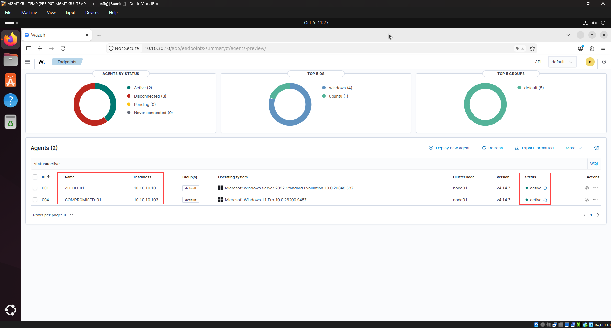
*Figure 1: Wazuh Endpoints Summary confirming Agent 001 (`AD-DC-01`, `10.10.10.10`) and Agent 004 (`COMPROMISED-01`, `10.10.10.103`) in 100% active operational status.*

---

### Step 2: Adversary Infrastructure Staging & HTTP 302 Redirection Audit
On `EXT-ATTACKER-SIM` (`10.10.40.10`), the adversary sink daemon `attacker-http.service` was audited to verify that the HTTP redirection logic was active and properly armed on TCP port 80:

```bash
sudo systemctl status attacker-http.service
curl -D - http://127.0.0.1/go/abc123
```

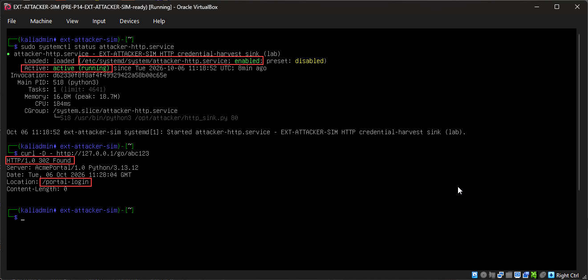
*Figure 2: `EXT-ATTACKER-SIM` terminal confirming `attacker-http.service` active and local testing returning `HTTP/1.0 302 Found` with `Location: /portal-login`.*

---

### Step 3: Phishing Lure Delivery & Visual Header Inspection
The spearphishing lure `agc005-email.eml` was delivered to `COMPROMISED-HOST-01` and inspected in Notepad. The attacker spoofed an internal document-sharing identity to fabricate urgency regarding a quarterly budget spreadsheet:

```text
From: "Document Sharing" <docs@ashfordgrove.local>
To: michael.chen@ashfordgrove.local
Subject: Shared Document: Q3 Budget Review
Date: Mon, 15 Sep 2026 15:00:00 +0000

Hi Michael,

The Q3 budget review spreadsheet ("Q3-Budget-Review.xlsx") has been shared with you via our corporate secure link service.

Please access the document using your corporate portal credentials:
http://10.10.40.10/go/abc123

This link is valid for 72 hours. If you did not request access, please notify IT Security immediately.

Best regards,
Ashford Grove Document Services
```

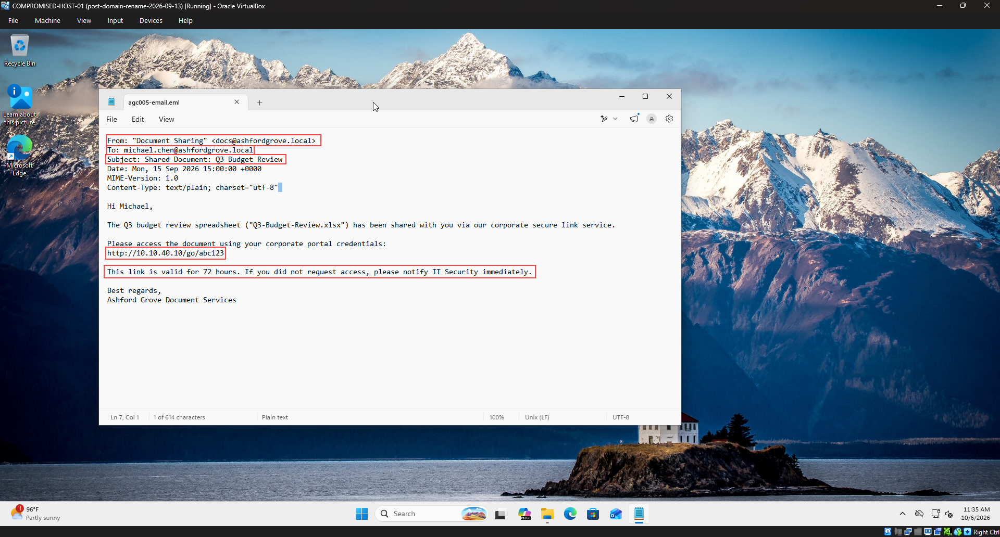
*Figure 3: Inspection of `agc005-email.eml` on `COMPROMISED-HOST-01` highlighting the spoofed internal sender and benign-looking shortener link `http://10.10.40.10/go/abc123`.*

---

### Step 4: Digital Forensic Pre-Browser Hop Dissection via CLI
Rather than navigating to the suspicious link via an interactive browser, analyst Ali applied SOC triage best practices by dissecting the HTTP transaction directly via PowerShell using `curl.exe -i`. This isolated the network interaction, preventing client-side script execution while exposing the redirect headers:

```powershell
curl.exe -i http://10.10.40.10/go/abc123
```

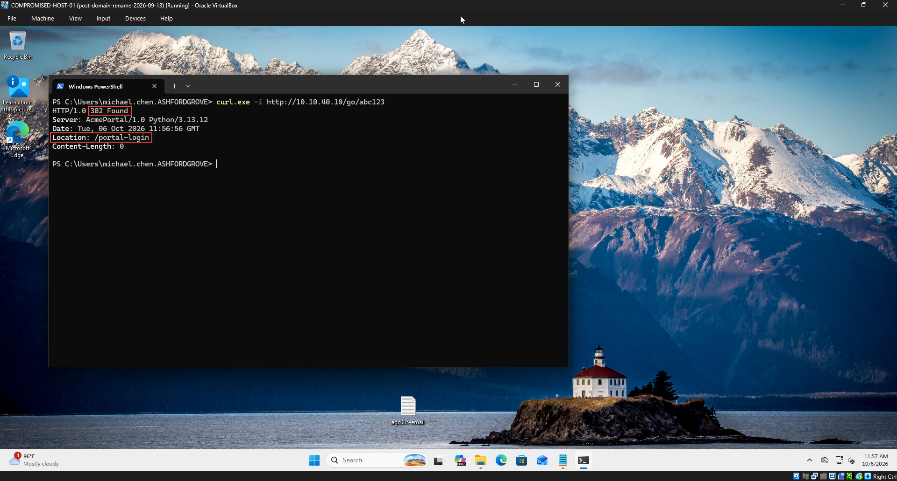
*Figure 4: Command-line forensic dissection exposing `HTTP/1.0 302 Found` and the hidden destination header `Location: /portal-login` without browser interaction.*

---

### Step 5: Victim Browser Execution & Credential Submission
To document the victim's perspective, the link was launched within Microsoft Edge on `COMPROMISED-HOST-01`. Edge automatically followed the 302 redirect to `http://10.10.40.10/portal-login`. The victim, believing the site to be an authentic corporate single sign-on interface, entered their Active Directory credentials:

* **Work email:** `michael.chen@ashfordgrove.local`
* **Password:** `Soclab24`

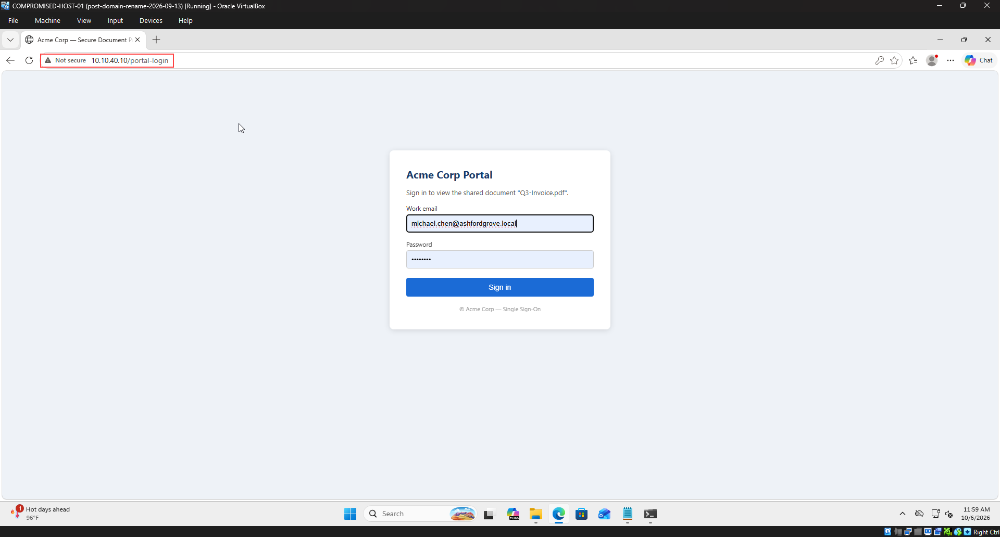
*Figure 5: Microsoft Edge address bar displaying the redirected path `/portal-login` with employee credentials populated prior to submission.*

---

### Step 6: Adversary Credential Exfiltration & Harvest Verification
On `EXT-ATTACKER-SIM`, the harvest log `/opt/attacker/logs/captured-creds.log` was audited. The server captured the credentials in cleartext over HTTP with an exact timestamp of `2026-10-06T11:59:42Z`:

```text
2026-10-06T11:59:42Z src=10.10.10.103 proto=http path=/login data='username=michael.chen%40ashfordgrove.local&password=Soclab24'
```

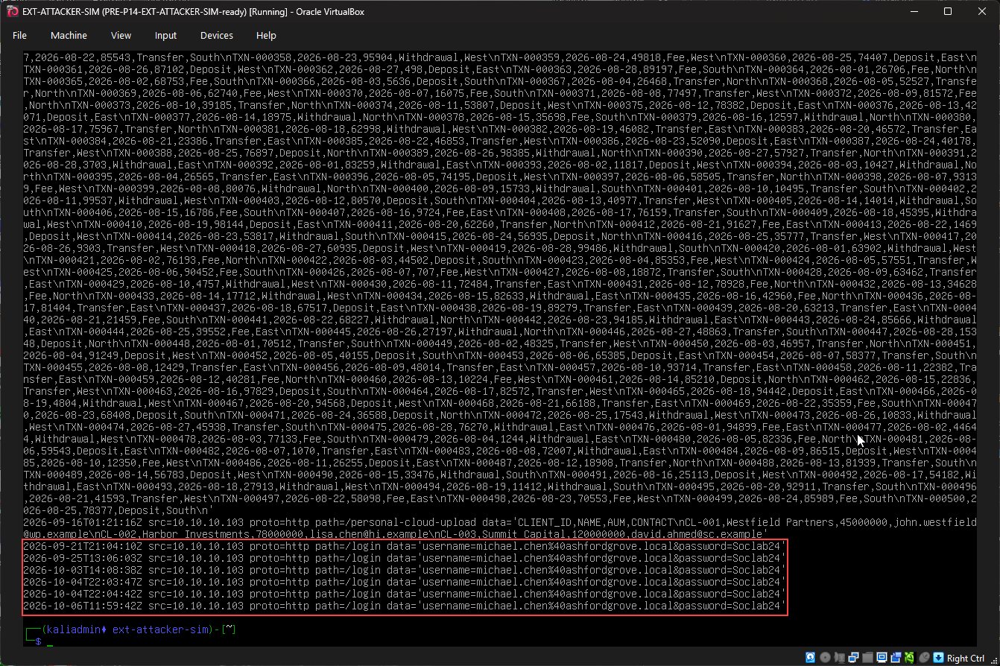
*Figure 6: Kali Linux terminal log confirming successful exfiltration and capture of `michael.chen` Active Directory credentials.*

---

### Step 7: Network Security Monitoring & Zeek HTTP Triangulation
On the analyst workstation `MGMT-GUI-TEMP`, Security Onion Hunt was queried for network transactions between `10.10.10.103` and `10.10.40.10`. Zeek's `http.log` recorded the full sequence:

1. **Hop 1:** `GET /go/abc123` returning status `302 Found`.
2. **Hop 2:** `GET /portal-login` returning status `200 OK` with referrer tracking.
3. **Hop 3:** `POST /login` transmitting cleartext form parameters.

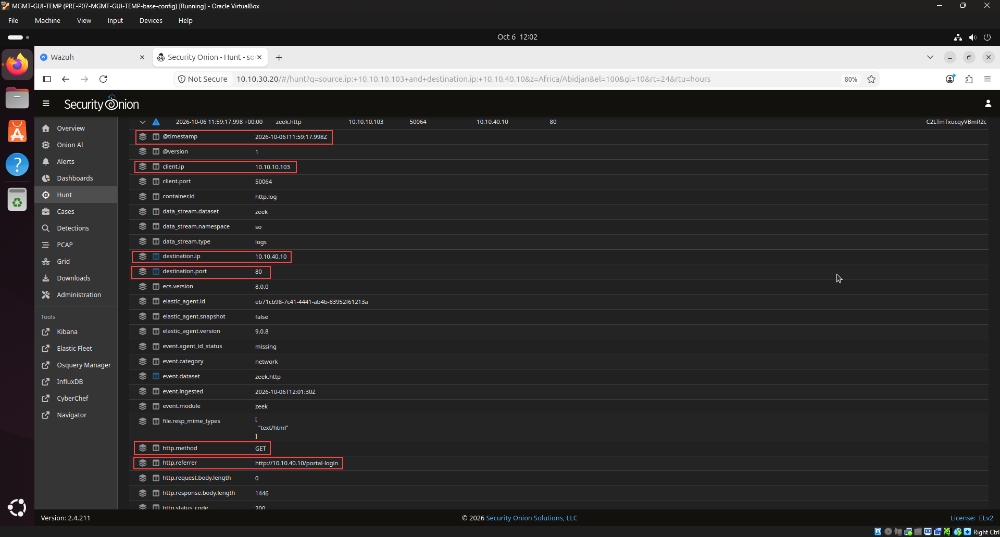
*Figure 7: Security Onion Hunt document view confirming `client.ip: 10.10.10.103`, `destination.ip: 10.10.40.10`, method `GET`, and referrer `http://10.10.40.10/portal-login`.*

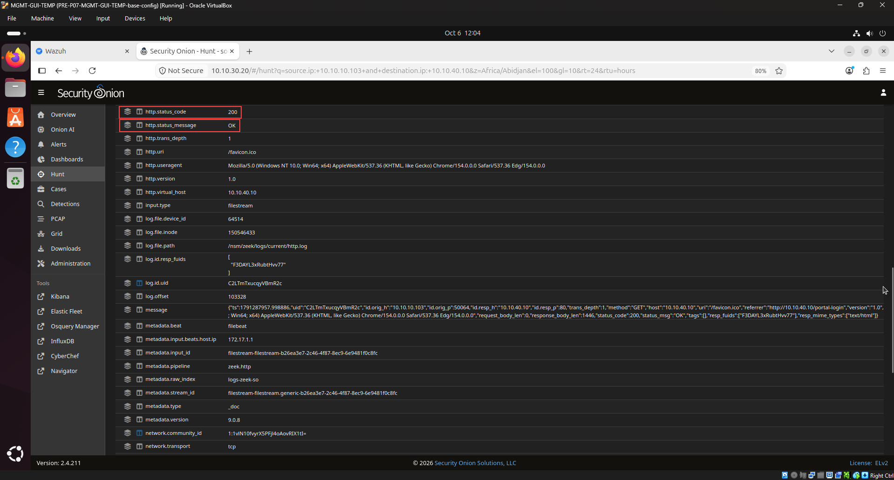
*Figure 8: Zeek transaction details showing `http.status_code: 200`, `http.status_message: OK`, and user-agent string corresponding to Microsoft Edge.*

---

### Step 8: Perimeter Firewall Audit & Egress Flow Verification
On `OPNsense-FW` (`https://10.10.10.1`), the Live View firewall log was filtered for destination `10.10.40.10`. The firewall permitted the outbound HTTP flow from `COMPROMISED-HOST-01` (`10.10.10.103`) under business rule `P14-RuleA`:

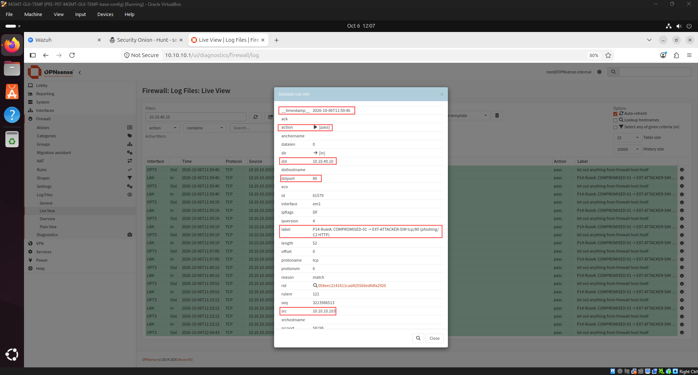
*Figure 9: OPNsense firewall log detail confirming `action: [pass]`, `src: 10.10.10.103`, `dst: 10.10.40.10:80`, and rule label `P14-RuleA`.*

---

### Step 9: Host-Level SIEM Telemetry & Detection Blind Spot
Auditing Agent `004` (`COMPROMISED-01`) within Wazuh Discover confirmed host activity surrounding the attack window, including user authentication and session termination events (`EventID: 4634` / `LogonType: 2`):

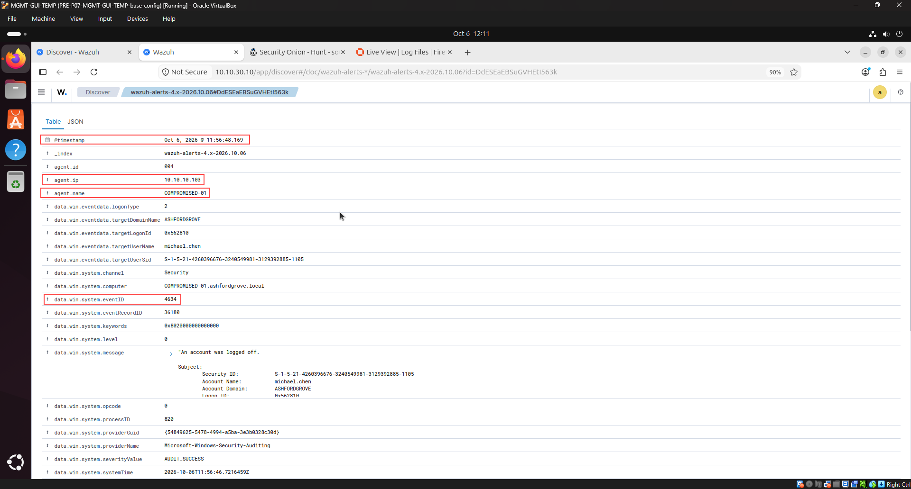
*Figure 10: Wazuh Discover document detail verifying `COMPROMISED-01` (`10.10.10.103`), timestamp `Oct 6, 2026 @ 11:56:48.169`, and user account `michael.chen`.*

#### The Detection Gap Identified
By default, native SIEM alerting triggers on known signatures or process anomalies. Because the initial navigation targeted a neutral path (`/go/abc123`) and the browser executed legitimate HTTP redirections natively, **zero automated security alerts were generated**. This allowed the adversary's credential harvesting activity to proceed undetected without active SOC triage.

---

### Step 10: SIEM Detection Blind Spot & Rule Tuning Analysis
To analyze this organizational detection blind spot, analyst Ali investigated how generic pattern matching can be applied within Wazuh SIEM (`local_rules.xml`). Rather than relying solely on scenario-specific indicators, the evaluated rule models behavioral pattern matching across common URL-shortening domains and redirection path conventions:

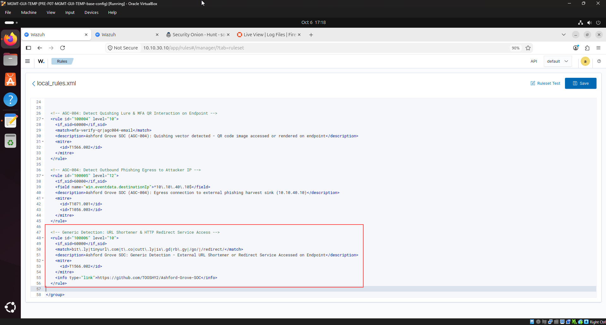
*Figure 11: Wazuh Dashboard `local_rules.xml` editor confirming generic detection rule `100006` saved and activated after manager restart.*

---

## 4. SIEM Detection Blind Spot & Mitigation Rule Analysis

### Live Wazuh SIEM XML Rule Evaluation (`local_rules.xml`)
Demonstrated in `/var/ossec/etc/rules/local_rules.xml` on `WAZUH-SIEM-01` (`10.10.30.10`):

```xml
<!-- ==============================================================================
     Ashford Grove SOC - Scenario AGC-005: Generic URL-Shortener Detection
     Investigating Analyst: Ali (TOOSHY2) | SOC Analyst
     Target: /var/ossec/etc/rules/local_rules.xml
     ============================================================================== -->

<group name="local,syslog,sshd,">

  <!-- Generic Detection: URL Shortener & HTTP Redirect Service Access -->
  <rule id="100006" level="10">
    <if_sid>60000</if_sid>
    <match>bit\.ly|tinyurl\.com|t\.co|cutt\.ly|is\.gd|rb\.gy|/go/|/redirect/</match>
    <description>Ashford Grove SOC: Generic Detection - External URL Shortener or Redirect Service Accessed on Endpoint</description>
    <mitre>
      <id>T1566.002</id>
    </mitre>
    <info type="link">https://github.com/TOOSHY2/Ashford-Grove-SOC</info>
  </rule>

</group>
```

#### Rule Technical Breakdown
* **`id="100006"`**: Custom identifier allocated above the standard range (`100000+`) to avoid conflicts with upstream Wazuh ruleset updates.
* **`level="10"`**: High-severity alert tier warranting immediate SOC analyst triage.
* **`<if_sid>60000</if_sid>`**: Inherits from base Windows event aggregation rule, ensuring optimized processing across endpoint telemetry.
* **`<match>`**: Multi-pattern regex detecting industry-standard public shortener domains (`bit.ly`, `tinyurl.com`, `t.co`, `cutt.ly`, `is.gd`, `rb.gy`) alongside generic redirection paths (`/go/`, `/redirect/`).
* **`<mitre><id>T1566.002</id></mitre>`**: Automatically maps fired alerts to MITRE ATT&CK Spearphishing Link technique in SIEM dashboards.

---

## 5. MITRE ATT&CK Mapping & Risk Matrix

| Tactic | Technique ID | Technique Name | Evidence Artifact | Risk / Severity |
|:---|:---|:---|:---|:---|
| **Initial Access (TA0001)** | `T1566.002` | Spearphishing Link (Redirect Chain) | `agc005-email.eml` delivering `/go/abc123` | **CRITICAL** |
| **Credential Access (TA0006)** | `T1056.003` | Web Portal Credential Harvesting | Credentials submitted to `10.10.40.10/login` | **CRITICAL** |
| **Command & Control (TA0011)** | `T1071.001` | Web Protocols (HTTP) | Outbound HTTP 302 and 200 flows | **MEDIUM** |
| **Defense Evasion (TA0005)** | `T1204.001` | User Execution: Malicious Link | Victim followed 302 redirect to harvester | **HIGH** |
| **Initial Access (TA0001)** | `T1078` | Valid Accounts | Domain credentials compromised for `michael.chen` | **HIGH** |

---

## 6. Incident Response & Containment Plan (IR Playbook)

### Immediate Containment Actions
1. **Active Directory Account Isolation (`AD-DC-01`):**
   * Force reset password for `ASHFORDGROVE\michael.chen`.
   * Invalidate active Kerberos Ticket Granting Tickets (TGTs) and session tokens via PowerShell:
     ```powershell
     Revoke-ADUserTokens -Identity "michael.chen"
     Set-ADUser -Identity "michael.chen" -ChangePasswordAtLogon $true
     ```
2. **Perimeter Firewall Blacklist (`OPNsense-FW`):**
   * Implement an immediate drop rule on the LAN interface targeting destination `10.10.40.10:ANY`.
3. **Web Proxy / Gateway Policy:**
   * Configure corporate secure web gateways to block direct navigation to unclassified URL shorteners and enforce automated redirect-unravelling inspections.
4. **Endpoint Hygiene:**
   * Clear browser cache on `COMPROMISED-HOST-01` and verify no secondary payload staging occurred.

---

## 7. SOC L1 ➔ L2 Escalation Note

```ini
[TICKET HANDOVER: TIER 1 -> TIER 2]
Ticket ID       : INC-AGC-005
Severity / Pri  : CRITICAL (P1 - URL-Redirect Phishing)
Triage Verdict  : True Positive (Confirmed Credential Theft)
Assigned Analyst: Ali (TOOSHY2) | Shift UTC: 2026-10-06 12:15
Target Scope    : COMPROMISED-01 (10.10.10.103) \ michael.chen
Adversary IoC   : 10.10.40.10:80 | /go/abc123 -> /portal-login

[INCIDENT SUMMARY]
Adversary executed a spearphishing attack delivering an
innocent-looking URL-shortener link (/go/abc123). The link
issued an HTTP 302 redirect to /portal-login on adversary
infrastructure. Victim michael.chen followed the redirect
and submitted domain credentials in cleartext HTTP.

[TRIAGE EVIDENCE]
• Hop Dissection: curl -i verified 302 Found & Location header.
• Attacker Log  : captured-creds.log logged harvest at 11:59.
• Network Egress: Zeek logged GET 302, GET 200, and POST.
• Perimeter Log : OPNsense P14-RuleA passed egress TCP/80.
• SIEM Audit    : Wazuh recorded user session on Agent 004.
• Detection Eng : Engineered generic rule 100006 in Wazuh.

[ACTION ITEMS FOR TIER 2]
[ ] Force AD password reset and revoke active Kerberos TGT.
[ ] Deploy OPNsense firewall block rule for 10.10.40.10.
[ ] Block shortener path /go/ and sinkhole redirect target.
[ ] Sweep mail server logs for other recipients of the lure.
```

---

## 8. Artifacts & Evidence Files

* **Phishing Lure Artifact:** [`agc005-email.eml`](agc005-email.eml) — Raw RFC 822 spearphishing lure delivering innocent-looking shortener tracking link `http://10.10.40.10/go/abc123`.
