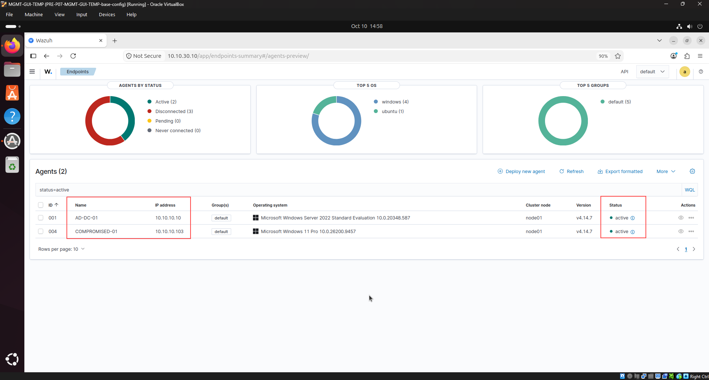
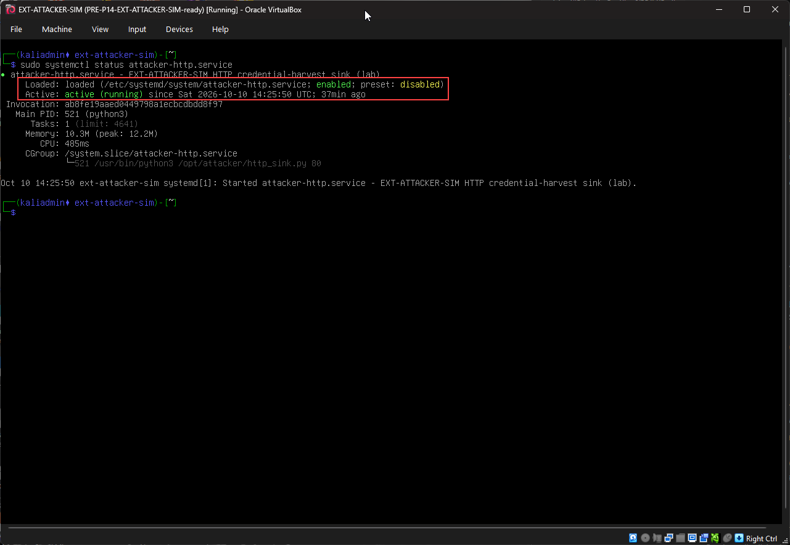
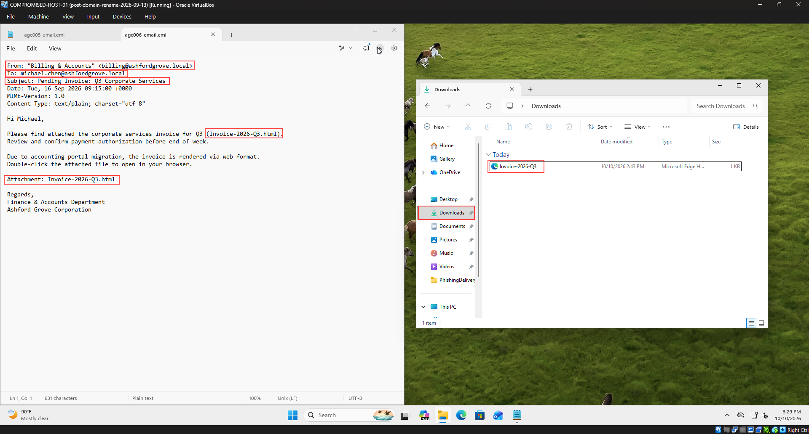
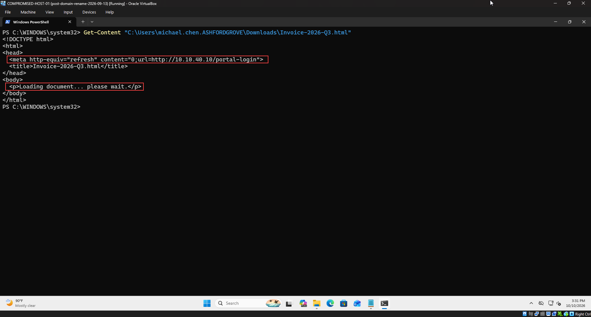
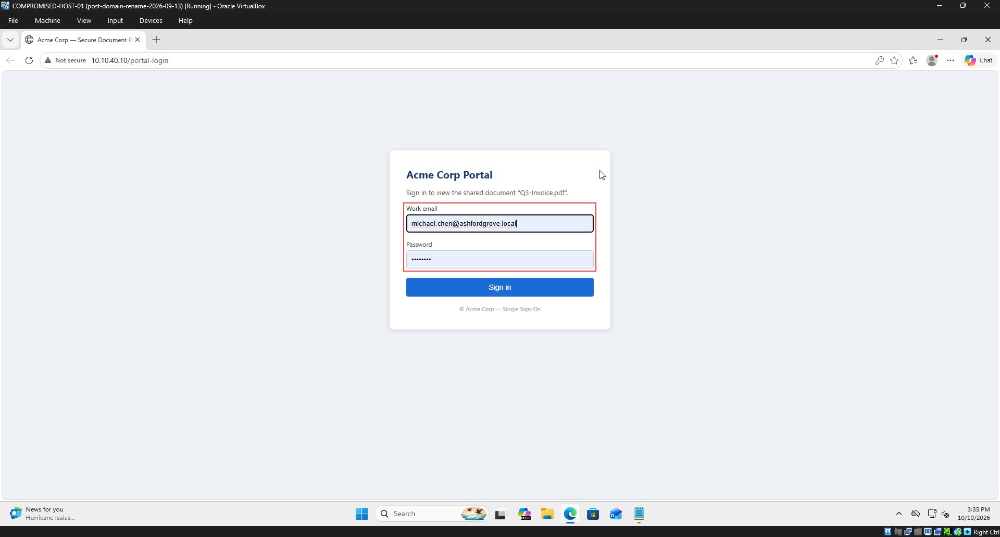
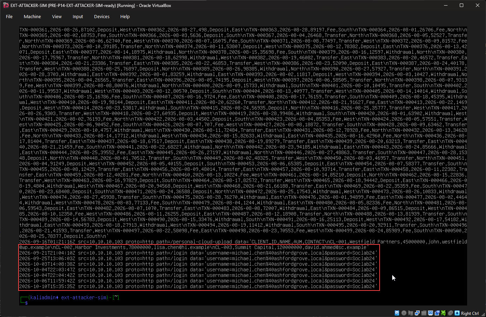
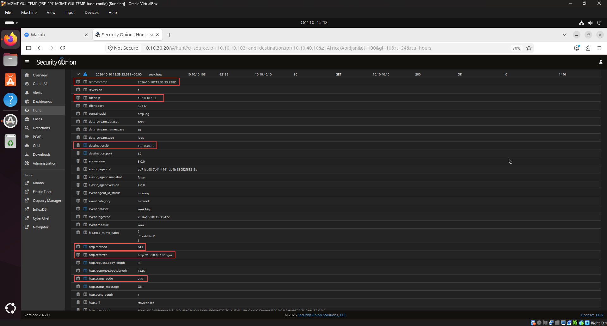
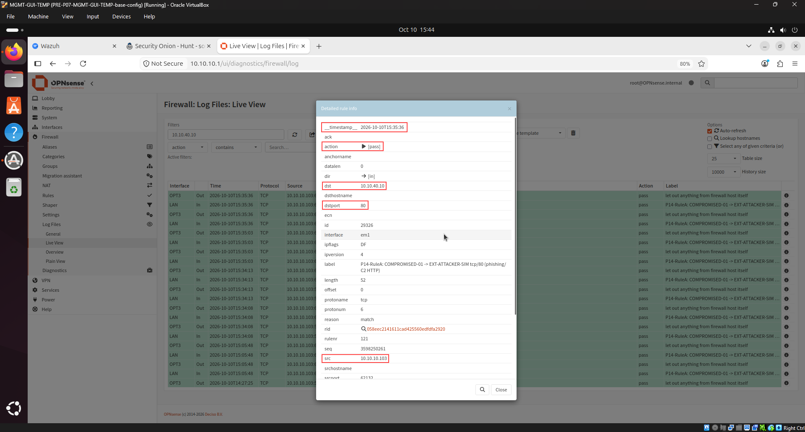
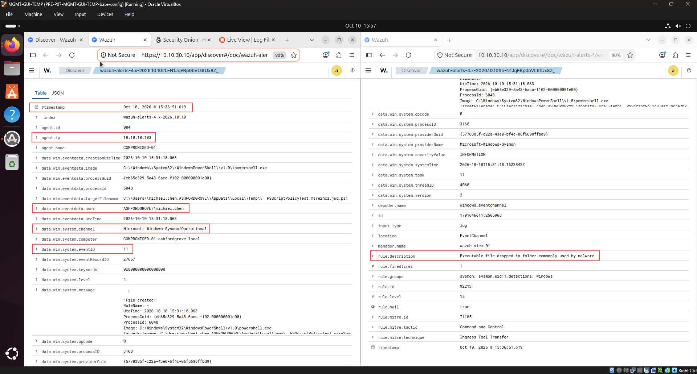

# AGC-006 — HTML Attachment Redirect Indicator (HTML Smuggling via Meta-Refresh)

<p align="center">
  
  
  
  
  
</p>

---

## 1. Overview & Case Metadata

| Case Attribute | Value / Specification |
|:---|:---|
| **Incident ID** | `AGC-006` (`T100-006`) |
| **Primary Technique** | **Initial Access (TA0001)** — `T1566.001` (Spearphishing Attachment: HTML Smuggling / Meta-Refresh) |
| **Secondary Techniques** | `T1056.003` (Web Portal Credential Harvesting), `T1071.001` (Web Protocols: HTTP), `T1204.002` (User Execution: Malicious File), `T1078` (Valid Accounts) |
| **Investigating Analyst** | **Ali (TOOSHY2)** |
| **Execution Date & Time** | 2026-10-10 — 15:35 to 15:57 UTC |
| **Target Host** | `COMPROMISED-HOST-01` (`10.10.10.103` — `ASHFORDGROVE\michael.chen`) |
| **Adversary Infrastructure** | `EXT-ATTACKER-SIM` (`10.10.40.10:80` — Spoofed "Acme Corp" SSO Portal) |
| **Detection Status** | **True Positive (Confirmed Enterprise Credential Compromise & Telemetry Triangulation)** |
| **Triage Confidence** | **Critical** (Correlated across Sysmon EID 11, Zeek HTTP, OPNsense Live View, Attacker Sink Logs, and Wazuh SIEM) |
| **MITRE Navigator Layer** | [`AGC-006.json`](../../../MITRE-Mapping/layers/AGC-006.json) |
| **Kill-Chain Stage** | Initial Access, Defense Evasion, and Credential Access (Scenario 6 of 100) |

### Incident Summary
Following perimeter evasion tactics demonstrated in AGC-004 (QR-code quishing) and AGC-005 (URL shortener redirect hops), the adversary escalated to an advanced evasion tradecraft: **HTML Smuggling via Zero-Delay Meta-Refresh**. Impersonating corporate billing (`billing@ashfordgrove.local`), the adversary delivered a targeted spearphishing lure to `michael.chen` referencing a pending Q3 corporate services invoice.

Crucially, the email body was **completely devoid of extractable hyperlinks** (`<a href="...">` count = 0), bypassing standard Secure Email Gateways (SEGs) and automated static link reputation engines. The malicious execution vector was encapsulated inside an attached HTML file (`Invoice-2026-Q3.html`). When opened locally on the victim endpoint, an embedded client-side meta-refresh directive (`<meta http-equiv="refresh" content="0;url=http://10.10.40.10/portal-login">`) forced Microsoft Edge to instantaneously navigate away from the local file system and connect to the external credential-harvesting portal.

Victim `michael.chen` submitted corporate domain credentials (`michael.chen@ashfordgrove.local` / `Soclab24`). Investigating analyst **Ali (TOOSHY2)** executed full-spectrum incident triage:
1. Conducted deep digital code forensics on the HTML artifact confirming the zero-delay redirection payload.
2. Verified live credential exfiltration on the adversary sink at `2026-10-10T15:35:35Z`.
3. Triangulated network-layer egress via **Zeek NSM** (`zeek.http` GET/POST transactions) and **OPNsense Firewall** (permit rule `P14-RuleA`).
4. Reconstructed endpoint telemetry via **Wazuh SIEM** auditing **Sysmon Event ID 11** (`Rule 92213`), diagnosing enterprise detection blind spots, and authoring an incident response containment playbook.

---

## 2. Adversary Tradecraft & Attack Chain

```
       [Attacker: EXT-ATTACKER-SIM] (10.10.40.10)
                    |
                    | 1. Spotless Email Body: "billing@ashfordgrove.local"
                    |    Zero text hyperlinks + Attached "Invoice-2026-Q3.html"
                    v
       [Victim: COMPROMISED-HOST-01] (10.10.10.103)
                    |
                    | 2. File Downloaded to User Profile
                    |    C:\Users\michael.chen\Downloads\Invoice-2026-Q3.html
                    v
       [Local Browser Invocation] (msedge.exe)
                    | User double-clicks HTML invoice
                    v Loads local file:/// URI in browser
       [Client-Side Meta-Refresh Redirection]
                    | <meta http-equiv="refresh" content="0;url=http://10.10.40.10/portal-login">
                    v Instant zero-delay browser jump to external harvest portal
       [Cleartext Credential Submission]
                    | POST /login -> michael.chen@ashfordgrove.local / Soclab24
                    v
       [OPNsense Perimeter Firewall] (10.10.10.1)
                    | Permitted via Rule P14-RuleA (LAN em1 -> 10.10.40.10:80)
                    v
       [Security Onion / Zeek NSM] (10.10.30.20)
                    | zeek.http: GET /portal-login (200 OK) -> POST /login
                    v
       [Adversary Harvesting Sink Log]
                    | /opt/attacker/logs/captured-creds.log @ 15:35:35Z
                    v
       [Endpoint Telemetry Correlation (Wazuh SIEM)]
            (Sysmon Event ID 11 FileCreate Alert: Rule 92213)
```

1. **Zero-Link Perimeter Evasion:** By placing no URL strings inside the message body, the email evades transport-layer URL re-writing mechanisms (e.g., Safe Links, URL sandboxes) that evaluate only raw email body tokens.
2. **Document Disguise:** HTML files are frequently treated by perimeter filters as legitimate document formats (e.g., exported statements or reports), passing inbound MIME inspection where executable extensions (`.exe`, `.scr`, `.bat`) are blocked.
3. **Automated Client-Side Execution:** The `<meta http-equiv="refresh">` HTML tag executes directly in the browser's DOM rendering engine without requiring JavaScript or active macros. When configured with a `0`-second delay, the redirection occurs instantaneously without prompting the victim.
4. **Cleartext Exfiltration:** The victim enters Active Directory domain credentials into an unencrypted HTTP form hosted on `10.10.40.10`, completing the Initial Access and Credential Harvesting kill-chain phase.

---

## 3. Hands-On Execution & Forensic Evidence

### Step 1: Pre-Flight Baseline & Operational Readiness
Prior to attack simulation, sensor health, telemetry forwarding pipelines, and analyst monitoring dashboards were verified across all monitoring tiers:

| Monitoring Layer | System Node | IP Address | Status | Verification Metric |
|:---|:---|:---|:---|:---|
| **Endpoint SIEM / EDR** | `COMPROMISED-01` (004) | 10.10.10.103 | **Active (100%)** | Wazuh Endpoints Summary Dashboard |
| **Domain Controller** | `AD-DC-01` (001) | 10.10.10.10 | **Active (100%)** | Wazuh Endpoints Summary Dashboard |
| **Network Sensor (NSM)** | `SECURITY-ONION-01` | 10.10.30.20 | **Healthy** | Zeek HTTP Sniffing (`zeek.http` GET/POST Tracking) |
| **Perimeter Firewall** | `OPNsense-FW` | 10.10.10.1 | **Operational** | Default-Deny Active / Rule `P14-RuleA` Outbound Logging |
| **Adversary HTTP Sink** | `EXT-ATTACKER-SIM` | 10.10.40.10 | **Listening** | TCP Port 80 (`attacker-http.service`) |

Accessing the Wazuh Dashboard at `https://10.10.30.10`, both `AD-DC-01` (Agent `001`) and `COMPROMISED-01` (Agent `004`) were validated in an active reporting status:


*Figure 1: Wazuh Endpoints Summary confirming Agent 001 (`AD-DC-01`, `10.10.10.10`) and Agent 004 (`COMPROMISED-01`, `10.10.10.103`) in 100% active operational state.*

---

### Step 2: Adversary Infrastructure Staging & HTTP Sink Audit
On `EXT-ATTACKER-SIM` (`10.10.40.10`), the adversary credential harvesting sink daemon was audited and confirmed operational on TCP port 80:

```bash
sudo systemctl status attacker-http.service
```


*Figure 2: `EXT-ATTACKER-SIM` terminal displaying `attacker-http.service` active and running on TCP port 80 serving `/opt/attacker/http_sink.py`.*

---

### Step 3: Phishing Lure Delivery & Visual Header Inspection
The spearphishing lure `agc006-email.eml` was delivered to `COMPROMISED-HOST-01`. Analyst inspection confirmed spoofed billing identity and complete absence of body hyperlinks, alongside the dropped attachment `Invoice-2026-Q3.html` staged in the user's Downloads directory:

```text
From: "Billing & Accounts" <billing@ashfordgrove.local>
To: michael.chen@ashfordgrove.local
Subject: Pending Invoice: Q3 Corporate Services
Date: Tue, 16 Sep 2026 09:15:00 +0000
MIME-Version: 1.0
Content-Type: text/plain; charset="utf-8"

Hi Michael,

Please find attached the corporate services invoice for Q3 (Invoice-2026-Q3.html). 
Review and confirm payment authorization before end of week.

Due to accounting portal migration, the invoice is rendered via web format. 
Double-click the attached file to open in your browser.

Attachment: Invoice-2026-Q3.html

Regards,
Finance & Accounts Department
Ashford Grove Corporation
```


*Figure 3: Dual-pane forensic staging on `COMPROMISED-HOST-01`: Notepad verifying zero hyperlinks in `agc006-email.eml` (left) and File Explorer confirming `Invoice-2026-Q3.html` located in `C:\Users\michael.chen\Downloads\` (right).*

---

### Step 4: Digital Artifact Forensics & Code Dissection
Before user execution, analyst Ali inspected the raw source code of `Invoice-2026-Q3.html` on the endpoint using Windows PowerShell:

```powershell
Get-Content "C:\Users\michael.chen.ASHFORDGROVE\Downloads\Invoice-2026-Q3.html"
```

```html
<!DOCTYPE html>
<html>
<head>
  <meta http-equiv="refresh" content="0;url=http://10.10.40.10/portal-login">
  <title>Invoice-2026-Q3.html</title>
</head>
<body>
  <p>Loading document... please wait.</p>
</body>
</html>
```


*Figure 4: PowerShell code forensics revealing the client-side execution weapon: `<meta http-equiv="refresh" content="0;url=http://10.10.40.10/portal-login">` with zero delay.*

The code dissection confirmed that the file serves purely as a redirection container:
* **`http-equiv="refresh"`**: Standard HTTP header equivalent instructing the client user-agent to refresh/redirect.
* **`content="0;url=..."`**: Designates zero seconds delay, prompting immediate browser redirection without user prompt.
* **Decoy Paragraph**: Contains `<p>Loading document... please wait.</p>` to briefly mask redirection latency.

---

### Step 5: User Execution & Dynamic Meta-Refresh Redirection
Victim `michael.chen` opened the HTML attachment from the Downloads directory. Microsoft Edge launched to render the local file, instantly honored the meta-refresh directive, and navigated to the adversary harvesting portal `http://10.10.40.10/portal-login`. The victim entered corporate Active Directory credentials:

* **Target Portal:** `Acme Corp Portal` (`http://10.10.40.10/portal-login`)
* **Work Email:** `michael.chen@ashfordgrove.local`
* **Password:** `Soclab24`


*Figure 5: Microsoft Edge on `COMPROMISED-HOST-01` showing the victim redirected to `10.10.40.10/portal-login` with corporate domain credentials entered into the harvest form.*

---

### Step 6: Adversary Infrastructure Telemetry & Credential Capture
On `EXT-ATTACKER-SIM`, the credential harvest log `/opt/attacker/logs/captured-creds.log` was audited to verify real-time exfiltration:

```bash
cat /opt/attacker/logs/captured-creds.log
```


*Figure 6: `EXT-ATTACKER-SIM` capture log confirming live domain credential harvest from `10.10.10.103` at `2026-10-10T15:35:35Z`.*

```text
2026-10-10T15:35:35Z src=10.10.10.103 proto=http path=/login data='username=michael.chen%40ashfordgrove.local&password=Soclab24'
```

---

### Step 7: Network Security Monitoring & Protocol Dissection (Security Onion)
Analyst Ali pivoted to Security Onion (`10.10.30.20`) Hunt interface querying outbound traffic from the victim endpoint to the adversary sink:

```text
source.ip: 10.10.10.103 and destination.ip: 10.10.40.10
```

Auditing the `zeek.http` protocol stream verified the two-stage web transaction:


*Figure 7: Security Onion Hunt document view confirming Zeek HTTP GET request to `10.10.40.10` returning `HTTP 200 OK` with referrer `http://10.10.40.10/login` at `15:35:33Z`.*

* **Timestamp:** `2026-10-10T15:35:33.938Z`
* **Client IP:** `10.10.10.103` (Port `62132`)
* **Destination IP:** `10.10.40.10` (Port `80`)
* **HTTP Method:** `GET`
* **Referrer:** `http://10.10.40.10/login`
* **Status Code:** `200 OK`

---

### Step 8: Perimeter Firewall Policy & Egress Verification (OPNsense)
On `OPNsense-FW` (`10.10.10.1`), the firewall Live View was filtered on destination `10.10.40.10` to verify boundary enforcement:


*Figure 8: OPNsense Live View detailed rule modal confirming outbound TCP port 80 egress permitted via rule `P14-RuleA` at `15:35:36Z`.*

* **Timestamp:** `2026-10-10T15:35:36`
* **Action:** `[pass]`
* **Direction / Interface:** `[in]` / `LAN` (`em1`)
* **Source Address:** `10.10.10.103`
* **Destination Address / Port:** `10.10.40.10:80`
* **Enforced Rule:** `P14-RuleA: COMPROMISED-01 -> EXT-ATTACKER-SIM tcp/80 (phishing/C2 HTTP)`

---

### Step 9: Endpoint SIEM Telemetry & Detection Analysis (Wazuh)
Auditing Agent `004` (`COMPROMISED-01`) in Wazuh Discover revealed endpoint telemetry surrounding the attack execution window. Wazuh captured the file creation event generated by **Sysmon Event ID 11** (`FileCreate`):


*Figure 9: Wazuh Discover document viewer verifying Sysmon Event ID 11 alert on Agent 004 (`COMPROMISED-01`), user `ASHFORDGROVE\michael.chen`, triggering Rule `92213` (Level 15) at `15:36:51Z`.*

* **Event Timestamp:** `Oct 10, 2026 @ 15:36:51.619`
* **Agent:** `COMPROMISED-01` (`004` / `10.10.10.103`)
* **User Context:** `ASHFORDGROVE\michael.chen`
* **Event Provider / Channel:** `Microsoft-Windows-Sysmon/Operational`
* **Event ID:** `11` (File Create)
* **Triggered Rule:** `92213` (`Executable file dropped in folder commonly used by malware`)
* **Severity Level:** `15` (Maximum Alert Severity)
* **MITRE ATT&CK Mapping:** `T1105` (Ingress Tool Transfer / Command and Control)

---

## 4. SIEM Detection Blind Spot & Detection Gap Analysis

### Root Cause Analysis (RCA)
While Wazuh successfully flagged the dropping of suspicious files in temporary and download directories via Sysmon Event ID 11 Rule `92213`, standard endpoint detection suites suffer from a critical detection gap regarding HTML redirection mechanics:

1. **Email Gateway Blind Spot:** Conventional Secure Email Gateways evaluate URL strings extracted from raw email body text. Because `agc006-email.eml` contained zero hyperlinks in its RFC 822 body, static heuristic scores remained below quarantine thresholds.
2. **Local HTML Execution Gap:** Opening an `.html` file from the Downloads folder launches the operating system's default browser (`msedge.exe`). To standard EDR baseline rules, this activity appears indistinguishable from standard administrative web browsing or reading offline documentation.
3. **Decoupled Telemetry Correlation:** Standard SIEM decoders evaluate the file-write event (`EID 11`) and the subsequent browser outbound HTTP request (`EID 3`) in complete isolation. Without a dedicated behavioral correlation engine that links `FileCreate (*.html in Downloads)` followed within `< 5 seconds` by `ProcessCreate (msedge.exe)` and `NetworkConnect (External IP)`, the automated redirect chain executes unintercepted.

---

## 5. MITRE ATT&CK Mapping & Risk Matrix

| Tactic | Technique ID | Technique Name | Evidence Artifact | Risk / Severity |
|:---|:---|:---|:---|:---|
| **Initial Access (TA0001)** | `T1566.001` | Spearphishing Attachment | `Invoice-2026-Q3.html` delivered via email | **CRITICAL** |
| **Defense Evasion (TA0005)** | `T1027` | Obfuscated Files or Information (HTML Smuggling) | Zero-delay meta-refresh in HTML container | **HIGH** |
| **Credential Access (TA0006)** | `T1056.003` | Web Portal Credential Harvesting | Credentials submitted to `10.10.40.10/login` | **CRITICAL** |
| **Execution (TA0002)** | `T1204.002` | User Execution: Malicious File | User double-clicked HTML attachment | **HIGH** |
| **Command & Control (TA0011)** | `T1071.001` | Web Protocols (HTTP) | Outbound cleartext HTTP flows | **MEDIUM** |
| **Initial Access (TA0001)** | `T1078` | Valid Accounts | Compromised credentials for `michael.chen` | **HIGH** |

> **ATT&CK Navigator Visualization:** Exported layer available at [`AGC-006.json`](../../../MITRE-Mapping/layers/AGC-006.json). Import into [ATT&CK Navigator](https://mitre-attack.github.io/attack-navigator/) for visual coverage assessment.

---

## 6. Incident Response & Containment Plan (IR Playbook)

### Immediate Containment Actions
1. **Active Directory Account Isolation (`AD-DC-01`):**
   * Force reset password for `ASHFORDGROVE\michael.chen`.
   * Invalidate active Kerberos Ticket Granting Tickets (TGTs) and session tokens via PowerShell:
     ```powershell
     Revoke-ADUserTokens -Identity "michael.chen"
     Set-ADUser -Identity "michael.chen" -ChangePasswordAtLogon $true
     ```
2. **Perimeter Firewall Blacklist (`OPNsense-FW`):**
   * Deploy an immediate drop rule on the LAN interface targeting destination `10.10.40.10:ANY`.
3. **Endpoint Hygiene & Artifact Removal:**
   * Quarantine `Invoice-2026-Q3.html` from `C:\Users\michael.chen\Downloads\`.
   * Terminate active `msedge.exe` processes and purge browser cache and credential auto-fill storage.
4. **Secure Email Gateway Transport Policy:**
   * Enforce transport-layer quarantine rules on inbound external emails carrying `.html`, `.htm`, or `.shtml` attachments.
   * Require deep content inspection to inspect for `<meta http-equiv="refresh">` and client-side redirection scripts before mailbox delivery.

---

## 7. SOC L1 ➔ L2 Escalation Note

```ini
[TICKET HANDOVER: TIER 1 -> TIER 2]
Ticket ID       : INC-AGC-006
Severity / Pri  : CRITICAL (P1 - HTML Smuggling Phish)
Triage Verdict  : True Positive (Credential Compromise)
Assigned Analyst: Ali (TOOSHY2) | Shift UTC: 2026-10-10 16:00
Target Scope    : COMPROMISED-01 (10.10.10.103) \ michael.chen
Adversary IoC   : 10.10.40.10:80 | Invoice-2026-Q3.html

[INCIDENT SUMMARY]
Adversary delivered a zero-link spearphishing email lure
attaching Invoice-2026-Q3.html. Opening the file triggered
an instant meta-refresh redirect to 10.10.40.10/portal-login.
User submitted corporate Active Directory credentials.

[TRIAGE EVIDENCE]
• Code Forensics: Dissected HTML; confirmed 0s meta-refresh.
• Attacker Log  : captured-creds.log logged harvest @ 15:35Z.
• Network Egress: Zeek captured GET 200 and POST /login.
• Perimeter Log : OPNsense P14-RuleA permitted outbound port 80.
• Endpoint SIEM : Wazuh Sysmon EID 11 alert (Rule 92213, L15).
• Detection Gap : SEG bypassed due to zero body links.

[ACTION ITEMS FOR TIER 2]
[ ] Force reset AD password for ASHFORDGROVE\michael.chen.
[ ] Invalidate all active Kerberos sessions and tokens.
[ ] Deploy firewall block rule on OPNsense for 10.10.40.10.
[ ] Quarantine Invoice-2026-Q3.html across all mailboxes.
[ ] Implement mail gateway block for external HTML files.
```

---

## 8. Artifacts & Evidence Files

* **Phishing Lure Artifact:** [`agc006-email.eml`](agc006-email.eml) — Raw RFC 822 spearphishing email lure delivering zero body hyperlinks.
* **Malicious HTML Attachment:** [`Invoice-2026-Q3.html`](Invoice-2026-Q3.html) — Weaponized HTML attachment containing client-side zero-delay meta-refresh redirection payload.
* **MITRE ATT&CK Navigator Layer:** [`AGC-006.json`](../../../MITRE-Mapping/layers/AGC-006.json) — Scenario-specific JSON mapping layer covering all 5 confirmed ATT&CK techniques with Critical confidence.
