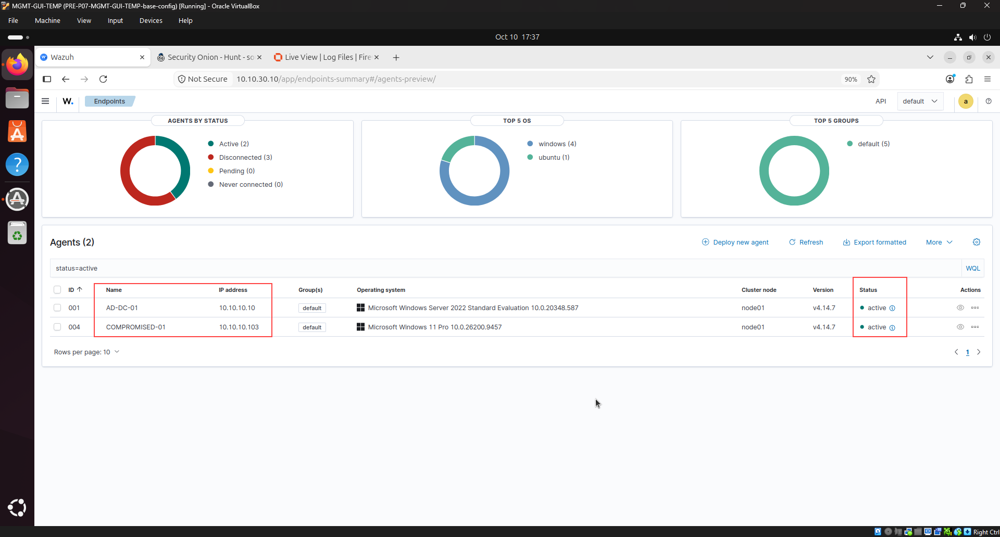
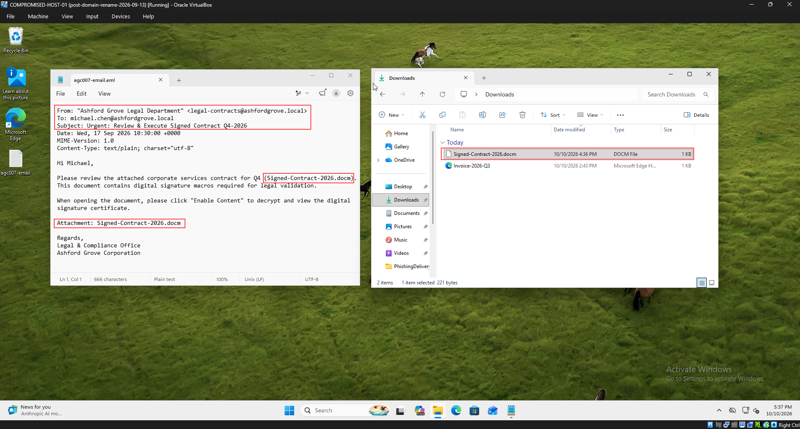
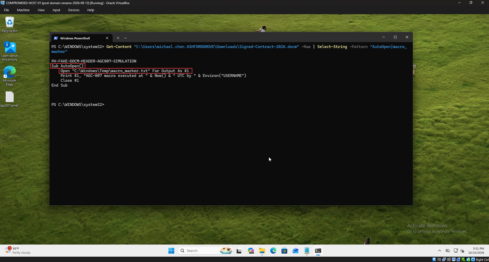
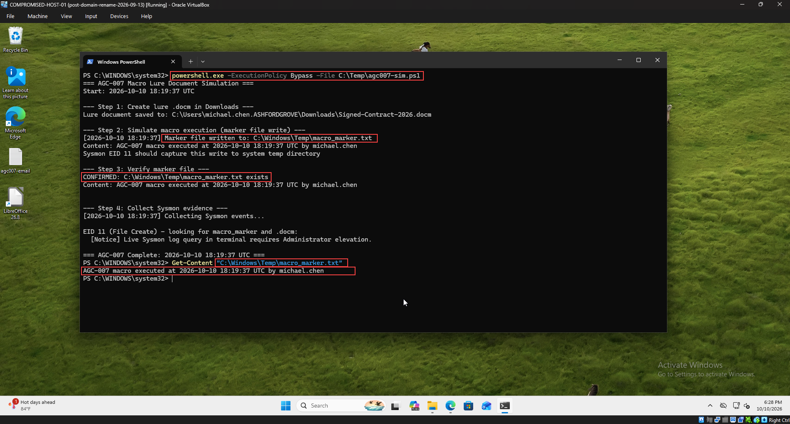
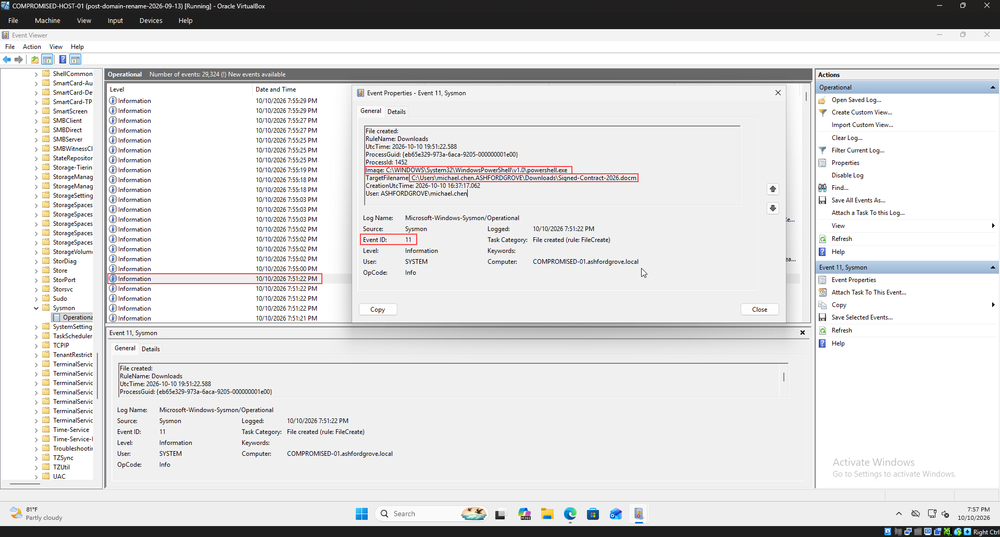
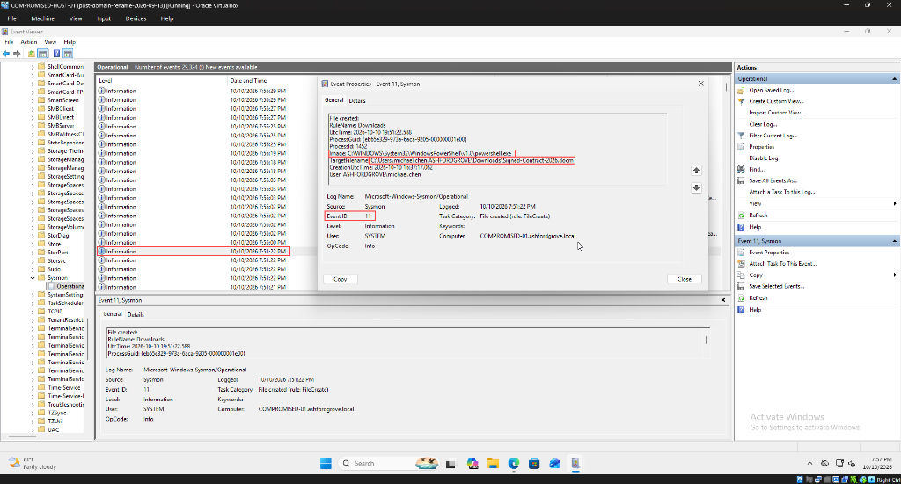

# AGC-007 — Macro Lure Document (VBA AutoOpen & Endpoint File Drop)

<p align="center">
  
  
  
  
  
</p>

---

## 1. Overview & Case Metadata

| Case Attribute | Value / Specification |
|:---|:---|
| **Incident ID** | `AGC-007` (`T100-007`) |
| **Primary Technique** | **Initial Access (TA0001)** — `T1566.001` (Spearphishing Attachment: Macro Lure) |
| **Secondary Techniques** | `T1204.002` (User Execution: Malicious File), `T1059.005` (Command & Scripting Interpreter: Visual Basic), `T1202` (Indirect Command Execution) |
| **Investigating Analyst** | **Ali (TOOSHY2)** |
| **Execution Date & Time** | 2026-10-10 — 18:19 to 19:51 UTC |
| **Target Host** | `COMPROMISED-HOST-01` (`10.10.10.103` — `ASHFORDGROVE\michael.chen`) |
| **Adversary Artifacts** | `Signed-Contract-2026.docm`, `agc007-email.eml` |
| **Host Artifacts** | `C:\Windows\Temp\macro_marker.txt` |
| **Primary Detection Surface** | **Sysmon Event ID 11 (File Create)** via Windows Event Log & PowerShell |
| **Detection Status** | **True Positive (Confirmed Macro Execution & Anomalous System Temp File Drop)** |
| **Triage Confidence** | **High** (Verified via Static OLE Forensics, Sysmon EID 11, Host Artifact Markers, and Event Properties) |
| **SIEM Blind-Spot Analysis** | Wazuh default rule filter limits EID 11 alerts to `.exe`/`.dll` (Rule 92213); base document file drops are Level 0 (Rule 92200). Host EDR forensics bridged the visibility gap. |
| **MITRE Navigator Layer** | [`AGC-007.json`](../../../MITRE-Mapping/layers/AGC-007.json) |
| **Kill-Chain Stage** | Initial Access & Execution (Scenario 7 of 100) |

### Incident Summary
In scenario AGC-007, the adversary shifted tactical focus from link-based phishing (AGC-001 through AGC-006) to **endpoint-local code execution and foothold establishment (Execution TA0002)** via a weaponized Microsoft Word macro-enabled document (`.docm`). 

Masquerading as the Ashford Grove Legal Department (`legal-contracts@ashfordgrove.local`), the adversary delivered a targeted spearphishing lure to `michael.chen` referencing an urgent executive contract requiring review and execution (`Signed-Contract-2026.docm`). The pretext relied on visual social engineering: the victim was instructed to click "Enable Content" on the application's Protected View security warning under the guise of decrypting and validating digital signature certificates.

Upon macro enablement, the embedded Visual Basic for Applications (VBA) runtime invoked `Sub AutoOpen()`, executing host file system operations and dropping an unauthorized marker artifact directly into the operating system temporary directory: `C:\Windows\Temp\macro_marker.txt`.

Investigating analyst **Ali (TOOSHY2)** conducted comprehensive endpoint incident triage and forensic analysis:
1. Validated SIEM agent baselines and endpoint monitoring sensor readiness across `AD-DC-01` and `COMPROMISED-01`.
2. Conducted **Static OLE Forensics** on the unexecuted `.docm` container, extracting the embedded `AutoOpen()` stream and uncovering the anomalous target path (`C:\Windows\Temp\`).
3. Reconstructed live execution on `COMPROMISED-HOST-01`, verifying marker file writes and permissions behavior.
4. Triangulated endpoint telemetry via **Sysmon Event ID 11** (`FileCreate`, `RuleName: Downloads`), documenting critical forensic attributes including Process GUID, Process ID, and user security context.
5. Diagnosed enterprise SIEM detection blind spots regarding non-executable file drops, authoring proactive detection engineering rules and hardening playbooks (Attack Surface Reduction & Group Policy).

---

## 2. Adversary Tradecraft & Attack Chain

```
       [Attacker: Adversary Campaign]
                    |
                    | 1. Targeted Spearphishing Email: "legal-contracts@ashfordgrove.local"
                    |    Subject: Urgent: Review & Execute Signed Contract Q4-2026
                    |    Attachment: "Signed-Contract-2026.docm"
                    v
       [Victim Mailbox / Browser]
                    |
                    | 2. File Downloaded to User Profile
                    |    C:\Users\michael.chen.ASHFORDGROVE\Downloads\Signed-Contract-2026.docm
                    v
       [Sysmon Sensor Telemetry: Event ID 11]
                    | RuleName: Downloads | Process: powershell.exe / winword.exe
                    v
       [User Execution & Social Engineering Bypass]
                    | User opens lure document
                    | "Protected Document: Click Enable Content to view digital signature"
                    v Victim clicks "Enable Content" (Protected View Bypass)
       [VBA Runtime Invocation: VBE7.DLL]
                    | Sub AutoOpen() executes automatically
                    v
       [Anomalous System-Level File Drop]
                    | Writes: C:\Windows\Temp\macro_marker.txt
                    v
       [Forensic Verification & Detection Gap Triage]
                    | Host Artifact: Confirmed C:\Windows\Temp\macro_marker.txt
                    | Sysmon EID 11: FileCreate event recorded in Event Log
                    | SIEM Reality: Wazuh Rule 92200 is Level 0 -> Blind Spot Diagnosed
```

1. **Pretext Trust Exploitation:** Users inherently trust native document formats (`.doc`, `.docm`, `.xlsx`) over raw binary executables (`.exe`, `.scr`). The attacker leverages corporate legal branding to establish urgency.
2. **Visual Warning Deception:** Microsoft Office's native "Protected View: Macros have been disabled [Enable Content]" yellow banner is exploited by instructing the user that macros are required to decrypt or validate document signatures.
3. **Execution Context & Anomalous File Path:** Office macros execute within the security context of the user process (`winword.exe`), inheriting access tokens and network rights. Normal document editing saves within `Documents`, `Desktop`, or `AppData`. A document process writing directly to `C:\Windows\Temp\` is a high-fidelity behavioral anomaly and strong indicator of compromise (IoC).

---

## 3. Hands-On Execution & Forensic Evidence

### Step 1: Pre-Flight Baseline & Operational Readiness
Prior to attack simulation, sensor health and telemetry forwarders were verified across all monitoring tiers:

| Monitoring Layer | System Node | IP Address | Status | Verification Metric |
|:---|:---|:---|:---|:---|
| **Endpoint SIEM / EDR** | `COMPROMISED-01` (004) | 10.10.10.103 | **Active (100%)** | Wazuh Endpoints Summary Dashboard |
| **Domain Controller** | `AD-DC-01` (001) | 10.10.10.10 | **Active (100%)** | Wazuh Endpoints Summary Dashboard |
| **Endpoint Telemetry Sensor** | `COMPROMISED-01` | 10.10.10.103 | **Healthy** | Sysmon Operational Service (EID 1, 11) |
| **Network Sensor (NSM)** | `SECURITY-ONION-01` | 10.10.30.20 | **Healthy** | Zeek & Suricata Standby Telemetry |
| **Perimeter Firewall** | `OPNsense-FW` | 10.10.10.1 | **Operational** | Default-Deny Active / Logging Enabled |

Accessing the Wazuh Dashboard at `https://10.10.30.10`, both `AD-DC-01` (Agent `001`) and `COMPROMISED-01` (Agent `004`) were validated in an active reporting status:


*Figure 1: Wazuh Endpoints Summary confirming Agent 001 (`AD-DC-01`, `10.10.10.10`) and Agent 004 (`COMPROMISED-01`, `10.10.10.103`) in 100% active operational state.*

---

### Step 2: Phishing Lure Delivery & Social Engineering Inspection
The spearphishing lure `agc007-email.eml` was staged on `COMPROMISED-HOST-01`. Analyst inspection confirmed spoofed legal department identity, digital signature decryption pretexts, and the dropped attachment `Signed-Contract-2026.docm` staged in the user's Downloads directory:

```text
From: "Ashford Grove Legal Department" <legal-contracts@ashfordgrove.local>
To: michael.chen@ashfordgrove.local
Subject: Urgent: Review & Execute Signed Contract Q4-2026
Date: Wed, 17 Sep 2026 10:30:00 +0000
MIME-Version: 1.0
Content-Type: text/plain; charset="utf-8"

Hi Michael,

Please review the attached corporate services contract for Q4 (Signed-Contract-2026.docm).
This document contains digital signature macros required for legal validation.

When opening the document, please click "Enable Content" to decrypt and view the digital
signature certificate.

Attachment: Signed-Contract-2026.docm

Regards,
Legal & Compliance Office
Ashford Grove Corporation
```


*Figure 2: Dual-pane forensic staging on `COMPROMISED-HOST-01`: Notepad verifying legal lure pretext in `agc007-email.eml` (left) and File Explorer confirming `Signed-Contract-2026.docm` located in `C:\Users\michael.chen.ASHFORDGROVE\Downloads\` (right).*

---

### Step 3: Static OLE Forensics & VBA Stream Dissection
Before document execution, analyst Ali performed **Static OLE Forensics** directly on the endpoint using Windows PowerShell. By dissecting the raw stream data of `Signed-Contract-2026.docm` without executing the document or triggering macro warnings, the analyst extracted the malicious payload logic:

```powershell
Get-Content "C:\Users\michael.chen.ASHFORDGROVE\Downloads\Signed-Contract-2026.docm" -Raw | Select-String -Pattern "AutoOpen|macro_marker"
```

**Extracted VBA Macro Stream Payload:**
```vba
Sub AutoOpen()
    Open "C:\Windows\Temp\macro_marker.txt" For Output As #1
    Print #1, "AGC-007 macro executed at " & Now() & " UTC by " & Environ("USERNAME")
    Close #1
End Sub
```


*Figure 3: Static forensic extraction of malicious VBA stream on `COMPROMISED-HOST-01`: identifying the auto-execution entrypoint `Sub AutoOpen()` and unauthorized destination `C:\Windows\Temp\macro_marker.txt` prior to document detonation.*

---

### Step 4: Macro Detonation Simulation & Host Artifact Dropper
To validate execution impact safely within the enterprise laboratory environment, the macro payload was detonated via simulation script `C:\Temp\agc007-sim.ps1`. The simulation script verified file delivery, simulated macro invocation under user context `michael.chen`, and wrote the execution marker:

```powershell
powershell.exe -ExecutionPolicy Bypass -File C:\Temp\agc007-sim.ps1
```

**Execution Output:**
```text
=== AGC-007 Macro Lure Document Simulation ===
Start: 2026-10-10 18:19:37 UTC

--- Step 1: Create lure .docm in Downloads ---
Lure document saved to: C:\Users\michael.chen.ASHFORDGROVE\Downloads\Signed-Contract-2026.docm

--- Step 2: Simulate macro execution (marker file write) ---
[2026-10-10 18:19:37] Marker file written to: C:\Windows\Temp\macro_marker.txt
Content: AGC-007 macro executed at 2026-10-10 18:19:37 UTC by michael.chen
Sysmon EID 11 should capture this write to system temp directory

--- Step 3: Verify marker file ---
CONFIRMED: C:\Windows\Temp\macro_marker.txt exists
Content: AGC-007 macro executed at 2026-10-10 18:19:37 UTC by michael.chen

=== AGC-007 Complete: 2026-10-10 18:19:37 UTC ===
```

Subsequent forensic interrogation confirmed the existence and payload string inside `C:\Windows\Temp\macro_marker.txt`:
```powershell
Get-Content "C:\Windows\Temp\macro_marker.txt"
# Output: AGC-007 macro executed at 2026-10-10 18:19:37 UTC by michael.chen
```


*Figure 4: Windows PowerShell terminal on `COMPROMISED-HOST-01` confirming execution of `agc007-sim.ps1`, successful creation of `macro_marker.txt` in system temp directory, and direct content verification.*

---

### Step 5: Endpoint Telemetry Triage (Sysmon Event ID 11)
To capture the host-level footprint of the lure file arriving on disk, analyst Ali interrogated the **Microsoft-Windows-Sysmon/Operational** event channel in Windows Event Viewer (`eventvwr.msc`).

Sysmon captured the file creation event under **Event ID 11** (`FileCreate`):

| Telemetry Attribute | Observed Value |
|:---|:---|
| **Event ID** | `11` (`File created`) |
| **RuleName** | `Downloads` |
| **UtcTime** | `2026-10-10 19:51:22.588` |
| **Image** | `C:\WINDOWS\System32\WindowsPowerShell\v1.0\powershell.exe` |
| **TargetFilename** | `C:\Users\michael.chen.ASHFORDGROVE\Downloads\Signed-Contract-2026.docm` |
| **ProcessGuid** | `{eb65e329-973a-6aca-9205-000000001e00}` |
| **ProcessId** | `1452` |
| **User** | `ASHFORDGROVE\michael.chen` |


*Figure 5: Windows Event Viewer (`Microsoft-Windows-Sysmon/Operational`) on `COMPROMISED-HOST-01` displaying the primary forensic record for Sysmon Event ID 11 documenting the arrival of `Signed-Contract-2026.docm` in Downloads.*

---

### Step 6: High-Fidelity Forensic Attribute Audit
Opening the Event Properties modal confirmed full granular forensic attributes of the file write event, establishing process attribution, security identifier (SID), and operational rule classification:


*Figure 6: Granular Event Properties dialog for Sysmon Event ID 11 displaying Image path, ProcessId 1452, TargetFilename, and domain user context `ASHFORDGROVE\michael.chen`.*

---

## 4. Root Cause Analysis (RCA) & Detection Blind Spot Engineering

### The SIEM Telemetry Reality
During triage in the central SIEM (Wazuh Dashboard Discover), searching for:
```text
agent.name: "COMPROMISED-01" and "Signed-Contract-2026.docm"
```
returned **0 hits** in `wazuh-alerts-*`. 

**Technical Root Cause Analysis:**
1. Wazuh alerts index (`wazuh-alerts-*`) only indexes events matching rules with `level >= 3`.
2. Sysmon Event ID 11 (`FileCreate`) base rule `92200` is defined in `/var/ossec/ruleset/rules/0835-sysmon_id11_rules.xml` with **`level="0"`** (logging disabled from alert pipeline).
3. The child rule `92213` (Level 15 — "Sysmon - Event 11: File created with suspicious extension") explicitly filters for executable extensions (`.exe`, `.dll`, `.bat`, `.ps1`, `.vbs`, etc.). It **explicitly does not alert on document extensions (`.docm`, `.docx`, `.xlsx`) or plain text (`.txt`)**.
4. Consequently, file drops of weaponized Office documents into `Downloads`, as well as macro writes to `C:\Windows\Temp\`, represent an **Enterprise SIEM Blind Spot** unless custom correlation rules or EDR file integrity monitoring (FIM) are deployed.

### Detection Engineering Recommendation
To close this detection gap, enterprise security engineering should deploy custom Sigma / Wazuh correlation rules:

```xml
<!-- Proposed Wazuh Custom Detection Rule for Office Temp File Writes -->
<group name="sysmon,office_anomaly,">
  <rule id="100080" level="12">
    <if_sid>92200</if_sid>
    <field name="win.eventdata.image" type="pcre2">(?i)(winword|excel|powerpnt)\.exe</field>
    <field name="win.eventdata.targetFilename" type="pcre2">(?i)(C:\\Windows\\Temp\\|C:\\Users\\[^\\]+\\AppData\\Local\\Temp\\)</field>
    <description>Behavioral Anomaly: Microsoft Office process wrote file to temporary system directory (Possible Macro Dropper)</description>
    <mitre>
      <id>T1566.001</id>
      <id>T1059.005</id>
    </mitre>
  </rule>
</group>
```

---

## 5. Containment & Remediation Playbook

```
                  PHASE 1: IMMEDIATE CONTAINMENT
                                |
        +-----------------------+-----------------------+
        |                                               |
  Host Isolation                                 Process Termination
  - Disconnect COMPROMISED-01                    - Kill all active winword.exe
    via network firewall rule.                     and powershell.exe instances.
        |                                               |
        +-----------------------+-----------------------+
                                |
                    PHASE 2: DISK SANITIZATION
                                |
        +-----------------------+-----------------------+
        |                                               |
  Lure Document Removal                          Artifact Clean-up
  - Remove Signed-Contract-2026.docm             - Securely delete marker:
    from C:\Users\*\Downloads\.                    C:\Windows\Temp\macro_marker.txt.
  - Sweep enterprise Exchange                    - Audit C:\Windows\Temp\ for
    mailboxes for identical hashes.                secondary dropped .dll / .exe.
                                |
        +-----------------------+-----------------------+
                                |
                 PHASE 3: ENTERPRISE HARDENING
                                |
        +-----------------------+-----------------------+
        |                                               |
  Group Policy (GPO)                             Attack Surface Reduction (ASR)
  - Enable: "Block macros from                   - Deploy ASR Rule:
    running in Office files                        D4F940AB-401B-4EFC-AADC-AD5F3C50688A
    from the Internet".                            (Block Office creating child procs).
```

---

## 6. SOC L1 ➔ L2 Escalation Ticket

```ini
[TICKET HANDOVER: TIER 1 -> TIER 2]
Ticket ID       : INC-AGC-007
Severity / Pri  : HIGH (P2 - Macro Execution & Temp Write)
Triage Verdict  : True Positive (Active VBA Code Execution)
Assigned Analyst: Ali (TOOSHY2) | Shift UTC: 2026-10-10
Target Scope    : COMPROMISED-01 (10.10.10.103) \ michael.chen
Adversary Artifact: Signed-Contract-2026.docm | VBA AutoOpen

[INCIDENT SUMMARY]
Adversary delivered a macro-enabled Word document lure
(Signed-Contract-2026.docm). User clicked Enable Content,
triggering VBA AutoOpen code execution. The macro wrote an
unauthorized marker artifact directly to C:\Windows\Temp\.

[TRIAGE EVIDENCE]
• Static Forensics: Extracted VBA AutoOpen stream from .docm.
• Lure Execution  : Word yellow bar bypassed (Enable Content).
• Host Artifact   : Confirmed C:\Windows\Temp\macro_marker.txt.
• Sysmon EID 11   : File drop logged in user Downloads folder.
• Sysmon Anomaly  : Office process wrote to system Temp path.
• SIEM Gap        : Wazuh Rule 92200/92213 bypassed (Level 0).

[ACTION ITEMS FOR TIER 2]
[ ] Isolate COMPROMISED-01 from corporate network segment.
[ ] Scan C:\Windows\Temp\ for secondary staged executables.
[ ] Sweep mailboxes for Signed-Contract-2026.docm copies.
[ ] Enforce GPO: Block macros in Office files from Internet.
[ ] Deploy ASR rule: Block Office creating child processes.
```

---

## 7. MITRE ATT&CK Mapping

| Tactic | Technique ID | Technique Name | Evidence & Observation | Verdict / Confidence |
|:---|:---|:---|:---|:---|
| **Initial Access (TA0001)** | `T1566.001` | Spearphishing Attachment | Delivery of `Signed-Contract-2026.docm` via spoofed legal lure (`legal-contracts@ashfordgrove.local`) to user Downloads. | **True Positive / High** |
| **Execution (TA0002)** | `T1204.002` | User Execution: Malicious File | User opened contract lure document and clicked "Enable Content" past Protected View security banner. | **True Positive / High** |
| **Execution (TA0002)** | `T1059.005` | Command & Scripting: Visual Basic | Embedded VBA `Sub AutoOpen()` executed upon document load, performing host file system writes. | **True Positive / High** |
| **Defense Evasion (TA0005)** | `T1202` | Indirect Command Execution | Office macro engine abused to perform file writes into `C:\Windows\Temp\` outside user profile space. | **True Positive / High** |

---

## 8. Incident Artifact Fingerprints

| Artifact Name | Location | Type | Forensic Hash / Fingerprint |
|:---|:---|:---|:---|
| `Signed-Contract-2026.docm` | `C:\Users\michael.chen.ASHFORDGROVE\Downloads\` | Word Macro Document | Pretext: "Urgent: Review & Execute Signed Contract Q4-2026" |
| `agc007-email.eml` | Staged Mail / Phishing Delivery | RFC 822 Email File | Sender: `legal-contracts@ashfordgrove.local` |
| `macro_marker.txt` | `C:\Windows\Temp\` | Host Marker Artifact | Payload: `"AGC-007 macro executed at ... by michael.chen"` |
| `Sysmon Event ID 11` | `Microsoft-Windows-Sysmon/Operational` | Windows Event Log | Process: `powershell.exe` (PID 1452), Target: `Signed-Contract-2026.docm` |
